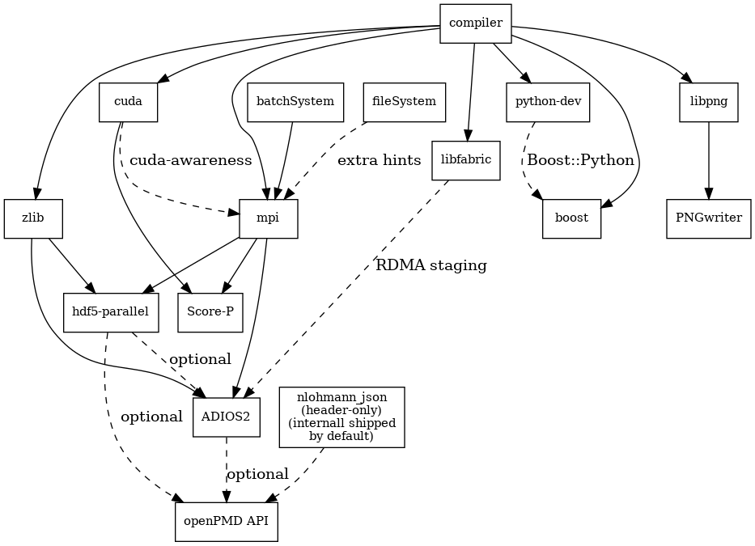

.. _install-dependencies:

.. seealso::

   You will need to understand how to use `the terminal <http://www.ks.uiuc.edu/Training/Tutorials/Reference/unixprimer.html>`_, what are `environment variables <https://unix.stackexchange.com/questions/44990/what-is-the-difference-between-path-and-ld-library-path/45106#45106>`_ and please read our :ref:`compiling introduction <install-source>`.

.. note::

   If you are a scientific user at a supercomputing facility we might have already prepared a software setup for you.
   See the :ref:`following chapter <install-profile>` if you can skip this step fully or in part by loading existing modules on those systems.

Dependencies
============

.. sectionauthor:: Axel Huebl

Overview
--------

   Overview of inter-library dependencies for parallel execution of PIConGPU on a typical HPC system. Due to common binary incompatibilities between compilers, MPI and boost versions, we recommend to organize software with a version-aware package manager such as `spack <https://github.com/spack/spack>`_ and to deploy a hierarchical module system such as `lmod <https://github.com/TACC/Lmod>`_.
   An Lmod example setup can be found `here <https://github.com/ComputationalRadiationPhysics/compileNode>`_.

Requirements
------------

Mandatory
^^^^^^^^^

gcc
"""
- 5.5 - 10.0 (if you want to build for Nvidia GPUs, supported compilers depend on your current `CUDA version <https://gist.github.com/ax3l/9489132>`_)

  - CUDA 9.2 - 10.0: Use gcc 5.5 - 7
  - CUDA 10.1/10.2: Use gcc 5.5 - 8
  - CUDA 11.x: Used gcc 5.5 - 10.0
- *note:* be sure to build all libraries/dependencies with the *same* gcc version; GCC 5 or newer is recommended
- *Debian/Ubuntu:*
  
  - ``sudo apt-get install gcc-5 g++-5 build-essential``
  - ``sudo update-alternatives --install /usr/bin/gcc gcc /usr/bin/gcc-5 60 --slave /usr/bin/g++ g++ /usr/bin/g++-5``
- *Arch Linux:*
  
  - ``sudo pacman --sync base-devel``
  - if the installed version of **gcc** is too new, `compile an older gcc <https://gist.github.com/slizzered/a9dc4e13cb1c7fffec53>`_
- *Spack:*
  
  - ``spack install gcc@5.5.0``
  - make it the default in your `packages.yaml <http://spack.readthedocs.io/en/latest/getting_started.html#compiler-configuration>`_ or *suffix* `all following <http://spack.readthedocs.io/en/latest/features.html#simple-package-installation>`_ ``spack install`` commands with a *space* and ``%gcc@5.5.0``

CMake
"""""
- 3.15.0 or higher
- *Debian/Ubuntu:* ``sudo apt-get install cmake file cmake-curses-gui``
- *Arch Linux:* ``sudo pacman --sync cmake``
- *Spack:* ``spack install cmake``

MPI 2.3+
""""""""
- **OpenMPI** 1.7+ / **MVAPICH2** 1.8+ or similar
- for running on Nvidia GPUs, perform a `GPU aware MPI install <https://devblogs.nvidia.com/parallelforall/introduction-cuda-aware-mpi/>`_ *after* installing CUDA
- *Debian/Ubuntu:* ``sudo apt-get install libopenmpi-dev``
- *Arch Linux:* ``sudo pacman --sync openmpi``
- *Spack:*

  - *GPU support:* ``spack install openmpi+cuda``
  - *CPU only:* ``spack install openmpi``
- *environment:*

  - ``export MPI_ROOT=<MPI_INSTALL>``
  - as long as CUDA awareness (``openmpi+cuda``) is missing: ``export OMPI_MCA_mpi_leave_pinned=0``

zlib
""""
- *Debian/Ubuntu:* ``sudo apt-get install zlib1g-dev``
- *Arch Linux:* ``sudo pacman --sync zlib``
- *Spack:* ``spack install zlib``
- *from source:*

  - ``./configure --prefix=$HOME/lib/zlib``
  - ``make && make install``
- *environent:* (assumes install from source in ``$HOME/lib/zlib``)

  - ``export ZLIB_ROOT=$HOME/lib/zlib``
  - ``export LD_LIBRARY_PATH=$ZLIB_ROOT/lib:$LD_LIBRARY_PATH``
  - ``export CMAKE_PREFIX_PATH=$ZLIB_ROOT:$CMAKE_PREFIX_PATH``

boost
"""""
- 1.65.1 - 1.70.0 (``program_options``, ``filesystem``, ``system``, ``math``, ``serialization`` and header-only libs, optional: ``fiber`` with ``context``, ``thread``, ``chrono``, ``atomic``, ``date_time``)
- *Debian/Ubuntu:* ``sudo apt-get install libboost-program-options-dev libboost-filesystem-dev libboost-system-dev libboost-thread-dev libboost-chrono-dev libboost-atomic-dev libboost-date-time-dev libboost-math-dev libboost-serialization-dev libboost-fiber-dev libboost-context-dev``
- *Arch Linux:* ``sudo pacman --sync boost``
- *Spack:* ``spack install boost``
- *from source:*

  - ``curl -Lo boost_1_65_1.tar.gz https://dl.bintray.com/boostorg/release/1.65.1/source/boost_1_65_1.tar.gz``
  - ``tar -xzf boost_1_65_1.tar.gz``
  - ``cd boost_1_65_1``
  - ``./bootstrap.sh --with-libraries=atomic,chrono,context,date_time,fiber,filesystem,math,program_options,serialization,system,thread --prefix=$HOME/lib/boost``
  - ``./b2 cxxflags="-std=c++11" -j4 && ./b2 install``
- *environment:* (assumes install from source in ``$HOME/lib/boost``)

  - ``export BOOST_ROOT=$HOME/lib/boost``
  - ``export LD_LIBRARY_PATH=$BOOST_ROOT/lib:$LD_LIBRARY_PATH``

git
"""
- 1.7.9.5 or `higher <https://help.github.com/articles/https-cloning-errors>`_
- *Debian/Ubuntu:* ``sudo apt-get install git``
- *Arch Linux:* ``sudo pacman --sync git``
- *Spack:* ``spack install git``

rsync
"""""
- *Debian/Ubuntu:* ``sudo apt-get install rsync``
- *Arch Linux:* ``sudo pacman --sync rsync``
- *Spack:* ``spack install rsync``

alpaka 0.4.0
""""""""""""
- `alpaka <https://github.com/ComputationalRadiationPhysics/alpaka>`_ is included in the PIConGPU source code

cupla 0.2.0
"""""""""""
- `cupla <https://github.com/ComputationalRadiationPhysics/cupla>`_ is included in the PIConGPU source code

mallocMC 2.3.0crp
"""""""""""""""""
- only required for CUDA backend
- `mallocMC <https://github.com/ComputationalRadiationPhysics/mallocMC>`_ is included in the PIConGPU source code

.. _install-dependencies-picongpu:

PIConGPU Source Code
^^^^^^^^^^^^^^^^^^^^

- ``git clone https://github.com/ComputationalRadiationPhysics/picongpu.git $HOME/src/picongpu``

  - *optional:* update the source code with ``cd $HOME/src/picongpu && git fetch && git pull``
  - *optional:* change to a different branch with ``git branch`` (show) and ``git checkout <BranchName>`` (switch)
- *environment*:

  - ``export PICSRC=$PICHOME/src/picongpu``
  - ``export PIC_EXAMPLES=$PICSRC/share/picongpu/examples``
  - ``export PATH=$PICSRC:$PATH``
  - ``export PATH=$PICSRC/bin:$PATH``
  - ``export PATH=$PICSRC/src/tools/bin:$PATH``
  - ``export PYTHONPATH=$PICSRC/lib/python:$PYTHONPATH``

Optional Libraries
^^^^^^^^^^^^^^^^^^

CUDA
""""
- `9.2 - 10.2 <https://developer.nvidia.com/cuda-downloads>`_
- required if you want to run on Nvidia GPUs
- *Debian/Ubuntu:* ``sudo apt-get install nvidia-cuda-toolkit``
- *Arch Linux:* ``sudo pacman --sync cuda``
- *Spack:* ``spack install cuda``
- at least one **CUDA** capable **GPU**
- *compute capability*: ``sm_30`` or higher
- `full list <https://developer.nvidia.com/cuda-gpus>`_ of CUDA GPUs and their *compute capability*
- `More <http://www.olcf.ornl.gov/summit/>`_ is always `better <http://www.cscs.ch/computers/piz_daint/index.html>`_. Especially, if we are talking GPUs :-)
- *environment:*

  - ``export CUDA_ROOT=<CUDA_INSTALL>``

If you do not install the following libraries, you will not have the full amount of PIConGPU plugins.
We recommend to install at least **pngwriter** and either **libSplash** (+ **HDF5**) or **ADIOS**.

libpng
""""""
- 1.2.9+ (requires *zlib*)
- *Debian/Ubuntu dependencies:* ``sudo apt-get install libpng-dev``
- *Arch Linux dependencies:* ``sudo pacman --sync libpng``
- *Spack:* ``spack install libpng``
- *from source:*

  - ``mkdir -p ~/src ~/lib``
  - ``cd ~/src``
  - ``curl -Lo libpng-1.6.34.tar.gz ftp://ftp-osl.osuosl.org/pub/libpng/src/libpng16/libpng-1.6.34.tar.gz``
  - ``tar -xf libpng-1.6.34.tar.gz``
  - ``cd libpng-1.6.34``
  - ``CPPFLAGS=-I$HOME/lib/zlib/include LDFLAGS=-L$HOME/lib/zlib/lib ./configure --enable-static --enable-shared --prefix=$HOME/lib/libpng``
  - ``make``
  - ``make install``
- *environment:* (assumes install from source in ``$HOME/lib/libpng``)

  - ``export PNG_ROOT=$HOME/lib/libpng``
  - ``export CMAKE_PREFIX_PATH=$PNG_ROOT:$CMAKE_PREFIX_PATH``
  - ``export LD_LIBRARY_PATH=$PNG_ROOT/lib:$LD_LIBRARY_PATH``

pngwriter
"""""""""
- 0.7.0+ (requires *libpng*, *zlib*, and optional *freetype*)
- *Spack:* ``spack install pngwriter``
- *from source:*

  - ``mkdir -p ~/src ~/build ~/lib``
  - ``git clone https://github.com/pngwriter/pngwriter.git ~/src/pngwriter/``
  - ``cd ~/build``
  - ``cmake -DCMAKE_INSTALL_PREFIX=$HOME/lib/pngwriter ~/src/pngwriter``
  - ``make install``

- *environment:* (assumes install from source in ``$HOME/lib/pngwriter``)

  - ``export CMAKE_PREFIX_PATH=$HOME/lib/pngwriter:$CMAKE_PREFIX_PATH``
  - ``export LD_LIBRARY_PATH=$HOME/lib/pngwriter/lib:$LD_LIBRARY_PATH``

libSplash
"""""""""
- 1.7.0+ (requires *HDF5*, *boost program-options*)
- *Debian/Ubuntu dependencies:* ``sudo apt-get install libhdf5-openmpi-dev libboost-program-options-dev``
- *Arch Linux dependencies:* ``sudo pacman --sync hdf5-openmpi boost``
- *Spack:* ``spack install libsplash ^hdf5~fortran``
- *from source:*

  - ``mkdir -p ~/src ~/build ~/lib``
  - ``git clone https://github.com/ComputationalRadiationPhysics/libSplash.git ~/src/splash/``
  - ``cd ~/build && rm -rf ../build/*``
  - ``cmake -DCMAKE_INSTALL_PREFIX=$HOME/lib/splash -DSplash_USE_MPI=ON -DSplash_USE_PARALLEL=ON ~/src/splash``
  - ``make install``

- *environment:* (assumes install from source in ``$HOME/lib/splash``)

  - ``export CMAKE_PREFIX_PATH=$HOME/lib/splash:$CMAKE_PREFIX_PATH``
  - ``export LD_LIBRARY_PATH=$HOME/lib/splash/lib:$LD_LIBRARY_PATH``

HDF5
""""
- 1.8.13+
- standard shared version (no C++, enable parallel)
- *Debian/Ubuntu:* ``sudo apt-get install libhdf5-openmpi-dev``
- *Arch Linux:* ``sudo pacman --sync hdf5-openmpi``
- *Spack:* ``spack install hdf5~fortran``
- *from source:*

  - ``mkdir -p ~/src ~/lib``
  - ``cd ~/src``
  - download hdf5 source code from `release list of the HDF5 group <https://www.hdfgroup.org/ftp/HDF5/releases/>`_, for example:

  - ``curl -Lo hdf5-1.8.20.tar.gz https://support.hdfgroup.org/ftp/HDF5/releases/hdf5-1.8/hdf5-1.8.20/src/hdf5-1.8.20.tar.gz``
  - ``tar -xzf hdf5-1.8.20.tar.gz``
  - ``cd hdf5-1.8.20``
  - ``./configure --enable-parallel --enable-shared --prefix $HOME/lib/hdf5/``
  - ``make``
  - *optional:* ``make test``
  - ``make install``
  - If you encounter errors related to linking MPI during ``./configure``, you might try setting the compiler manually via ``./configure --enable-parallel --enable-shared --prefix $HOME/lib/hdf5/ CC=mpicc CXX=mpic++``.
- *environment:* (assumes install from source in ``$HOME/lib/hdf5``)

  - ``export HDF5_ROOT=$HOME/lib/hdf5``
  - ``export LD_LIBRARY_PATH=$HDF5_ROOT/lib:$LD_LIBRARY_PATH``

splash2txt
""""""""""
- requires *libSplash* and *boost* ``program_options``
- converts slices in dumped hdf5 files to plain txt matrices
- assume you [downloaded](#requirements) PIConGPU to `PICSRC=$HOME/src/picongpu`
- ``mkdir -p ~/build && cd ~/build``
- ``cmake -DCMAKE_INSTALL_PREFIX=$PICSRC/src/tools/bin $PICSRC/src/tools/splash2txt``
- ``make``
- ``make install``
- *environment:*

  - ``export PATH=$PATH:$PICSRC/src/splash2txt/build``
- options:

  - ``splash2txt --help``
  - list all available datasets: ``splash2txt --list <FILE_PREFIX>``

png2gas
"""""""
- requires *libSplash*, *pngwriter* and *boost* ``program_options``)
- converts png files to hdf5 files that can be used as an input for species initial density profiles
- compile and install exactly as *splash2txt* above

c-blosc
"""""""
- general purpose compressor, used in ADIOS for in situ data reduction
- *Debian/Ubuntu:* ``sudo apt-get install libblosc-dev``
- *Arch Linux:* ``sudo pacman --sync blosc``
- *Spack:* ``spack install c-blosc``
- *from source:*

  - ``mkdir -p ~/src ~/build ~/lib``
  - ``cd ~/src``
  - ``curl -Lo c-blosc-1.15.0.tar.gz https://github.com/Blosc/c-blosc/archive/v1.15.0.tar.gz``
  - ``tar -xzf c-blosc-1.15.0.tar.gz``
  - ``cd ~/build && rm -rf ../build/*``
  - ``cmake -DCMAKE_INSTALL_PREFIX=$HOME/lib/c-blosc -DPREFER_EXTERNAL_ZLIB=ON ~/src/c-blosc-1.15.0/``
  - ``make``
  - ``make install``
- *environment:* (assumes install from source in ``$HOME/lib/c-blosc``)

  - ``export BLOSC_ROOT=$HOME/lib/c-blosc``
  - ``export CMAKE_PREFIX_PATH=$BLOSC_ROOT:$CMAKE_PREFIX_PATH``
  - ``export LD_LIBRARY_PATH=$BLOSC_ROOT/lib:$LD_LIBRARY_PATH``

ADIOS
"""""
- 1.13.1+ (requires *MPI*, *zlib* and *c-blosc*)
- *Debian/Ubuntu:* ``sudo apt-get install libadios-dev libadios-bin``
- *Arch Linux* using an `AUR helper <https://wiki.archlinux.org/index.php/AUR_helpers>`_: ``pacaur --sync libadios``
- *Arch Linux* using the `AUR <https://wiki.archlinux.org/index.php/Arch_User_Repository>`_ manually:

  - ``sudo pacman --sync --needed base-devel``
  - ``git clone https://aur.archlinux.org/libadios.git``
  - ``cd libadios``
  - ``makepkg -sri``
- *Spack:* ``spack install adios``
- *from source:*

  - ``mkdir -p ~/src ~/lib``
  - ``cd ~/src``
  - ``curl -Lo adios-1.13.1.tar.gz http://users.nccs.gov/~pnorbert/adios-1.13.1.tar.gz``
  - ``tar -xzf adios-1.13.1.tar.gz``
  - ``cd adios-1.13.1``
  - ``CFLAGS="-fPIC" ./configure --enable-static --enable-shared --prefix=$HOME/lib/adios --with-mpi=$MPI_ROOT --with-zlib=$HOME/lib/zlib --with-blosc=$HOME/lib/c-blosc``
  - ``make``
  - ``make install``
- *environment:* (assumes install from source in ``$HOME/lib/adios``)

  - ``export ADIOS_ROOT=$HOME/lib/adios``
  - ``export LD_LIBRARY_PATH=$ADIOS_ROOT/lib:$LD_LIBRARY_PATH``

openPMD API
"""""""""""
- 0.12.0+ (bare minimum) / 0.13.0+ (for streaming IO)
- *Spack*: ``spack install openpmd-api``
- For usage in PIConGPU, the openPMD API must have been built either with support for ADIOS2 or HDF5 (or both).
  When building the openPMD API from source (described below), these dependencies must be built and installed first.

  - For ADIOS2, CMake build instructions can be found in the `official documentation <https://adios2.readthedocs.io/en/latest/setting_up/setting_up.html>`_.
    The default configuration should generally be sufficient, the ``CMAKE_INSTALL_PREFIX`` should be set to a fitting location.
  - For HDF5, CMake build  instructions can be found in the `official documentation <https://support.hdfgroup.org/HDF5/release/cmakebuild.html>`_.
    The parameters ``-DHDF5_BUILD_CPP_LIB=OFF -DHDF5_ENABLE_PARALLEL=ON`` are required, the ``CMAKE_INSTALL_PREFIX`` should be set to a fitting location.
- *from source:*

  - ``mkdir -p ~/src ~/lib``
  - ``cd ~/src``
  - ``git clone https://github.com/openPMD/openPMD-api.git``
  - ``cd openPMD-api``
  - ``mkdir build && cd build``
  - ``cmake .. -DopenPMD_USE_MPI=ON -DCMAKE_INSTALL_PREFIX=~/lib/openPMD-api``
    Optionally, specify the parameters ``-DopenPMD_USE_ADIOS2=ON -DopenPMD_USE_HDF5=ON``. Otherwise, these parameters are set to ``ON`` automatically if CMake detects the dependencies on your system.
  - ``make -j $(nproc) install``
- environment:* (assumes install from source in ``$HOME/lib/openPMD-api``)

  - ``export CMAKE_PREFIX_PATH="$HOME/lib/openPMD-api:$CMAKE_PREFIX_PATH"``
  - ``export LD_LIBRARY_PATH="$HOME/lib/openPMD-api/lib:$LD_LIBRARY_PATH"``
- If PIConGPU is built with openPMD output enabled, the JSON library
  nlohmann_json will automatically be used, found in the ``thirdParty/``
  directory.
  By setting the CMake parameter ``PIC_nlohmann_json_PROVIDER=extern``, CMake
  can be instructed to search for an installation of nlohmann_json externally.
  Refer to LICENSE.md for further information.

ISAAC
"""""
- 1.4.0+
- requires *boost* (header only), *IceT*, *Jansson*, *libjpeg* (preferably *libjpeg-turbo*), *libwebsockets* (only for the ISAAC server, but not the plugin itself)
- enables live in situ visualization, see more here `Plugin description <https://github.com/ComputationalRadiationPhysics/picongpu/wiki/Plugin%3A-ISAAC>`_
- *Spack:* ``spack install isaac``
- *from source:* build the *in situ library* and its dependencies as described in `ISAAC's INSTALL.md <https://github.com/ComputationalRadiationPhysics/isaac/blob/master/INSTALL.md>`_
- *environment:* set environment variable ``CMAKE_PREFIX_PATH`` for each dependency and the ISAAC in situ library

VampirTrace
"""""""""""
- for developers: performance tracing support
- download 5.14.4 or higher, e.g. from `www.tu-dresden.de <https://tu-dresden.de/zih/forschung/projekte/vampirtrace>`_
- *from source:*

  - ``mkdir -p ~/src ~/build ~/lib``
  - ``cd ~/src``
  - ``curl -Lo VampirTrace-5.14.4.tar.gz "http://wwwpub.zih.tu-dresden.de/~mlieber/dcount/dcount.php?package=vampirtrace&get=VampirTrace-5.14.4.tar.gz"``
  - ``tar -xzf VampirTrace-5.14.4.tar.gz``
  - ``cd VampirTrace-5.14.4``
  - ``./configure --prefix=$HOME/lib/vampirtrace --with-cuda-dir=<CUDA_ROOT>``
  - ``make all -j``
  - ``make install``
- *environment:* (assumes install from source in ``$HOME/lib/vampirtrace``)

  - ``export VT_ROOT=$HOME/lib/vampirtrace``
  - ``export PATH=$VT_ROOT/bin:$PATH``
