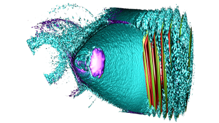
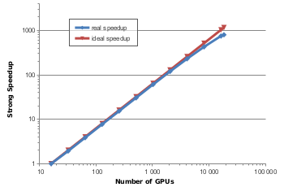

PIConGPU - Particle-in-Cell Simulations for the Exascale Era
============================================================

Introduction
------------

PIConGPU is a fully relativistic,
[manycore](https://en.wikipedia.org/wiki/Manycore_processor),
3D3V particle-in-cell ([PIC](http://en.wikipedia.org/wiki/Particle-in-cell))
code. The Particle-in-Cell algorithm is a central tool in plasma physics.
It describes the dynamics of a plasma by computing the motion of
electrons and ions in the plasma based on
[Maxwell's equations](http://en.wikipedia.org/wiki/Maxwell%27s_equations).

PIConGPU implements various numerical schemes to solve the PIC cycle.
Its features for the electro-magnetic PIC algorithm include:
- a central or Yee-lattice for fields
- particle pushers that solve the equation of motion for charged and neutral
  particles, e.g., the *Boris-* and the
  [*Vay-Pusher*](http://dx.doi.org/10.1063/1.2837054)
- Maxwell field solvers, e.g.
  [*Yee's*](http://dx.doi.org/10.1109/TAP.1966.1138693) and
  [*Lehe's*](http://dx.doi.org/10.1103/PhysRevSTAB.16.021301) scheme
- rigorously charge conserving current deposition schemes, such as
  [*Villasenor-Buneman*](http://dx.doi.org/10.1016/0010-4655%2892%2990169-Y),
  [*Esirkepov*](http://dx.doi.org/10.1016/S0010-4655%2800%2900228-9)
  and *ZigZag*
- macro-particle form factors ranging from NGP (0th order), CIC (1st),
  TSC (2nd), PQS (3rd) to PCS (4th)

and the electro-magnetic PIC algorithm is further self-consistently coupled to:
- classical radiation reaction
  ([DOI:10.1016/j.cpc.2016.04.002](http://dx.doi.org/10.1016/j.cpc.2016.04.002))
- QED synchrotron radiation (photon emission)
  ([DOI:10.1103/PhysRevE.92.023305](http://dx.doi.org/10.1103/PhysRevE.92.023305))
- advanced field ionization methods
  ([DOI:10.1103/PhysRevA.59.569](http://dx.doi.org/10.1103/PhysRevA.59.569),
   [LV Keldysh](http://www.jetp.ac.ru/cgi-bin/dn/e_020_05_1307.pdf), BSI)

Besides the electro-magnetic PIC algorithm and extensions to it, we developed
a wide range of tools and diagnostics, e.g.:
- online, far-field radiation diagnostics for coherent and incoherent radiation
  emitted by charged particles
- full restart and output capabilities via [openPMD](http://openPMD.org),
  including [parallel HDF5](http://hdfgroup.org/) (via
  [libSplash](https://github.com/ComputationalRadiationPhysics/libSplash)) and
  [ADIOS](https://csmd.ornl.gov/adios/), allowing for
  extreme I/O scalability and massively parallel online-analysis
- 2D and 3D live view and diagnostics tools
- a large selection of extensible
  [online-plugins](http://picongpu.readthedocs.io/en/latest/usage/plugins.html)

As one of our supported compute platforms, GPUs provide a computational
performance of several
[TFLOP/s](http://en.wikipedia.org/wiki/FLOPS) at considerable lower invest and
maintenance costs compared to multi CPU-based compute architectures of similar
performance. The latest high-performance systems
([TOP500](http://www.top500.org/)) are enhanced by accelerator hardware that
boost their peak performance up to the multi-PFLOP/s level. With its
outstanding performance and scalability to more than 18'000 GPUs,
PIConGPU was one of the **finalists** of the 2013
[Gordon Bell Prize](http://sc13.supercomputing.org/content/acm-gordon-bell-prize).

PIConGPU is developed and maintained by the
[Computational Radiation Physics Group](https://www.hzdr.de/db/Cms?pNid=2097)
at the [Institute for Radiation Physics](http://www.hzdr.de/db/Cms?pNid=132)
at [HZDR](http://www.hzdr.de/) in close collaboration with the Center
for Information Services and High Performance Computing
([ZIH](http://tu-dresden.de/die_tu_dresden/zentrale_einrichtungen/zih)) of the
Technical University Dresden ([TUD](http://www.tu-dresden.de)). We are a
member of the [Dresden GPU Center of Excellence](http://ccoe-dresden.de/) that
cooperates on a broad range of scientific GPU and manycore applications,
workshops and teaching efforts.

Attribution
-----------

PIConGPU is a *scientific project*. If you **present and/or publish** scientific
results that used PIConGPU, you should set a **reference** to show your support.

Our according **up-to-date publication** at **the time of your publication**
should be inquired from:
- [REFERENCE.md](https://raw.githubusercontent.com/ComputationalRadiationPhysics/picongpu/master/REFERENCE.md)

Please also consider adding yourself to our [community map](https://github.com/ComputationalRadiationPhysics/picongpu-communitymap).
We would love to hear from you!

Oral Presentations
------------------

The following slide should be part of **oral presentations**. It is intended to
acknowledge the team maintaining PIConGPU and to support our community:

(*coming soon*) presentation_picongpu.pdf
(svg version, key note version, png version: 1920x1080 and 1024x768)

Software License
----------------

*PIConGPU* is licensed under the **GPLv3+**. Furthermore, you can develop your
own particle-mesh algorithms based on our general library *PMacc* that is
shipped alongside PIConGPU. *PMacc* is *dual licensed* under both the
**GPLv3+ and LGPLv3+**.
For a detailed description, please refer to [LICENSE.md](LICENSE.md)

********************************************************************************

Install
-------

See our notes in [INSTALL.rst](INSTALL.rst).

Users
-----

Dear User, please be aware that this is an **open beta release**!
We hereby emphasize that we are still actively developing PIConGPU at great
speed and do, from time to time, break backwards compatibility.

When using this software, please stick to the `master` branch containing the
latest *stable* release. It also contains a file `CHANGELOG.md` with the
latest changes (and how to update your simulations). Read it first before
updating between two versions! Also, we add a git `tag` according to a version
number for each release in `master`.

For any questions regarding the usage of PIConGPU please **do not** contact the
developers and maintainers directly.

Instead, please sign up to our **PIConGPU-Users** mailing list so we can
distribute and archive user questions:
[Subscribe (select "Feed" on bottom left)](https://cg.hzdr.de/Lists/picongpu-users/List.html).

Before you post a question, browse the PIConGPU
[documentation](https://github.com/ComputationalRadiationPhysics/picongpu/search?l=markdown),
[wiki](https://github.com/ComputationalRadiationPhysics/picongpu/wiki),
[issue tracker](https://github.com/ComputationalRadiationPhysics/picongpu/issues) and the
[mailing list history](https://cg.hzdr.de/Lists/picongpu-users/List.html)
to see if your question has been answered, already.

PIConGPU is a collaborative project.
We thus encourage users to engage in answering questions of other users and post solutions to problems to the list.
A problem you have encountered might be the future problem of another user.

In addition, please consider using the collaborative features of GitHub if you have questions or comments on code or documentation.
This will allow other users to see the piece of code or documentation you are referring to.

Main ressources are in our [online manual](https://picongpu.readthedocs.io), the [user section](https://github.com/ComputationalRadiationPhysics/picongpu/wiki) of our wiki, documentation files in [`.md` (Markdown)](http://commonmark.org/help/) and [`.rst` (reStructuredText)](http://www.sphinx-doc.org/en/stable/rest.html) format in this repository and a [getting started video](http://www.youtube.com/watch?v=7ybsD8G4Rsk).
Feel free to visit [picongpu.hzdr.de](http://picongpu.hzdr.de) to learn more about the PIC algorithm.

Software Upgrades
-----------------

PIConGPU follows a
[master - dev](http://nvie.com/posts/a-successful-git-branching-model/)
development model. That means our latest stable release is shipped in a branch
called `master` while new and frequent changes to the code are incooporated
in the development branch `dev`.

Every time we update the *master* branch, we publish a new release
of PIConGPU. Before you pull the changes in, please read our
[ChangeLog](CHANGELOG.md)!
You may have to update some of your simulation `.param` and `.cfg` files by
hand since PIConGPU is an active project and new features often require changes
in input files. Additionally, a full description of new features and fixed bugs
in comparison to the previous release is provided in that file.

In case you decide to use *new, potentially buggy and experimental* features
from our `dev` branch, be aware that support is very limited and you must
participate or at least follow the development yourself. Syntax changes
and in-development bugs will *not* be announced outside of their according pull
requests and issues.

Before drafting a new release, we open a new `release-*` branch from `dev` with
the `*` being the version number of the upcoming release. This branch only
receives bug fixes (feature freeze) and users are welcome to try it out
(however, the change log and a detailed announcement might still be missing in
it).

Developers
----------

### How to participate

See [CONTRIBUTING.md](CONTRIBUTING.md)

If you like to jump in right away, see  

Active Team
-----------

### Scientific Supervision

- Dr. Michael Bussmann
- Dr. Axel Huebl

### Maintainers* and core developers

- Dr. Sergei Bastrakov*
- Dr. Alexander Debus
- Marco Garten*
- Dr. Axel Huebl*
- Alexander Matthes
- Dr. Richard Pausch*
- Sophie Rudat
- Sebastian Starke
- Dr. Klaus Steiniger
- Rene Widera*

### Former Members, Contributions and Thanks

The PIConGPU Team expresses its gratitude to:

Florian Berninger, Heiko Burau, Robert Dietrich, Carlchristian Eckert,
Wen Fu, Ph.D., Alexander Grund, Sebastian Hahn, Anton Helm, Wolfgang Hoehnig,
Dr.-Ing. Guido Juckeland, Jeffrey Kelling, Maximilian Knespel, Dr. Remi Lehe,
Felix Schmitt, Benjamin Schneider, Joseph Schuchart, Conrad Schumann,
Stefan Tietze, Marija Vranic, Ph.D., Benjamin Worpitz, and Erik Zenker.

Kudos to everyone, mentioned or unmentioned, who contributed further in any
way!

********************************************************************************

