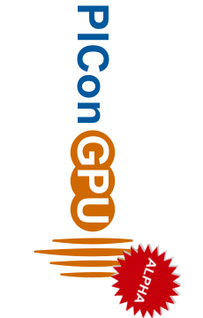
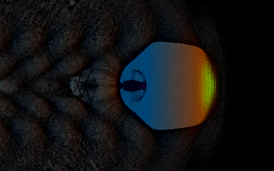
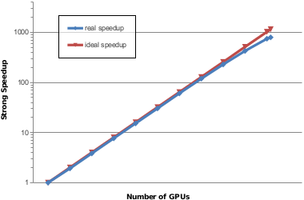

PIConGPU - A Many GPGPU PIC Code
================================================================

Open Alpha
----------

Please note that this is an Open
[Alpha](https://en.wikipedia.org/wiki/Software_release_life_cycle#Alpha)
release for **developers** and **power users** [only](#users).

**Users** *should wait* for our 
[Open Beta](https://github.com/ComputationalRadiationPhysics/picongpu/milestones)
release!

********************************************************************************

Introduction
------------

PIConGPU is a fully relativistic, many
[GPGPU](http://en.wikipedia.org/wiki/Graphics_processing_unit),
3D3V particle-in-cell ([PIC](http://en.wikipedia.org/wiki/Particle-in-cell))
code. The Particle-in-Cell algorithm is a central tool in plasma physics.
It describes the dynamics of a plasma by computing the motion of
electrons and ions in the plasma based on
[Maxwell's equations](http://en.wikipedia.org/wiki/Maxwell%27s_equations).

PIConGPU implements various numerical schemes to solve the PIC cycle.
Its features include:
- a Yee-lattice like grid structure
- particle pushers that solve the equation of motion for
charged particles, e.g. the *Boris-* and the *Vay-Pusher*
- Maxwell field solvers, e.g. *Yee's* and *Lehe's* scheme
- rigorously charge conserving current deposition schemes, proposed by
*Villasenor-Buneman* and *Esirkepov*
- macro-particle form factors ranging from NGP (0th order), CIC (1st), TSC(2nd)
  to PSQ (3rd)

Besides the central PIC algorithm, we developed a wide range of tools and diagnostics, e.g.:
- online, far-field radiation diagnostics for coherent and incoherent radiation
  emitted by charged particles
- full hdf5 restart and dumping capabilities
- 2D and 3D live view and diagnostics tools

Todays GPUs reach a performance up to
[TFLOP/s](http://en.wikipedia.org/wiki/FLOPS)
at considerable lower invest and maintenance cost compared to CPU-based compute
architectures of similar performance. The latest high-performance systems
([TOP500](http://www.top500.org/)) are enhanced by accelerator hardware that
boost their peak performance up to the multi-PFLOP/s level. With its
outstanding performance, PIConGPU is one of the **finalists** of the 2013s
[Gordon Bell Prize](http://sc13.supercomputing.org/content/acm-gordon-bell-prize).

PIConGPU is developed and maintained by the
[Junior Group Computational Radiation Physics](http://www.hzdr.de/db/Cms?pNid=132&pOid=30354)
at the [Institute for Radiation Physics](http://www.hzdr.de/db/Cms?pNid=132)
at [HZDR](http://www.hzdr.de/) in close collaboration with the Center
for Information Services and High Performance Computing
([ZIH](http://tu-dresden.de/die_tu_dresden/zentrale_einrichtungen/zih)) of the
Technical University Dresden ([TUD](http://www.tu-dresden.de)). We are a
member of the [Dresden CUDA Center of Excellence](http://ccoe-dresden.de/) that
cooperates on a broad range of scientific CUDA applications, workshops and
teaching efforts.

Attribution
-----------

PIConGPU is a *scientific project*. If you **present and/or publish** scientific
results that used PIConGPU, you should set a **reference** to show your support.

Our according **up-to-date publication** at **the time of your publication**
should be inquired from:
- [https://github.com/ComputationalRadiationPhysics/picongpu/blob/master/REFERENCE.md](https://github.com/ComputationalRadiationPhysics/picongpu/blob/master/REFERENCE.md)

Oral Presentations
------------------

The following slide should be part of **oral presentations**. It is intended to
acknowledge the team maintaining PIConGPU and to support our community:

(*coming soon*) presentation_picongpu.pdf
(svg version, key note version, png version: 1920x1080 and 1024x768)

Software License
----------------

*PIConGPU* is licensed under the **GPLv3+**. You can use our *libraries* with
**GPLv3+ or LGPLv3+** (they are *dual licensed*).
Please refer to our [LICENSE.md](LICENSE.md)

********************************************************************************

Install
-------

See our notes in [INSTALL.md](doc/INSTALL.md).

Users
-----

Dear User, please [beware](#open-alpha) that this is a **developer and
power user only release**! We hereby emphasize that you should wait for our
[Beta](https://github.com/ComputationalRadiationPhysics/picongpu/milestones)
release.

Visit [picongpu.hzdr.de](http://picongpu.hzdr.de) to learn more about PIC
codes. See the [user guide](https://github.com/ComputationalRadiationPhysics/picongpu/wiki), 
our [getting started video](http://www.youtube.com/watch?v=7ybsD8G4Rsk) and
[contact](http://www.hzdr.de/db/Cms?pNid=132&pOid=30354) us!

Please sign up on our **PIConGPU-Users** mailing list:
[Subscribe (Feed)](https://cg.hzdr.de/Lists/picongpu-users/List.html)

**Upgrades:** Every time we update the *master* branch, we publish a new release
of PIConGPU. Before you pull the changes in, please read our [ChangeLog](CHANGELOG.md)!
You may have to update some of your simulation `.param` files by hand
(detailed upgrade guide coming soon).

Developers
----------

### How to participate

See [CONTRIBUTING.md](CONTRIBUTING.md)

Active Team
-----------

### Scientific Supervision

- Dr. Michael Bussmann
- Dr.-Ing. Guido Juckeland

### Maintainers* and core developers

- Heiko Burau*
- Dr. Alexander Debus
- Carlchristian Eckert
- Marco Garten
- Alexander Grund
- Axel Huebl*
- Maximilian Knespel
- Richard Pausch*
- Stefan Tietze
- Rene Widera*
- Benjamin Worpitz*

### Former Members, Contributions and Thanks

The PIConGPU Team expresses its thanks to:

- Florian Berninger
- Robert Dietrich
- Wen Fu, PhD
- Anton Helm
- Wolfgang Hoehnig
- Dr. Remi Lehe
- Felix Schmitt(*)
- Benjamin Schneider
- Joseph Schuchart
- Conrad Schumann
- Klaus Steiniger

Kudos to everyone who helped!

********************************************************************************

