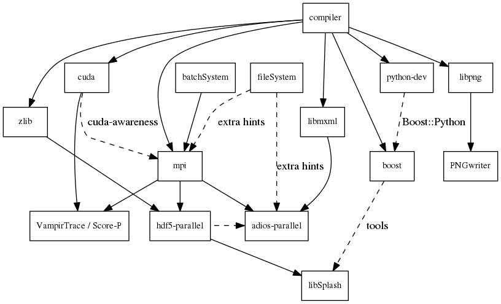

PIConGPU Install Guide
======================

Overview
--------

*Figure:* Overview of inter-library dependencies for parallel execution of
PIConGPU on a typical HPC system. Due to common binary incompatibilities
between compilers, MPI and boost versions, we recommend to deploy a
hierarchical module system such as [lmod](https://github.com/TACC/Lmod).
An example setup can be found
[here](https://github.com/ComputationalRadiationPhysics/compileNode).

Requirements
------------

### Mandatory

- **gcc** 4.6 to 4.8 (depends on your current [CUDA version](https://gist.github.com/ax3l/9489132))
  - *Debian/Ubuntu:*
    - `sudo apt-get install gcc-4.6 g++-4.6 build-essential`
    - `sudo update-alternatives --install /usr/bin/gcc gcc /usr/bin/gcc-4.6 60 --slave /usr/bin/g++ g++ /usr/bin/g++-4.6`
  - *Arch Linux:*
    - `sudo pacman --sync base-devel`
    - the installed version of **gcc** might be too new. [Compile an older gcc](https://gist.github.com/slizzered/a9dc4e13cb1c7fffec53)
  - *experimental alternatives:* **icc** since **cuda 5.5**

- [CUDA 5.0](https://developer.nvidia.com/cuda-downloads) or higher
  - **Attention:** You must use at least the 5.5+ [drivers](http://www.nvidia.com/Drivers)
    even if you run with CUDA 5.0. Supported drivers: 319.82+/331.22+
  - *Arch Linux:* `sudo pacman --sync cuda`

- at least one **CUDA** capable **GPU**
  - *Compute capability* **sm\_20** or higher
  - [full list](https://developer.nvidia.com/cuda-gpus) of CUDA GPUs and their *compute capability*
  - ([More](http://www.olcf.ornl.gov/titan/) is always better. Especially, if we are talking about GPUs.)

- **cmake** 3.1.0 or higher
  - *Debian/Ubuntu:* `sudo apt-get install cmake file cmake-curses-gui`
  - *Arch Linux:* `sudo pacman --sync cmake`

- **OpenMPI** 1.5.1+ / **MVAPICH2** 1.8+ or similar
  ([GPU aware](https://devblogs.nvidia.com/parallelforall/introduction-cuda-aware-mpi/) install recommented)
  - *Debian/Ubuntu:* `sudo apt-get install libopenmpi-dev`
  - *Arch Linux:* `sudo pacman --sync openmpi`

- **zlib**
  - *Debian/Ubuntu:* `sudo apt-get install zlib1g-dev`
  - *Arch Linux:* `sudo pacman --sync zlib`

- **boost** 1.56.0+ ("program options", "regex" , "filesystem", "system", "thread", "math" and nearly all header-only libs)
  - download from [http://www.boost.org/](http://sourceforge.net/projects/boost/files/boost/1.56.0/boost_1_56_0.tar.gz/download),
      e.g. version 1.56.0
  - *Debian/Ubuntu:* `sudo apt-get install libboost-program-options-dev libboost-regex-dev libboost-filesystem-dev libboost-system-dev`
  - *Arch Linux:* `sudo pacman --sync boost`
  - *From source:*
    - `./bootstrap.sh --with-libraries=filesystem,program_options,regex,system,thread,math --prefix=$HOME/lib/boost`
    - `./b2 -j4 && ./b2 install`

- **git** 1.7.9.5 or [higher](https://help.github.com/articles/https-cloning-errors)
  - *Debian/Ubuntu:* `sudo apt-get install git`
  - *Arch Linux:* `sudo pacman --sync git`

### Optional Libraries

If you do not install the optional libraries, you will not have the full amount of PIConGPU plugins.
We recomment to install at least **pngwriter**.
Some of our examples will also need **libSplash**.

- **pngwriter** >= 0.5.6
    - download our modified version from
      [github.com/pngwriter/pngwriter](https://github.com/pngwriter/pngwriter)
    - Requires [libpng](http://www.libpng.org/),
      - *Debian/Ubuntu:* `sudo apt-get install libpng-dev`
      - *Arch Linux:* `sudo pacman --sync libpng`
    - example:
      - `mkdir -p ~/src ~/build ~/lib`
      - `git clone https://github.com/pngwriter/pngwriter.git ~/src/pngwriter/`
      - `cd ~/build`
      - `cmake -DCMAKE_INSTALL_PREFIX=$HOME/lib/pngwriter ~/src/pngwriter`
      - `make install`
    - set the environment variable
      [PNGWRITER\_ROOT](#additional-required-environment-variables-for-optional-libraries)
      to `$HOME/lib/pngwriter`

- **libSplash** >= 1.4.0 (requires *HDF5*, *boost program-options*)
    - *Debian/Ubuntu dependencies:* `sudo apt-get install libhdf5-openmpi-dev libboost-program-options-dev`
    - *Arch Linux dependencies:* `sudo pacman --sync hdf5-openmpi boost`
    - *or compile hdf5 yourself:*  follow instructions one paragraph below 
    - example:
      - `mkdir -p ~/src ~/build ~/lib`
      - `git clone https://github.com/ComputationalRadiationPhysics/libSplash.git ~/src/splash/`
      - `cd ~/build`
      - `cmake -DCMAKE_INSTALL_PREFIX=$HOME/lib/splash ~/src/splash`
      - `make install`
    - set the environment variable
      [SPLASH\_ROOT](#additional-required-environment-variables-for-optional-libraries)
      to `$HOME/lib/splash`

- **HDF5** >= 1.8.6, standard shared version (no c++, enable parallel), e.g. `hdf5/1.8.5-threadsafe`
    - *Debian/Ubuntu:* `sudo apt-get install libhdf5-openmpi-dev`
    - *Arch Linux:* `sudo pacman --sync hdf5-openmpi`
    - example:
      - `mkdir -p ~/src ~/build ~/lib`
      - `cd ~/src`
      - download hdf5 source code from [release list of the HDF5 group]
        (https://www.hdfgroup.org/ftp/HDF5/releases/)
        for example `wget https://www.hdfgroup.org/ftp/HDF5/releases/hdf5-1.8.14/src/hdf5-1.8.14.tar.gz`
      - `tar -xvzf hdf5-1.8.14.tar.gz`
      - `cd hdf5-1.8.14`
      - `./configure --enable-parallel --enable-shared --prefix $HOME/lib/hdf5/`
      - `make`
      - *optional:* `make test`
      - `make install`
    - set the environment variable
      [HDF5\_ROOT](#additional-required-environment-variables-for-optional-libraries)
      to `$HOME/lib/hdf5` and the
      [LD\_LIBRARY\_PATH](#additional-required-environment-variables-for-optional-libraries)
      to `export LD_LIBRARY_PATH=$LD_LIBRARY_PATH:$HOME/lib/hdf5/lib`

- **splash2txt** (requires *libSplash* and *boost* "program_options", "regex")
    - converts slices in dumped hdf5 files to plain txt matrices
    - assume you [downloaded](#requirements) PIConGPU to `PICSRC=$HOME/src/picongpu`
    - `mkdir -p ~/build && cd ~/build`
    - `cmake -DCMAKE_INSTALL_PREFIX=$PICSRC/src/tools/bin $PICSRC/src/tools/splash2txt`
    - `make`
    - `make install`
    - add the directory of the binary `splash2txt`, `$PICSRC/src/tools/bin`,
      to a place in your `$PATH`
    - options:
      - `splash2txt --help`
      - list all available datasets: `splash2txt --list <FILE_PREFIX>`

- **png2gas** (requires *libSplash*, *pngwriter* and *boost* "program_options")
    - converts png files to hdf5 files that can be used as an input for a
      species initial density profiles
    - compile and install exactly as *splash2txt* above

- **ADIOS** >= 1.9.0 (requires *MPI*, *zlib* and *mxml* http://www.msweet.org/projects.php?Z3)
    - *Debian/Ubuntu:* `sudo apt-get install libadios-dev libadios-bin`
    - *Arch Linux using an [AUR helper](https://wiki.archlinux.org/index.php/AUR_helpers):* `pacaur --sync libadios`
    - *Arch Linux using the [AUR](https://wiki.archlinux.org/index.php/Arch_User_Repository) manually:*
      - `sudo pacman --sync --needed base-devel`
      - `git clone https://aur.archlinux.org/libadios.git`
      - `cd libadios`
      - `makepkg -sri`
    - example:
      - `mkdir -p ~/src ~/build ~/lib`
      - `cd ~/src`
      - `wget http://users.nccs.gov/~pnorbert/adios-1.9.0.tar.gz`
      - `tar -xvzf adios-1.9.0.tar.gz`
      - `cd adios-1.9.0`
      - `CFLAGS="-fPIC" ./configure --enable-static --enable-shared --prefix=$HOME/lib/adios-1.9.0 --with-mxml=$MXML_ROOT --with-mpi=$MPI_ROOT --with-zlib=/usr`
      - `make`
      - `make install`
    - set the environment variable
      [ADIOS\_ROOT](#additional-required-environment-variables-for-optional-libraries)
      to `export ADIOS_ROOT=$HOME/lib/adios-1.9.0`, the
      [PATH](#additional-required-environment-variables-for-optional-libraries)
      to `export PATH=$PATH:$ADIOS_ROOT/bin` and the
      [LD\_LIBRARY\_PATH](#additional-required-environment-variables-for-optional-libraries)
      to `export LD_LIBRARY_PATH=$LD_LIBRARY_PATH:$ADIOS_ROOT/lib`

- for **VampirTrace** support
    - download 5.14.4 or higher, e.g. from 
    [http://www.tu-dresden.de](http://www.tu-dresden.de/die_tu_dresden/zentrale_einrichtungen/zih/forschung/projekte/vampirtrace)
    - example:
      - `mkdir -p ~/src ~/build ~/lib`
      - `cd ~/src`
      - `wget -O VampirTrace-5.14.4.tar.gz "http://wwwpub.zih.tu-dresden.de/~mlieber/dcount/dcount.php?package=vampirtrace&get=VampirTrace-5.14.4.tar.gz"`
      - `tar -xvzf VampirTrace-5.14.4.tar.gz`
      - `cd VampirTrace-5.14.4`
      - `./configure --prefix=$HOME/lib/vampirtrace --with-cuda-dir=<CUDA_ROOT>`
      - `make all -j`
      - `make install`
    - add environment variable: `export PATH=$PATH:$HOME/lib/vampirtrace/bin`

*******************************************************************************

Install
-------

### Mandatory environment variables

- `CUDA_ROOT`: cuda installation directory, 
    e.g. `export CUDA_ROOT=<CUDA_INSTALL>`
- `MPI_ROOT`: mpi installation directory, 
    e.g. `export MPI_ROOT=<MPI_INSTALL>`
- extend your `$PATH` with helper tools for PIConGPU, see point,
    [Checkout and Build PIConGPU](#checkout-and-build-picongpu) *step 2.2*

### Additional required environment variables (for optional libraries)

#### for splash and HDF5
- `SPLASH_ROOT`: libsplash installation directory, 
    e.g. `export SPLASH_ROOT=$HOME/lib/splash`
- `HDF5_ROOT`: hdf5 installation directory, 
    e.g. `export HDF5_ROOT=$HOME/lib/hdf5`
- `LD_LIBRARY_PATH`: add path to $HOME/lib/hdf5/lib,
    e.g. `export LD_LIBRARY_PATH=$LD_LIBRARY_PATH:$HOME/lib/hdf5/lib`

#### for png support
- `PNGWRITER_ROOT`: pngwriter installation directory,
  e.g. `export PNGWRITER_ROOT=<PNGWRITER_INSTALL>`

#### environment variables for tracing
- `VT_ROOT`: VampirTrace installation directory,
    e.g. `export PATH=$PATH:$HOME/lib/vampirtrace/bin`

### Installation notes
- Be sure to build all libraries/dependencies with the **same** gcc version.
- Never set a environment variable to the source folder, always set them to the
  installation directory.

*******************************************************************************

Checkout and Build PIConGPU
---------------------------

This is an example how to use the modular building environment of PIConGPU.

1. **Setup PIConGPU home** `export PICHOME=$HOME`
   - Note that the PICHOME path can be set to any other location.

2. **Setup directories:** `mkdir -p $PICHOME/src $PICHOME/build $PICHOME/paramSets $PICHOME/runs`
   - `$PICHOME/runs` is the directory for PIConGPU simulation output
   - NOTE for HPC-Systems: Never write your simulation output to your home
     (`~/` or `$HOME`) directory, but ask your admin about the mount point
     of your *dedicated high-bandwidth file-system*.
   - In most cases `$WORK/runs`, `$WORKDIR/runs` or `/scratch/runs` are the right places!
3. **Download the source code:**
   1. `git clone https://github.com/ComputationalRadiationPhysics/picongpu.git $PICHOME/src/picongpu`
      - *optional:* update the source code with `cd $PICHOME/src/picongpu && git pull`
      - *optional:* change to a different branch with `git branch` (show) and
                    `git checkout <BranchName>` (switch)
   2. `export PATH=$PATH:$PICHOME/src/picongpu/src/tools/bin`
   3. `export PICSRC=$PICHOME/src/picongpu`
4. **Create parameterset:** `$PICSRC/createParameterSet $PICSRC/examples/LaserWakefield/ $PICHOME/paramSets/case001`
   - Clone the LWFA example to `PICHOME/paramSets/case001`
   - Edit `$PICHOME/paramSets/case001/include/simulation_defines/param/*` to change the
     physical configuration of this parameter set.
   - See `$PICSRC/createParameterSet --help` for more options.
   - *optional:* `$PICSRC/createParameterSet $PICHOME/paramSets/case001/ $PICHOME/paramSets/case002`
     - Clone the individual parameterSet `case001` to `case002`.
5. `cd $PICHOME/build`: go to the build directory to compile your first test
6. **Configure:** `$PICSRC/configure $PICHOME/paramSets/case001`
    - *optional:* `$PICSRC/configure --help`
    - NOTE: *makefiles* are always created in the current directory
    - Configure *one* parameter set for *one* compilation
    - The script `configure` is only a wrapper for cmake. The real `cmake`
      command will be shown in the first line of the output.
    - `case001` is the directory were the full compiled binary with all
      parameter files will be installed to
7. **Compile:** `make [-j]`: compile PIConGPU with the current parameter set: `case001`
8. **Install:** `make install`: copy binaries and params to a fixed data structure: `case001`
9. `cd $PICHOME/paramSets/case001`: goto installed programm
10. **Run:** Example run for the HPC System "hypnos" using a PBS batch system
    - *optional:* `tbg --help`
    - `tbg -s qsub -c submit/0016gpus.cfg
           -t submit/hypnos/k20_profile.tpl $PICHOME/runs/testBatch01`
    - This will create the directory `$PICHOME/runs/testBatch01` were all
      simulation output will be written to.
      ( *Again*, do NOT use your home `$HOME/runs` - change this path!)
    - `tbg` will create a subfolder `picongpu` in the directory of the run with
      the same structure as `case001`. It can be reused to:
        - clone parameters as shown in step 3, by using this run as origin
        - create a new binary with configure (step 5):
          e.g. `$PICSRC/configure -i $PICHOME/paramSets/case002 $PICHOME/runs/testBatch01`

To build PIConGPU with tracing support, change the steps in the example to:

(5.) `$PICSRC/configure ../projects/case001 -c "-DVAMPIR_ENABLE=ON"`

(8.) `cd $PICHOME/paramSets/case001`: goto installed programm

(9.) `tbg -s qsub -c submit/0016gpus.cfg -t submit/hypnos/k20_vampir_profile.tpl
       $PICHOME/runs/testBatchVampir`

*******************************************************************************

Notes:
------

This document uses markdown syntax: http://daringfireball.net/projects/markdown/

To create and up-to-date pdf out of this Markdown (.md) file use gimli.
Anyway, please do *not* check in the binary pdf in our version control system!

  - `sudo apt-get install rubygems wkhtmltopdf libxslt-dev libxml2-dev`
  - `sudo gem install gimli`
  - `gimli -f INSTALL.md`

On OS X (Apple Macintosh) you can get `gimli` using the already installed
`ruby-gems` (`gem`) or install a newer version using macports:

1. *install macports: http://www.macports.org/*
2. *install rubygems*  
    `sudo port install rb-rubygems `  
    *rubygems is called gem by default*
3. install gimli  
    `sudo gem install gimli` 
    (installs all libraries automatically)
4. convert documentation to pdf  
    `gimli -f INSTALL.md`
