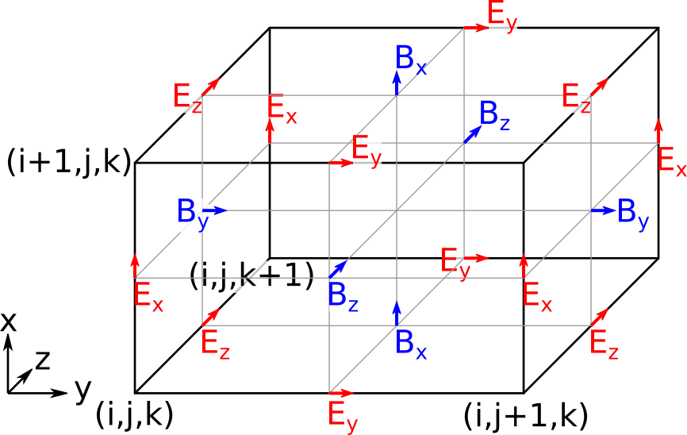
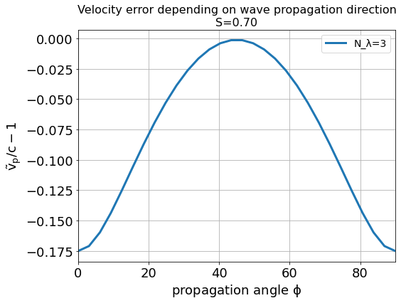
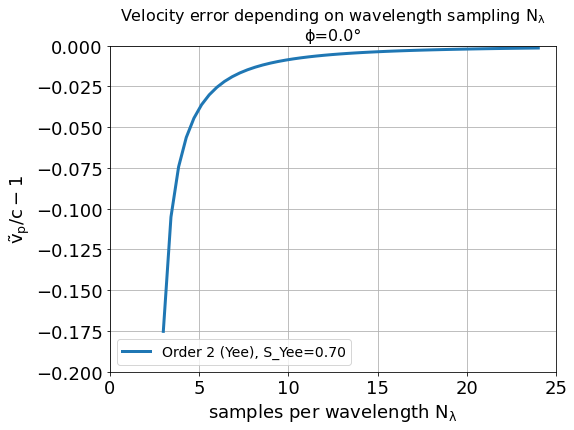
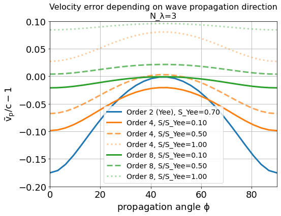
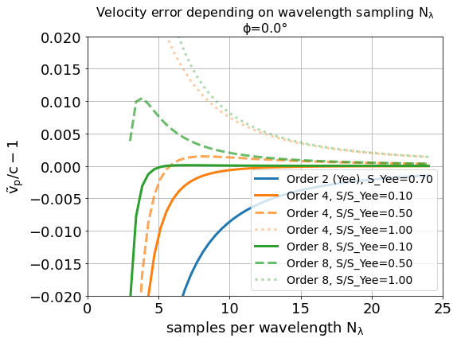
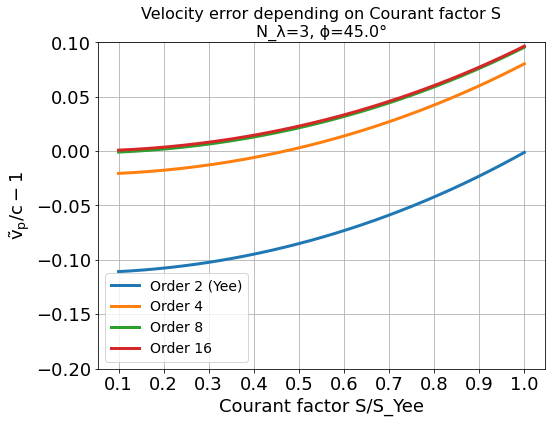

.. _model-AOFDTD:

Finite-Difference Time-Domain Method
====================================

.. sectionauthor:: Klaus Steiniger

For the discretization of Maxwell's equations on a mesh in PIConGPU, only the equations

.. math::

   \frac{1}{c^2}\frac{\partial}{\partial t}\vec E &= \nabla \times \vec B - \mu_0 \vec J

   \frac{\partial}{\partial t}\vec B &= - \nabla \times \vec E

are solved.
This becomes possible, first, by correctly solving Gauss's law
:math:`\nabla \cdot \vec{E} = \frac{1}{\varepsilon_0}\sum_s \rho_s` using
Esirkepov's current deposition method [Esirkepov2001]_ (or variants thereof) which solve the discretized continuity
equation exactly.
Second, by assuming that the initially given electric and magnetic field satisfy Gauss' laws.
Starting simulations in an initially charge free and magnetic-divergence-free space, i.e.

.. math::

   \nabla \cdot \vec E &= 0

   \nabla \cdot \vec B &= 0

is standard.

Discretization on a staggered mesh
----------------------------------
In the Finite-Difference Time-Domain method, above Maxwell's equations are discretized by replacing the partial space and
time derivatives with centered finite differences.
For example, the partial space derivative along :math:`x` of a scalar field :math:`u` at position
:math:`(i,j,k)` and time step :math:`n` becomes

.. math::

   \partial_x u(i\Delta x,j\Delta y,k\Delta z,n\Delta t) = \frac{u_{i+1/2,j,k}^n - u_{i-1/2,j,k}^n}{\Delta x}

and the temporal derivative becomes

.. math::

   \partial_t u(i\Delta x,j\Delta y,k\Delta z,n\Delta t) = \frac{u_{i,j,k}^{n+1/2} - u_{i,j,k}^{n-1/2}}{\Delta t},

when replacing with the lowest order central differences.
Note, with this leapfrog discretization or staggering, derivatives of field quantities are calculated at positions
between positions where the field quantities are known.

The above discretization uses one neighbor to each side from the point where the derivative is calculated yielding a
second order accurate approximation of the derivative.
Using more neighbors for the approximation of the spatial derivative is possible in PIConGPU and reduces the
discretization error.
Which is to say that the order of the method is increased.
The error order scales with twice the number of neighbors :math:`M` used to approximate the derivative.
The arbitrary order finite difference of order :math:`2M` reads

.. math::

   \partial_x u(i\Delta x,j\Delta y,k\Delta z,n\Delta t) &=  \sum\limits_{l=1/2}^{M-1/2}
      \left[ g^{2M}_l \frac{u_{i + l, j, k}^n - u_{i - l, j, k}^n}{\Delta x} \right]\,\mathrm{, where}

   g^{2M}_l &= \frac{(-1)^{l-1/2}}{2l^2} \frac{((2M-1)!!)^2}{(2M -1 - 2l)!! (2M -1 + 2l)!!}

with :math:`l=-M+1/2, -M+1+1/2, ..., -1/2, 1/2, ..., M-1/2` [Ghrist2000]_.
A recurrence relation for the weights exists,

.. math::

   g^{2M}_l &= (-1)\frac{(l-1)^2}{l^2} \frac{(2M+1-2l)}{(2M-1+2l)} g^{2M}_{l-1}

   g^{2M}_\frac{1}{2} &= \frac{16^{1-M}}{M} \left( \frac{(2M-1)!}{\left[(M-1)!\right]^2} \right)^2

Maxwell's equations on the mesh
-------------------------------
When discretizing on the mesh with centered finite differences, the spatial positions of field components need to be
chosen such that a field component, whose **temporal derivative** is
calculated on the left hand side of a Maxwell equation, is spatially positioned between the two field components whose
**spatial derivative** is evaluated on the right hand side of the respective Maxwell equation.
In this way, the spatial points where a left hand side temporal derivative of a field is evaluate lies exactly at the
position where the spatial derivative of the right hand side fields is calculated.
The following image visualizes the arrangement of field components in PIConGPU.

Component-wise and using second order finite differences for the derivative approximation, Maxwell's equations read in
PIConGPU

.. math::

   \frac{E_x\rvert_{i+1/2, j, k}^{n+1} - E_x\rvert_{i+1/2, j, k}^{n}}{c^2 \Delta t} =&
    \frac{B_z\rvert_{i+1/2, j+1/2, k}^{n+1/2} - B_z\rvert_{i+1/2, j-1/2, k}^{n+1/2}}{\Delta y}

   & - \frac{B_y\rvert_{i+1/2, j, k+1/2}^{n+1/2} - B_y\rvert_{i+1/2, j, k-1/2}^{n+1/2}}{\Delta z}
    - \mu_0 J_x\rvert_{i+1/2, j, k}^{n+1/2}

   \frac{E_y\rvert_{i, j+1/2, k}^{n+1} - E_y\rvert_{i, j+1/2, k}^{n}}{c^2 \Delta t} =&
    \frac{B_x\rvert_{i, j+1/2, k+1/2}^{n+1/2} - B_x\rvert_{i, j, k-1/2}^{n+1/2}}{\Delta z}

   & - \frac{B_z\rvert_{i+1/2, j+1/2, k}^{n+1/2} - B_z\rvert_{i-1/2, j+1/2, k}^{n+1/2}}{\Delta x}
    - \mu_0 J_y\rvert_{i, j+1/2, k}^{n+1/2}

   \frac{E_z\rvert_{i, j, k+1/2}^{n+1} - E_z\rvert_{i, j, k+1/2}^{n}}{c^2 \Delta t} =&
    \frac{B_y\rvert_{i+1/2, j, k+1/2}^{n+1/2} - B_y\rvert_{i-1/2, j, k+1/2}^{n+1/2}}{\Delta x}

   & - \frac{B_x\rvert_{i, j+1/2, k+1/2}^{n+1/2} - B_x\rvert_{i, j-1/2, k+1/2}^{n+1/2}}{\Delta y}
    - \mu_0 J_z\rvert_{i+1/2, j+1/2, k}^{n+1/2}

   \frac{B_x\rvert_{i, j+1/2, k+1/2}^{n+3/2} - B_x\rvert_{i, j+1/2, k+1/2}^{n+1/2}}{\Delta t} =&
    \frac{E_y\rvert_{i, j+1/2, k+1}^{n+1} - E_y\rvert_{i, j+1/2, k}^{n+1}}{\Delta z}
    - \frac{E_z\rvert_{i, j+1, k+1/2}^{n+1} - E_z\rvert_{i, j, k+1/2}^{n+1}}{\Delta y}

   \frac{B_y\rvert_{i+1/2, j, k+1/2}^{n+3/2} - B_y\rvert_{i+1/2, j, k+1/2}^{n+1/2}}{\Delta t} =&
    \frac{E_z\rvert_{i+1, j, k+1/2}^{n+1} - E_z\rvert_{i, j, k+1/2}^{n+1}}{\Delta x}
    - \frac{E_x\rvert_{i+1/2, j, k+1}^{n+1} - E_x\rvert_{i+1/2, j, k}^{n+1}}{\Delta z}

   \frac{B_z\rvert_{i+1/2, j+1/2, k}^{n+3/2} - B_z\rvert_{i+1/2, j+1/2, k}^{n+1/2}}{\Delta t} =&
    \frac{E_x\rvert_{i+1/2, j+1, k}^{n+1} - E_x\rvert_{i+1/2, j, k}^{n+1}}{\Delta y}
    - \frac{E_y\rvert_{i+1, j+1/2, k}^{n+1} - E_y\rvert_{i, j+1/2, k}^{n+1}}{\Delta x}

As can be seen from these equations, the components of the source current are located at the respective components of
the electric field.
Following Gauss's law, the charge density is located at the cell corner.

Using Esirkepov's notation for the discretized differential operators,

.. math::

   \nabla^+ u_{i,j,k} &= \left( \frac{u_{i+1,j,k} - u_{i,j,k}}{\Delta x},
                                \frac{u_{i,j+1,k} - u_{i,j,k}}{\Delta y}
                                \frac{u_{i,j,k+1} - u_{i,j,k}}{\Delta z}
                         \right)

   \nabla^- u_{i,j,k} &= \left( \frac{u_{i,j,k} - u_{i-1,j,k}}{\Delta x},
                                \frac{u_{i,j,k} - u_{i,j-1,k}}{\Delta y}
                                \frac{u_{i,j,k} - u_{i,j,k-1}}{\Delta z}
                         \right)\,,

the shorthand notation for the discretized Maxwell equations in PIConGPU reads

.. math::

   \frac{\vec E\rvert^{n+1} - \vec E\rvert^{n}}{c^2 \Delta t} &=
       \nabla^- \times \vec B\rvert^{n+1/2} - \mu_0 \vec J\rvert^{n+1/2}

   \frac{\vec B\rvert^{n+3/2} - \vec B\rvert^{n+1/2}}{\Delta t} &= - \nabla^+ \times \vec E\rvert^{n+1}

   \nabla^- \cdot \vec E\rvert^{n+1} &= \rho\rvert^{n+1}

   \nabla^+ \cdot \vec B\rvert^{n+3/2} &= 0\,,

with initial conditions

.. math::

   \nabla^- \cdot \vec E &= 0

   \nabla^+ \cdot \vec B &= 0\,.

The components :math:`E_x\rvert_{1/2, 0, 0}=E_y\rvert_{0, 1/2, 0}=E_z\rvert_{0, 0, 1/2}
=B_x\rvert_{I, J+1/2, K+1/2}=B_y\rvert_{I+1/2, J, K+1/2}=B_z\rvert_{I+1/2, J+1/2, K}=0` for all times when using
absorbing boundary conditions.
Here, :math:`I,J,K` are the maximum values of :math:`i,j,k` defining the total mesh size.

Note, in PIConGPU the :math:`\vec B`-field update is split in two updates of half the time step, e.g.

.. math::

   \frac{B_x\rvert_{i, j+1/2, k+1/2}^{n+1} - B_x\rvert_{i, j+1/2, k+1/2}^{n+1/2}}{\Delta t / 2} =
    \frac{E_y\rvert_{i, j+1/2, k+1}^{n+1} - E_y\rvert_{i, j+1/2, k}^{n+1}}{\Delta z}
    - \frac{E_z\rvert_{i, j+1, k+1/2}^{n+1} - E_z\rvert_{i, j, k+1/2}^{n+1}}{\Delta y}

and

.. math::

   \frac{B_x\rvert_{i, j+1/2, k+1/2}^{n+3/2} - B_x\rvert_{i, j+1/2, k+1/2}^{n+1}}{\Delta t / 2} =
    \frac{E_y\rvert_{i, j+1/2, k+1}^{n+1} - E_y\rvert_{i, j+1/2, k}^{n+1}}{\Delta z}
    - \frac{E_z\rvert_{i, j+1, k+1/2}^{n+1} - E_z\rvert_{i, j, k+1/2}^{n+1}}{\Delta y}

for the :math:`B_x` component, where the second half of the update is performed at the beginning of the next time step
such that the electric and magnetic field are known at equal time in the particle pusher and at the end of a time step.

Dispersion relation of light waves on a mesh
--------------------------------------------
The dispersion relation of a wave relates its oscillation period in time :math:`T` to its oscillation wavelength
:math:`\lambda`, i.e. its angular frequency :math:`\omega = \frac{2\pi}{T}` to wave vector
:math:`\vec k = \frac{2\pi}{\lambda} \vec e_k`.
For an electromagnetic wave in vacuum,

.. math::

   \left[ \frac{\omega}{c} \right]^2 = k_x^2 + k_y^2 + k_z^2\,.

However, on a 2D mesh, with arbitrary order finite differences for the spatial derivatives, the dispersion relation
becomes

.. math::

   \left[ \frac{1}{c\Delta t} \sin\left(\frac{\omega \Delta t}{2} \right) \right]^2 =
  \sum\limits_{l=1/2}^{M - 1/2} \sum\limits_{p=1/2}^{M - 1/2} g_l^{2M} g_p^{2M}
    \left\lbrace
      \frac{\sin(\tilde k_x l \Delta x)\sin(\tilde k_x p \Delta x)}{\Delta x^2}
      + \frac{\sin(\tilde k_y l \Delta y)\sin(\tilde k_y p \Delta y)}{\Delta y^2}
    \right\rbrace\,,

where :math:`\tilde k_x` and :math:`\tilde k_y` are the wave vector components on the mesh in :math:`x` and :math:`y`
direction, respectively.
As is obvious from the relation, the numerical wave vector will be different from the real world wave vector for a given
frequency :math:`\omega` due to discretization.

Dispersion Relation for Yee's Method
^^^^^^^^^^^^^^^^^^^^^^^^^^^^^^^^^^^^
Yee's Method [Yee1966]_ uses second order finite differences for the approximation of spatial derivatives.
The corresponding dispersion relation reads

.. math::

   \left[ \frac{1}{c\Delta t} \sin\left(\frac{\omega \Delta t}{2}\right) \right]^2 =
  \left[
      \frac{1}{\Delta x} \sin\left(\frac{\tilde k_x \Delta x}{2}\right)
  \right]^2
      + \left[
      \frac{1}{\Delta y} \sin\left(\frac{\tilde k_y \Delta y}{2}\right)
  \right]^2\,.

Solving for a wave's numerical frequency :math:`\omega` in dependence on its wave vector
:math:`\vec{\tilde k} = (\tilde k\cos\phi, \tilde k\sin\phi)`, where the angle :math:`\phi` is enclosed by the mesh's
:math:`x`-axis and the wave's propagation direction,

.. math::

   \omega = \frac{2}{\Delta t} \arcsin \xi\,\text{, where } \xi_\mathrm{max} = c\Delta t
     \sqrt{ \frac{1}{\Delta x^2} + \frac{1}{\Delta y^2} + \frac{1}{\Delta z^2}} \quad \text{(in 3D)}

reveals two important properties of the field solver.
(The 2D version is obtained by letting :math:`\Delta z \rightarrow \infty`.)

First, only within the range :math:`\xi_\mathrm{max} \leq 1` the field solver operates stable.
This gives the *Courant-Friedrichs-Lewy* stability condition relating time step to mesh spacing

.. math::

   c\Delta t < \frac{1}{\sqrt{ \frac{1}{\Delta x^2} + \frac{1}{\Delta y^2} + \frac{1}{\Delta z^2} }} \quad \text{(in 3D)}

Typically, :math:`\xi_\mathrm{max} = 0.995` is chosen.
Outside this stability region, the frequency :math:`\omega` corresponding to a certain wave vector becomes imaginary,
meaning that wave amplitudes can be nonphysical exponentially amplified [Taflove2005]_.

Second, there exists a purely numerical anisotropy in a wave's phase velocity :math:`\tilde v_p = \omega / \tilde k`
(speed of electromagnetic wave propagation) depending on its propagation direction :math:`\phi`, as depicted in the following figure

assuming square cells :math:`\Delta x = \Delta y = \Delta` and where :math:`S=c\Delta t / \Delta`,
:math:`N_\lambda=\lambda/\Delta`.
That is, for the chosen sampling of three samples per wavelength :math:`\lambda`, the phase velocities along a cell
edge and a cell diagonal differ by approximately 20%.
The velocity error is largest for propagation along the edge.
The phase velocity error can be significantly reduced by increasing the sampling, as visualized in the following figure
by the scaling of the velocity error with wavelength sampling for propagation along the cell edge

Another conclusion from this figure is, that a short-pulse laser with a large bandwidth will suffer from severe
dispersion if the sampling is bad.
In the extreme case where a wavelength is not even sampled twice on the mesh, its field is exponentially damped
[Taflove2005]_.

Given that most simulations employ short-pulse lasers propagating along the :math:`y`-axis and featuring a large bandwidth,
the resolution of the laser wavelength should be a lot better than in the example, e.g. :math:`N_\lambda=24`, to reduce
errors due to numerical dispersion.

Note, the reduced phase velocity of light can further cause the emission of numerical Cherenkov radiation by fast charged
particles  in the simulation [Lehe2012]_.
The largest emitted wavelength equals the wavelength whose phase velocity is as slow as the particle's velocity, provided
it is resolved at least twice on the mesh.

Dispersion Relation for Arbitrary Order Finite Differences
^^^^^^^^^^^^^^^^^^^^^^^^^^^^^^^^^^^^^^^^^^^^^^^^^^^^^^^^^^
Using higher order finite differences for the approximation of spatial derivatives significantly improves the
dispersion properties of the solver.
Most notably, the velocity anisotropy reduces and the dependence of phase velocity on sampling reduces, too.
Yet higher order solvers still feature dispersion.
As shown in the following picture, its effect is, however, not reduction of phase velocity but increase of phase velocity
beyond the physical vacuum speed of light.
But this can be tweaked by reducing the time step relative to the limit set by the stability criterion.

Note, it is generally not a good idea to reduce the time step in Yee's method significantly below the stability
criterion as this increases the absolute phase velocity error.
See the following figure,

from which the optimum Courant factor :math:`S=c\Delta t / \Delta` can be read off for a 2D, square mesh, too.

An important conclusion from the above figures showing velocity error over sampling is, that
a higher order solver, with a larger mesh spacing and a smaller time step than given by the above stability limit,
produces physically more accurate results than the standard Yee solver operating with smaller mesh spacing and a
time step close to the stability limit.

That is, it can be beneficial not only in terms of **physical accuracy**, but also in terms of **memory complexity**
and **time to solution**, to chose a higher order solver with lower spatial resolution and increased time sampling
relative to the stability limit.
Memory complexity scales with number of cells :math:`N_\mathrm{cells}` required to sample a given volume
:math:`N_\mathrm{cells}^d`, where :math:`d=2,3` is the dimension of the simulation domain,
which decreases for larger cells.
Time to solution scales with the time step and this can be larger with solvers of higher order compared to the Yee solver
with comparable dispersion properties (which requires a smaller cell size than the arbitrary order solver)
since the time step is limited by the stability condition which scales with cell size.
Since the cell size can be larger for arbitrary order solvers, the respective time step limit given by the stability
condition is larger and operating with a time step ten times smaller than the limit might still result in a larger
step than those of the comparable Yee solver.
Finally, physical accuracy is increased by the reduction of the impact of dispersion effects.

Usage
-----
The field solver can be chosen and configured in :ref:`fieldSolver.param <usage-params-core>`.

References
----------
.. [Esirkepov2001]
        T.Zh. Esirkepov,
        *Exact charge conservation scheme for particle-in-cell simulation with an arbitrary form-factor*,
        Computer Physics Communications 135.2 (2001): 144-153,
        https://doi.org/10.1016/S0010-4655(00)00228-9

.. [Ghrist2000]
        M. Ghrist,
        *High-Order Finite Difference Methods for Wave Equations*,
        PhD thesis (2000),
        Department of Applied Mathematics, University of Colorado

.. [Lehe2012]
        R. Lehe et al.
        *Numerical growth of emittance in simulations of laser-wakefield acceleration*,
        Physical Review Special Topics-Accelerators and Beams 16.2 (2013): 021301.

.. [Taflove2005]
        A. Taflove
        *Computational electrodynamics: the finite-difference time-domain method*
        Artech house (2005)

.. [Yee1966]
        K.S. Yee,
        *Numerical solution of initial boundary value problems involving Maxwell's equations in isotropic media*,
        IEEE Trans. Antennas Propagat. 14, 302-307 (1966)
