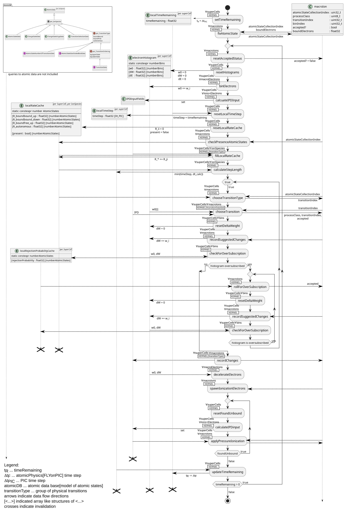

.. _model-atomicPhysics:

Atomic Physics/FLYonPIC
======================

.. moduleauthor:: Brian Marre

Introduction
------------

FLYonPIC is an advanced atomic physics model integrated with the PIConGPU PIC-simulation.

In contrast to the standard ionization models, FLYonPIC tracks excited states explicitly, allowing for a more detailed modelling of atomic physics process.

FLYonPIC is based on averaged states and models the evolution of the atomic state distribution time and space resolved,

- depending on the local plasma conditions
- without assuming a temperature or equilibrium
- self consistent with the PIC simulation.

This allows a more accurate prediction of ionization dynamics and the prediction of the atomic state distributions in non-thermal, transient plasmas, for example high-intensity short-pulse laser plasma interactions.

FLYonPIC is based on the [FlyCHK]_ atomic model and currently implements the following processes:

- electronic collisional de-/excitation
- spontaneous deexcitation
- electronic ionization (with ionization potential depression)
- autonomous ionization
- pressure ionization

FLYonPIC is energy and charge conserving and in the thermal average momentum conserving and solves the atomic rate equation time dependent and explicit with adaptive sub-stepping of the PIC-cycle.

In addition FLYonPIC will be extended in the near future to include:

- energy field ionization
- three body electronic recombination

Momentum conservation and photonic processes are also planned in the future.

Model Overview
--------------

FLYonPIC is based on tracking the atomic state of ions as a particle attribute of ion macro particles, with each "macro-ion" representing a phase space sample of exactly one atomic state.

.. note::
   FLYonPIC tracks only FlyCHK super configurations, i.e., FLYonPIC distinguishes only between states differing in the number of electron contained in atomic shells.

   Example: (1s^2)(2s^1 2p^2) and (1s^2)(2p^3) would be considered the same state (2,3,0, ...) by FLYonPIC.

The atomic state dynamics are modelled as some average rate of change to another atomic state, dependent current state, transition and local plasma conditions.

Over the set of all transitions, atomic state dynamics may be represented as a matrix of rates describing the change of the entire atomic state population with time.

This rate equation is solved in FLYonPIC by a Monte Carlo solver for every macro-ion individually and time dependent.

For this FLYonPIC,

- bins all macro-electrons in a super cell by energy
- calculates the energy dependent cross-section using approximation formulas for each transition
- calculates an energy dependent electron collision frequency depending on the local electron histogram.

.. note::

   A super cell is a patch of cells, usually 8x8x4, with the size being user configurable

The resulting energy dependent rates are then used by a monte-carlo solver to update the atomic states of all macro-ions independently in this super cell according to the rate equation.

This time dependent and explicit update is done at least once ever PIC-time step with adaptive sub stepping to assure numerical stability despite large changes in local rates.

Changes of the PIC-simulation state by the atomic physics/FLYonPIC step are propagated back to the PIC-simulation through ionization of macro-ions and macro-electron energy change.

Which transitions and states are included in this update is user configurable, with the user providing all transition coefficients and state energies via an input file.

Input Data for FLYonPIC
-----------------------

FLYonPIC requires user provided input data describing the properties of charge- and atomic-states as well the cross section coefficients of all transitions to be modelled for all atomic Physics ions species.

These data files may be generated from existing ScFLY input files using `flylite <https://github.com/BrianMarre/flylite/tree/dev>`_, simply

- add the ScFLY input file to the data folder as described in the flylite install description.
- set the Z of the wanted element in :code:`ExtractionAtomicData.py`
- execute the python script :code:`ExtractionAtomicData.py`

.. code-block::

   python ExtractionAtomicData.py

Alternatively users may create their own atomic data input files following the input file description below.

.. note::

   Atomic states must be specified by configNumber in all input files, see `AtomicConfigNumberConversion <https://github.com/ComputationalRadiationPhysics/SCFlyTools/blob/main/AtomicConfigNumberConversion.py>`_ for a conversion between occupation number level vector and atomic config number.

Charge State Input Data:
^^^^^^^^^^^^^^^^^^^^^^^^

one line for every charge stat, format of a line:

.. code-block::

   (charge state : uint) <space> (ionization Energy[eV] : float) <space> (Z_effective : uint)\n

Requirements:
~~~~~~~~~~~~~
- no charge state may be duplicated
- must be ordered ascending in charge state
- no charge state may be missing in the range 0 to Z-1
- completely ionized state must be left out
- no charge state larger than the atomic number of the species may be included

Atomic State Input Data:
^^^^^^^^^^^^^^^^^^^^^^^^
one line per atomic state, format of a line in the input file:

.. code-block::

   (configNumber : uint) <space> (exciation energy[eV] : float)\n

Requirements:
~~~~~~~~~~~~~
- no configNumber may be duplicated
- states must be ordered primarily ascending by charge state, secondarily ascending by configNumber
- chargeState derived from configNumber must be <= atomic Number of species

Pressure Ionization State Input Data:
^^^^^^^^^^^^^^^^^^^^^^^^^^^^^^^^^^^^^

One line per atomic state, format of a line in the input file:

.. code-block::

   (state configNumber : uint) <space> (pressure ioniaztion state configNumber : uint)\n

.. note::

   To disable pressure ionization for a state set it's pressure ionization states configNumber equal to its own configNumber

.. note::
   The pressure ionization state input is optional, set fileName in species definition to ``""`` to not specify it
   If no pressure ionization state input file is provided, FLYonPIC will try to find a good pressure ionization state for each atomic state in the atomic state input.

Requirements:
~~~~~~~~~~~~~
- must be ordered primarily ascending by atomic state charge state and secondary by atomic state configNumber, same order as in the atomic state input
- all atomic states in the input must have exactly one pressure ionization state
- all pressure ionization states must be defined as an atomic state in the atomic state input

Bound-Bound Transition Input Data:
^^^^^^^^^^^^^^^^^^^^^^^^^^^^^^^^^^
Each bound-bound transition is associated with a spontaneous deexcitation, electronic de- and electronic excitation.

One line per transition, format of a line in the input file:

.. code-block::

   (lower state configNumber: uint) <space> (upper state configNumber : uint) <space> (collisional oscillator strength : float) <space> (absorption oscillator strength : float) <space> (cxin1 : float) <space> (cxin2 : float) <space> (cxin3 : float) <space> (cxin4 : float) <space> (cxin5 : float)

.. note::

   cxin* ... gaunt coefficients

.. note::
   For bound-bound transitions the atomic state with the lower excitation energy is considered the lower state of an transition.

Requirements:
~~~~~~~~~~~~~
- lower- and upper state's charge states must be >= 0 and <= Z
- lower- and upper state's charge state must be the same
- transitions must be sorted primarily by lower state charge state, secondarily by lower state configNumber, tertiary by upper state charge state, quartary by upper state configNumber.

Bound-Free Transition Input Data:
^^^^^^^^^^^^^^^^^^^^^^^^^^^^^^^^^
Each bound-free transition is associated with a electronic ionization, and in future one field ionization and one recombination transition.

One line per transition, format of a line in the input file:

.. code-block::

   (lower state configNumber: uint) <space> (upper state configNumber : uint) <space> (collisional oscillator strength : float) <space> (absorption oscillator strength : float) <space> (cxin1 : float) <space> (cxin2 : float) <space> (cxin3 : float) <space> (cxin4 : float) <space> (cxin5 : float)  <space> (cxin6 : float) <space> (cxin7 : float) <space> (cxin8 : float)

.. note::

   cxin* ... gaunt coefficient, currently unused

.. note::

    For bound-free transitions the atomic state with the lower charge state is considered the lower state of an transition.

Requirements:
~~~~~~~~~~~~~
- lower- and upper state's charge states must be >= 0 and <= Z
- lower state's charge state must be smaller than the upper state's charge state
- transitions must be sorted primarily by lower state charge state, secondarily by lower state configNumber, tertiary by upper state charge state, quartary by upper state configNumber.

Autonomous Transition Input Data:
^^^^^^^^^^^^^^^^^^^^^^^^^^^^^^^^^
Each autonomous transition is associated with an autonomous ionization.

One line per transition, format of a line in the input file:

.. code-block::

   (lower state configNumber: uint) <space> (upper state configNumber : uint) <space> (rate[1/s] : float)

.. note::

    For autonomous transition the atomic state with the overall lower energy is considered the lower state of an transition.

Requirements:
~~~~~~~~~~~~~
- lower- and upper state's charge states must be >= 0 and <= Z
- lower state's charge state must be larger than the upper state's charge state
- transitions must be sorted primarily by lower state charge state, secondarily by lower state configNumber, tertiary by upper state charge state, quartary by upper state configNumber.

FLYonPIC step
-------------

overview of the FLYonPIC step

.. [FlyCHK]
   H.-K.Chung, M.H. Chen, R.W. Lee
   "Extension of atomic configuration sets of the Non-LTE model in the application to the Ka diagnostics of hot dense matter"
   High Energy Density Physics 3 (2007) 57-64
   https://doi.org/10.1016/j.hedp.2007.02.001
