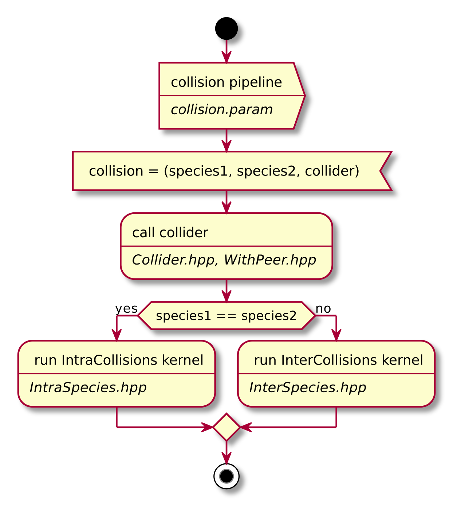
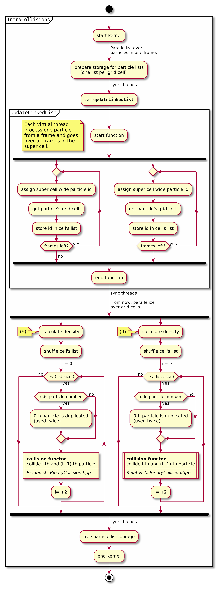
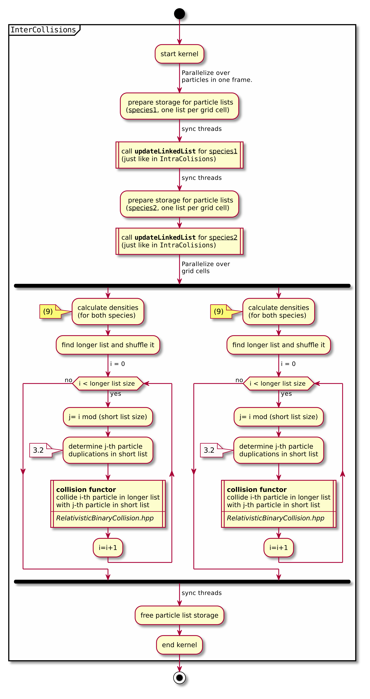
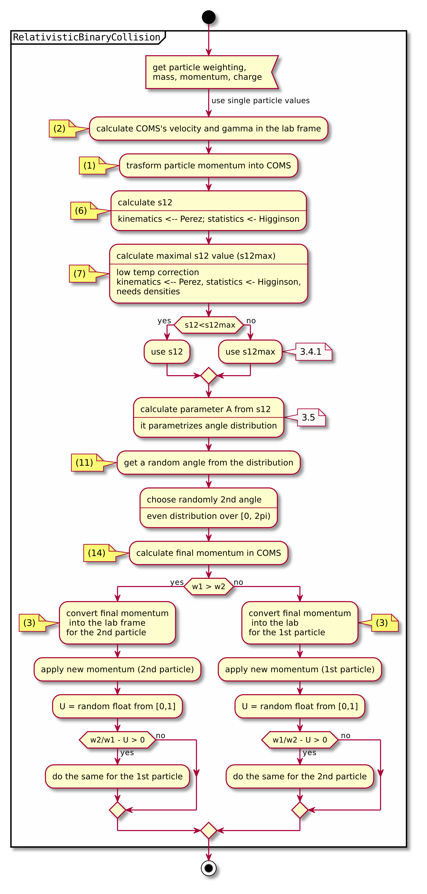
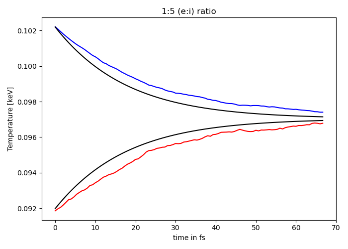
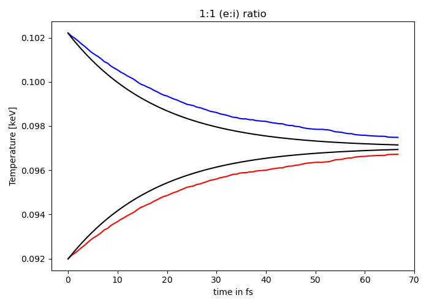
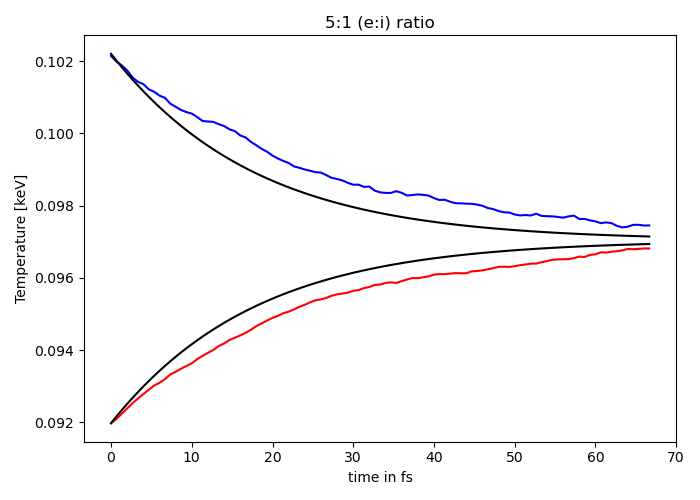
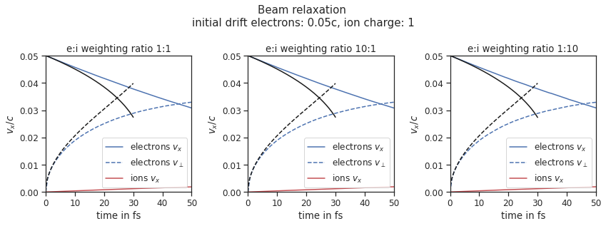
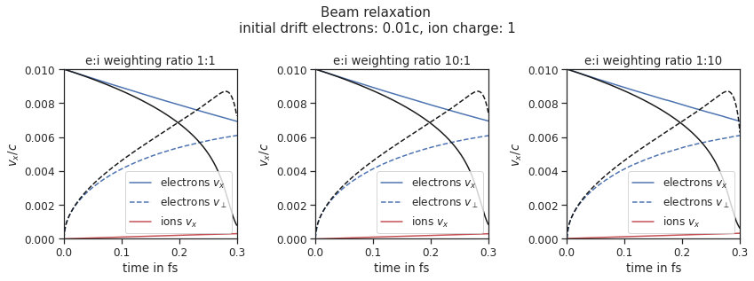
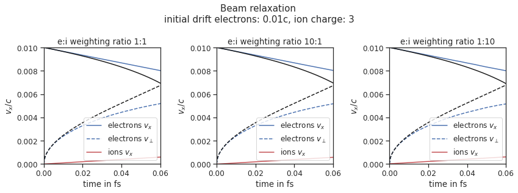

.. _model-binaryCollisions:

Binary collisions
=================

.. sectionauthor:: Pawel Ordyna

.. warning::
    This is an experimental feature.
    Feel free to use it but be aware that there is an unsolved bug causing some simulations to hang up.
    Follow the issue on github for more up to date information https://github.com/ComputationalRadiationPhysics/picongpu/issues/3461.

1 Introduction
--------------

The base PIC algorithm can’t resolve interactions between particles, such as coulomb collisions, on a scale smaller than one cell.
Taking them into consideration requires additional simulation steps.
In many PIC software solutions collisions are introduced as binary collisions.
With that approach every macro particle collides only with one other macro particle so that the computation time scales linearly with the number of particles, and not quadratically.

We have used the binary collisions algorithm introduced in :ref:`[1] <model-binaryCollisions-ref-Perez2012>` and updated it according to the corrections suggested in :ref:`[2] <model-binaryCollisions-ref-Higginson2020>`.
In that way, we were recreating the implementation from ``smilei`` :ref:`[3] <model-binaryCollisions-ref-smilei>`.
We have also tested our code against ``smilei`` by running the test cases from ``smilei``\ ’s documentation with PIConGPU.
We describe the algorithm and the underlying equations in detail in section :ref:`3 <model-binaryCollisions::section::algorithm>`.
Section :ref:`2 <model-binaryCollisions::section::usage>` explains the usage of the collision feature.
We show in section :ref:`4 <model-binaryCollisions::section::tests>` the test simulations that we used to compare ``PIConGPU`` with ``smilei``.

.. _model-binaryCollisions::section::usage:

2 Usage
-------

To enable collisions in your simulation you have to edit ``collision.param``.
There you can define the collision initialization pipeline.
The collisions are set up with the ``Collider`` class.
Each collider defines a list of species pairs that should collide with each other.
A pair can consist of two different species, for collisions between two different particle groups, or two identical species, for collision within one group.
Each collider sets a fix Coulomb logarithm (automatic online estimation of the Coulomb logarithm is not yet supported).
You can put in your initialization pipeline as many ``Collider`` objects as you need.
Leaving the ``CollisionPipeline`` empty disables collisions.

2.1 Basics
^^^^^^^^^^

Imagine you have two species in your simulation: ``Ions`` and ``Electrons``.
To enable collisions between the Ions and Electrons you would edit your param file in a following way:

.. code:: c++

   namespace picongpu
   {
       namespace particles
       {
           namespace collision
           {
               namespace precision
               {
                   using float_COLL = float_64;
               } // namespace precision
               /** CollisionPipeline defines in which order species interact with each other
                *
                * the functors are called in order (from first to last functor)
                */

               struct Params
               {
                   static constexpr float_X coulombLog = 5.0_X;
               };
               using Pairs = MakeSeq_t<Pair<Electrons, Ions>>;
               using CollisionPipeline = bmpl::
                   vector<Collider<binary::RelativisticBinaryCollision, Pairs, Params>>;
           } // namespace collision
       } // namespace particles
   } // namespace picongpu

Notice how the Coulomb logarithm is send to the collider in a struct.

If you now would like to add internal collisions (electrons – electrons and ions – ions) you just need to extend the line 20 so that it looks like that:

.. code:: c++

   using Pairs = MakeSeq_t<Pair<Electrons, Ions>, Pair<Electrons, Electrons>, Pair<Ions, Ions>>;

But what if you don’t want to have the same Coulomb logarithm for all collision types?
For that you need more colliders in your pipeline.
Here is an example with :math:`\Lambda = 5` for electron-ion collisions and :math:`\Lambda=10` for electron-electron and ion-ion collisions.

.. code:: c++

    struct Params1
    {
       static constexpr float_X coulombLog = 5.0_X;
    };
    struct Params2
    {
       static constexpr float_X coulombLog = 10.0_X;
    };
    using Pairs1 = MakeSeq_t<Pair<Electrons, Ions>>;
    using Pairs2 = MakeSeq_t<Pair<Electrons, Electrons>, Pair<Ions, Ions>>;
    using CollisionPipeline =
        bmpl::vector<
            Collider<binary::RelativisticBinaryCollision, Pairs1, Params1>,
            Collider<binary::RelativisticBinaryCollision, Pairs2, Params2>
        >;

2.2 Particle filters
^^^^^^^^^^^^^^^^^^^^

You can also use particle filters to further refine your setup.
The ``Collider`` class can take one more, optional, template argument defining a pair of particle filters.
Each filter is applied respectively to the first and the second species in a pair.
You need to define your filters in ``particleFilters.param`` and than you can use them, for example, like that:

.. code:: c++

    using Pairs1 = MakeSeq_t<Pair<Electrons, Ions>>;
    using Pairs2 = MakeSeq_t<Pair<Electrons, Electrons>, Pair<Ions, Ions>>;
    using CollisionPipeline =
        bmpl::vector<
            Collider<
                binary::RelativisticBinaryCollision,
                Pairs1,
                Params1,
                FilterPair<filter::FilterA, filter::FilterB>>,
            Collider<
                binary::RelativisticBinaryCollision,
                Pairs2,
                Params2,
                OneFilter<filter::FilterA>
            >;

Here only the electrons passing the A-filter will collide with ions but only with the ions that pass the B-filter.
If the filters are identical you can use ``OneFilter`` instead of ``FilterPair``.
For collisions within one species the filters in ``FilterPair`` **have** to be identical since there is only one particle group colliding.

A full functional example can be found in the ``CollisionsBeamRelaxation`` test, where particle filters are used to enable each of the three colliders only in a certain part of the simulation box.

2.3 Precision
^^^^^^^^^^^^^

Highly relativistic particles can cause numerical errors in the collision algorithm that result in NaN values.
To avoid that, by default, all the kinematics of a single binary collision is calculated in the 64 bit precision, regardless of the chosen simulation precision.
Until now, this has been enough to avoid NaNs but we are looking into better solutions to this problem.
You can change this setting by editing the

.. code:: c++

   using float_COLL = float_64;

line. You can set it to

.. code:: c++

   using float_COLL = float_X;

to match the simulation precision or to

.. code:: c++

   using float_COLL = float_32;

for explicit single precision usage.
If you use PIConGPU with the 32 bit precision, lowering the collision precision will speed up your simulation and is recommended for non–relativistic setups.

.. _model-binaryCollisions::section::algorithm:

3 Algorithm
-----------

3.1 Algorithm overview
^^^^^^^^^^^^^^^^^^^^^^

A short summary of the important algorithm steps in the case of inter-species collisions.
The case of intra-collisions is very similar.
See figures :numref:`model-binaryCollisions::fig::flow::all`, :numref:`model-binaryCollisions::fig::flow::inter`, :numref:`model-binaryCollisions::fig::flow::intra`, :numref:`model-binaryCollisions::fig::flow::func` for more details.

#. Sort particles from a super cell into particle lists, one list for each grid cell.

#. In each cell, shuffle the list with more particles.

#. Collide each particle from the first longer list with a particle from the shorter one (or equally long).
   When you run out of particles in the shorter list, start from the beginning of that list and collide some particles more than once.

   #. Determine how many times the second particle will be collided with some particle from the longer list (in the current simulation step).

   #. Read particle momenta.

   #. Change into the center of mass frame.

   #. Calculate the :math:`s` parameter.

   #. Generate a random azimuthal collision angle :math:`\varphi \in (0, 2\pi]`.

   #. Get the cosine of the 2nd angle :math:`\theta` from its probability distribution (depends on :math:`s`).

   #. Use the angles to calculate the final momenta (in the COM frame).

   #. Get the new momenta into the lab frame.

   #. | Apply the new momentum to the macro particle A (smaller weighting).
      | Do the same for the macro particle B (bigger weighting) but with a probability equal to the weighting ratio of the particles A and B.

#. Free up the memory used for the particle lists.

   Flow chart showing the complete algorithm. For more detail on intra-collisions see fig.  :numref:`model-binaryCollisions::fig::flow::intra`, for more details on inter-collisions see fig. :numref:`model-binaryCollisions::fig::flow::inter`.
   Numbers in brackets refer to equations other to sections.

   Flow chart showing the part of the collision algorithm that is unique for intra-collisions.
   For more details on collisions functor see fig. :numref:`model-binaryCollisions::fig::flow::func` .
   Numbers in brackets refer to equations other to sections.

   Flow chart showing the part of the collision algorithm that is unique for inter-collisions.
   Numbers in brackets refer to equations other to sections.

   Flow chart showing the ``RelativisticBinaryCollision`` collisions functor.
   Numbers in brackets refer to equations other to sections.

.. _model-binaryCollisions::details:duplication:

3.2 Details on macro particle duplication
^^^^^^^^^^^^^^^^^^^^^^^^^^^^^^^^^^^^^^^^^

First step that requires some more detailed explanation is the step 3.1 .
In a situation where there are less macro particles, inside one cell, of one species than the other one not every macro particle has its collision partner.
Similar problem emerges in a case of intra-collisions when the particle number is odd.
We deal with that issue using an approach introduced in :ref:`[2] <model-binaryCollisions-ref-Higginson2020>`.
We collide, in such situation, some macro particles more than once.
To account for that, we use corrected particle weights :math:`w_{0/1} =\frac{1}{\max\{d_0, d_1\}}`, where :math:`d_{0/1}` are the number of collisions for the colliding macro particles.

Let us consider the inter-collisions first.
The i–th particle from the longer list is collided with the (:math:`i \mod m)` –th particle in the shorter one (:math:`m` is the length of the shorter list).
All of the particles from the longer list will collide just once.
So the correction for each binary collision is :math:`1/d` of the particle from the shorter list.
:math:`d` is determined in the following way:

.. code:: c++

           d = floor(n / m);
           if (i % m ) < (n % m) d = d + 1;

:math:`i` – particle index in the long list, :math:`n` – long list length, :math:`m` – short list length, :math:`d` – times the particle from the shorter list is used in the current step.

In the intra-collisions, the i–th (:math:`i` is odd) particle collides with the :math:`i+1`–th one. When there is, in total, an odd number of particles to collide, the first particle on the list collides twice.
At first it is collided with the second one and in the end with the last one.
All other particles collide once. So :math:`d` will be 2 for the first collision (1st with 2nd particle) and for the last one (n-th with 1st particle).
For the other collisions it’s 1.

3.3 Details on the coordinate transform
^^^^^^^^^^^^^^^^^^^^^^^^^^^^^^^^^^^^^^^

A binary collision is calculated in this model in the center of mass frame.
A star :math:`^*` denotes a COMS variable.

We use the coordinate transform from :ref:`[1] <model-binaryCollisions-ref-Perez2012>`:

.. math::
    \mathbf{p}^* = \mathbf{p}_{\text{lab}} + ( \frac{\gamma_C -1}{\left|\mathbf{v}_C\right|^2} \mathbf{v}_C \cdot\mathbf{v}_{\text{lab}} - \gamma_C) m\gamma \mathbf{v}_C \ ,
   :label: eq:trans_fw

where :math:`\mathbf{v}_C` is the velocity of the CMOS in the lab frame, :math:`\gamma` is the [list::duplications] factor in the lab frame, :math:`m` the particle mass and :math:`\gamma_C` the gamma factor of the CMOS frame.

.. math:: \mathbf{v}_C = \frac{\mathbf{p}_{\text{lab},0} + \mathbf{p}_{\text{lab}, 1}}{m_0\gamma_0 + m_1\gamma_1}
   :label: eq:v_c

The inverse transformation:

.. math:: \mathbf{p_{\text{lab}}} = \mathbf{p}^* + ( \frac{\gamma_C -1}{\left|\mathbf{v}_C\right|^2} \mathbf{v}_C \cdot\mathbf{p}^* + m\gamma^* \gamma_C) \mathbf{v}_C \ ,
    :label: eq:trans_inv

where

.. math:: \gamma^* = \gamma_C \gamma( 1 - \frac{\mathbf{v}_C \cdot \mathbf{v}_{\text{lab}}}{c^2}) \ .
    :label: eq:gamma_star

3.4 Details on the :math:`s` parameter
^^^^^^^^^^^^^^^^^^^^^^^^^^^^^^^^^^^^^^

.. math:: s = \frac{1}{2} N \left<\theta^{*2}\right>
    :label: eq:s_param

:math:`N` is the number of real collisions.
It’s the number of small angle collisions of a test particle represented by one of the macro particles with all the potential collision partners in a cell (here real particles not macro particles) in the current time step assuming the relative velocity is the one of the two colliding macro particles.
:math:`\left<\theta^{*2}\right>` is the averaged squared scattering angle for a single collision (of real particles).
According to :ref:`[2] <model-binaryCollisions-ref-Higginson2020>` :math:`s` is a normalized path length.

To calculate this parameter we use the relativistic formula from :ref:`[1] <model-binaryCollisions-ref-Perez2012>` and adjust it so it fits the new corrected algorithm from :ref:`[2] <model-binaryCollisions-ref-Higginson2020>`.

.. math::
    \begin{split}
     s_{01} =& \frac{\Delta T \log \Lambda q_0^2 q_1^2}{4\pi \varepsilon_0^2 c^4 m_0 \gamma_0 m_1 \gamma_1} \\
     & \times  \frac{\gamma_C\left|\mathbf{p}_0^*\right|}{m_0\gamma_0 + m_1 \gamma_1} ( m_0 \gamma_0^* m_1 \gamma_1^* c^2 \left|\mathbf{p}_0^*\right|^{-2} +1 )^2 \\
     & \times  N_{\text{partners}} V_{\text{cell}}^{-1} \max\{\frac{w_0}{d}, \frac{w_1}{d}\} \ .
     \end{split}
    :label: eq:s12

Here: :math:`\Delta T` – time step duration, :math:`\log \Lambda` – Coulomb logarithm, :math:`q_0,q_1` – particle charges, :math:`\gamma_0, \gamma_1` particles gamma factors(lab frame), :math:`N_{\text{partners}}` is the number of collision partners (macro particles), :math:`V_{\text{cell}}` – cell volume, :math:`w_0, w_1` particle weightings, :math:`d` was defined in :ref:`3.2 <model-binaryCollisions::details::duplication>`.

For inter-species collisions :math:`N_{\text{partners}}` is equal to the size of the long particle list.
For intra-species collisions :math:`N_{\text{partners}}` = :math:`n - 1 + (n \mod 2)`,where :math:`n` is the number of macro particles to collide.

The fact that :math:`s_{01}` depends only on the higher weighting is accounted for by the rejection method in the 3.9 step.

3.4.1 Low temperature limit
~~~~~~~~~~~~~~~~~~~~~~~~~~~

According to :ref:`[1] <model-binaryCollisions-ref-Perez2012>` equation :eq:`eq:s12` will provide non physical values for low temperatures.
More specifically, it will result in :math:`s` values corresponding to scattering lengths smaller than the average particle distance :math:`(\frac{V}{n})^{\frac{1}{3}}`.
:ref:`[1] <model-binaryCollisions-ref-Perez2012>` provides a maximal value for :math:`s_{01}`:

.. math::
   \begin{split}
        s_{01}^{\max} =& (\frac{4\pi}{3})^{1/3} \frac{\Delta T(m_0 + m_1)}{\max  \{ m_0 n_0^{2/3}, m_1 n_1^{2/3}\}} \mathbf{v}_{\text{rel}}^* \\
        & \times  N_{\text{partners}} V_{\text{cell}}^{-1} \max\{\frac{w_0}{d}, \frac{w_1}{d}\} \ .
    \end{split}
   :label: eq:s12_max

with

.. math:: \mathbf{v}^*_{\text{rel}} = \frac{(m_1\gamma_1 + m_2\gamma_2)p_1^*}{m_1\gamma_1^*m_2\gamma_2^*\gamma_C} \ .
    :label: eq:rel_vel

where the relativistic factor :math:`(1 + v_1^*v_2^*/c^2)^{-1}` has been left out.

For each binary collision both values are calculated and the smallest one is used later.
The particle density is just the sum of all particle weightings from one grid cell divided by cell volume

.. math:: n = \frac{1}{V_{\text{cell}}} \sum_{i} w_i \ .
    :label: eq:dens

.. note::
    It is not checked if the collision is really non-relativistic.
    If the low temp limit is smaller than :math:`s_{01}` due to some other reason, e.g. an overflow in :math:`s_{01}` calculation, the code will use this limit regardless of the particle being relativistic or not which could be physically incorrect.

3.5 Details on the scattering angle distribution
^^^^^^^^^^^^^^^^^^^^^^^^^^^^^^^^^^^^^^^^^^^^^^^^

The distribution for the cumulative angle :math:`\chi` as a function of :math:`s` was introduced in :ref:`[4] <model-binaryCollisions-ref-Nanbu1997>`

.. math:: F(\chi) = \frac{A(s) \sin \chi}{2 \sinh A(s)} e^{A(s) \cos \chi} \ .
    :label: eq:dist

We obtain a random value for the cosine from :math:`F` with

.. math:: \cos \chi = A^{-1} \ln(e^{-A} + 2U \sinh A) \ ,
    :label: eq:cos

where :math:`U` is a random float between 0 and 1.
The parameter :math:`A` is obtained by solving

.. math:: \coth A - A^{-1} = e^{-s} \ \ .
    :label: eq:A_impl

The algorithm approximates :math:`A` in a following way :ref:`[1] <model-binaryCollisions-ref-Perez2012>`

If :math:`\mathbf{0.1 \leq s < 3}` then:
   .. math::
      :label: eq:A_inv

      \begin{split}
                      A^{-1} &= 0.0056958 + 0.9560202 s \\
                             &- 0.508139 s^2 + 0.47913906 s^3 \\
                             &- 0.12788975 s^4 + 0.02389567 s^5 \ \ .
      \end{split}

If :math:`\mathbf{3\leq s < 6}` then:
    :math:`A=3e^{-s}`

For :math:`s < 0.1` :math:`\cos \chi = 1 + s\ln U` to avoid an overflow in the exponential.
In the :math:`s\rightarrow \infty` limit scattering becomes isotropic :ref:`[4] <model-binaryCollisions-ref-Nanbu1997>` so that we can take :math:`\cos \chi = 2U -1` for :math:`s > 6`.

3.6 Details on final momentum calculation
^^^^^^^^^^^^^^^^^^^^^^^^^^^^^^^^^^^^^^^^^

The final particle momenta in the COMS frame are calculated with the following formula from :ref:`[1] <model-binaryCollisions-ref-Perez2012>`

.. math::
   :label: eq:matrix

   \mathbf{p}_{1f}^* = -\mathbf{p}_{2f}^* =
   \begin{pmatrix}
   \frac{p_{1x}^*p_{1z}^*}{p_{1\perp}^*} &  \frac{p_{1y}^*p_{1}^*}{p_{1\perp}^*} & p_{1x}^* \\
   \frac{p_{1y}^*p_{1z}^*}{p_{1\perp}^*} &  \frac{p_{1x}^*p_{1}^*}{p_{1\perp}^*} & p_{1y}^* \\
   -p_{1\perp}^* & 0 & p_{1z}^*
   \end{pmatrix}
   \cdot
   \begin{pmatrix}
   \sin\theta^*\cos\varphi^* \\
   \sin\theta^*\sin\varphi^* \\
   \cos\theta^*
   \end{pmatrix}
   \ .

.. _model-binaryCollisions::section::tests:

4 Tests
-------

For testing we plan to reproduce all the test cases from ``smilei``’s documentation( https://smileipic.github.io/Smilei/collisions.html).
For now we have done the thermalization and the beam relaxation tests.
The simulations that we used are available under ``share/picongpu/tests``.

.. _model-binaryCollisions::section::tests::thermalization:

4.1 Thermalization
^^^^^^^^^^^^^^^^^^

In this example there are two particle populations — electrons and ions.
They are thermally initialized with different temperatures and their temperatures get closer to each other with time.
The usual PIC steps are disabled (there is no field solver and no pusher).
The thermalization happens solely due to the binary collisions.
We enable inter-collisions for ions and electrons as well as collisions between the two species.
Simulation parameters are listed in table :numref:`tab::therm`.
The species temperatures are calculated in post processing from an ``openPMD`` output.
The results are shown in fig. :numref:`model-binaryCollisions::fig::thermalization::1to5`, :numref:`model-binaryCollisions::fig::thermalization::1to1`, and  :numref:`model-binaryCollisions::fig::thermalization::5to1` for three different macro particle weight ratios.
The theoretical curves are obtained from the same formula that was used by ``smilei``\ ’s developers and originates from the NRL plasma formulary :ref:`[5] <model-binaryCollisions-ref-NRL>`.

.. math:: \frac{\mathrm{d}T_\alpha}{\mathrm{d}t} = \nu_\epsilon(T_\beta -T_\alpha)

.. math::

   \nu_\epsilon = \frac{2}{3}\sqrt\frac{2}{\pi} \frac{e^4\,Z^{\star 2} \sqrt{m_em_i}\,n_i\,\ln\Lambda }{ 4 \pi\varepsilon_0^2 \,\left(m_eT_e+m_iT_i\right)^{3/2} }

   Electron (blue) and ion (red) temperature over time in the thermalization test.
   The electron to ion weight ratio in the simulation is 1:5.
   Black lines are the the theoretical curves.

   Electron (blue) and ion (red) temperature over time in the thermalization test.
   The electron to ion weight ratio in the simulation is 1:1.
   Black lines are the the theoretical curves.

   Electron (blue) and ion (red) temperature over time in the thermalization test.
   The electron to ion weight ratio in the simulation is 5:1.
   Black lines are the the theoretical curves.

.. table:: Simulation parameters in the thermalization test
      :name: tab::therm

      +----------------------------------+------------------------------------------------------+
      | parameter or setting             | value                                                |
      +==================================+======================================================+
      | time step duration               | 2/3 fs                                               |
      +----------------------------------+------------------------------------------------------+
      | time steps in the simulation     | 100                                                  |
      +----------------------------------+------------------------------------------------------+
      | density profile                  | homogeneous                                          |
      +----------------------------------+------------------------------------------------------+
      | density                          | 1.1 × 10\ :sup:`28` m\ :sup:`-3`                     |
      +----------------------------------+------------------------------------------------------+
      | cell side length                 | :math:`\frac{1}{3}c \cdot 10^{-13} \approx 10 \mu m` |
      +----------------------------------+------------------------------------------------------+
      | ion mass                         | :math:`10 \ m_e`                                     |
      +----------------------------------+------------------------------------------------------+
      | ion charge                       | +1                                                   |
      +----------------------------------+------------------------------------------------------+
      | initial ion temperature          | 1.8 × 10\ :sup:`−4` :math:`m_e c^2`                  |
      +----------------------------------+------------------------------------------------------+
      | initial electron temperature     | 2.0 × 10\ :sup:`−4` :math:`m_e c^2`                  |
      +----------------------------------+------------------------------------------------------+
      | Coulomb logarithm                | 5                                                    |
      | (inter–collisions)               |                                                      |
      +----------------------------------+------------------------------------------------------+
      | Coulomb lgarithm                 | 1000                                                 |
      | (intra–collisions)               |                                                      |
      +----------------------------------+------------------------------------------------------+
      | geometry                         | 2D                                                   |
      +----------------------------------+------------------------------------------------------+
      | grid                             | 12x12                                                |
      +----------------------------------+------------------------------------------------------+
      | super cell size                  | 4x4                                                  |
      +----------------------------------+------------------------------------------------------+
      | macro particles per cell (ions)  | 5000, 1000, 5000                                     |
      | setups 1, 2, 3                   |                                                      |
      +----------------------------------+------------------------------------------------------+
      | macro pearticles per cell        | 5000, 5000, 1000                                     |
      | (electrons)                      |                                                      |
      | setups 1, 2, 3                   |                                                      |
      +----------------------------------+------------------------------------------------------+

.. _model-binaryCollisions::section::tests::beamRelaxation:

4.2 Beam relaxation
^^^^^^^^^^^^^^^^^^^

A population of electrons with a very small temperature and a drift velocity (the beam) is colliding with ions.
Due to the collisions the velocity distribution of electrons is changing and the drift momentum is transferred into the electron transversal momentum and partially into ion momenta.
In this test only the inter-collisions (between ions and electrons) are enabled.

There are three slightly different setups with varying electron drift velocity, ion charge and time step duration.
Additionally each setup performs the collisions with three different electron to ion weight ratios: 1:1, 5:1, 1:5.
This is achieved by dividing the simulation box into three parts and enabling collisions only for one ratio in each part.
All important simulation parameters can be found in tables :numref:`tab::beam_1` and :numref:`tab::beam_2`.

The figure shows the electron and ion drift velocities :math:`\left<v_x\right>`, electron transversal velocity :math:`\sqrt{\left< v_\perp^2\right>}`, as well as the ion drift velocity, developing over time.
The theoretical curves where calculated using the following formulas from the NRL formulary :ref:`[5] <model-binaryCollisions-ref-NRL>` :

.. math:: \frac{\mathrm{d}v_x}{\mathrm{d}t} = \nu_s v_x

.. math:: \frac{\mathrm{d}}{\mathrm{d}x}(v_{e,\perp} - \bar{v}_{e,\perp} )^2 = \nu_\perp v_x^2

with

.. math:: \nu_s = (1  + \frac{m_e}{m_i})\Psi(x)\nu_0

.. math:: \nu_\perp = 2((1- 0.5 x) \Psi(x) + \Psi'(x))\nu_0

.. math:: x = \frac{m_i v_e^2}{2 k_B T_i}

.. math:: v_0 = \frac{e^2 q_i^2 n_i  \ln\Lambda}{4 \pi \varepsilon_0 m_e^2 v_e^3}

.. math:: \Psi(x) = \Gamma(\sqrt{x}) - \frac{2}{\sqrt{\pi}} e^{-x}\sqrt{x}

.. math:: \Psi'(x) = \frac{2}{\sqrt{\pi}} e^{-x} \sqrt{x} \ .

Where :math:`v_x` is the electron drift velocity and :math:`v_e` is the electron drift relative to the ion background.
The ion drift and ion temperature :math:`T_i` are obtained from the simulation.
The theory is valid only in the beginning where the velocity distribution is still more or less Maxwellian.

   Electron drift velocity :math:`\left<v_x\right>`, electron transversal velocity :math:`\sqrt{\left< v_\perp^2\right>}`, and ion drift velocities from the beam equilibration example setup 1.

   Electron drift velocity :math:`\left<v_x\right>`, electron transversal velocity :math:`\sqrt{\left< v_\perp^2\right>}`, and ion drift velocities from the beam equilibration example setup 2.

   Electron drift velocity :math:`\left<v_x\right>`, electron transversal velocity :math:`\sqrt{\left< v_\perp^2\right>}`, and ion drift velocities from the beam equilibration example setup 3.

.. table:: Collisions in the 3 parts of the simulation box in the beam relaxation example
    :name: tab::beam_1

    +---------------------------------------+------------+-------------+------------+
    |parameter                              | upper part | middle part | lower part |
    +=======================================+============+=============+============+
    | macro particles per cell (ions)       |  1000      | 1000        |   100      |
    +---------------------------------------+------------+-------------+------------+
    | macro particles per cell (electrons)  |  1000      |  100        |  1000      |
    +---------------------------------------+------------+-------------+------------+

.. table:: Simulation parameters in beam the relaxation test
    :name: tab::beam_2

    +----------------------------------+----------------------------------+---------------------------------+---------------------------------+
    |     parameter or setting         |                                          value                                                       |
    +----------------------------------+----------------------------------+---------------------------------+---------------------------------+
    |                                  |    setup 1                       |       setup 2                   |      setup 3                    |
    +==================================+==================================+=================================+=================================+
    | time step duration               |    :math:`\frac{2}{3}` fs        |  :math:`\frac{0.01}{3}` fs      |    :math:`\frac{0.002}{3}` fs   |
    +----------------------------------+----------------------------------+---------------------------------+---------------------------------+
    |   time steps in the simulation   |                                 200                                                                  |
    +----------------------------------+----------------------------------+---------------------------------+---------------------------------+
    | density profile                  |                               homogeneous                                                            |
    +----------------------------------+----------------------------------+---------------------------------+---------------------------------+
    | density electrons                | 1.1 × 10\ :sup:`28` m\ :sup:`-3`                                                                     |
    +----------------------------------+----------------------------------+---------------------------------+---------------------------------+
    | density ions                     | 1.1 × 10\ :sup:`28` m\ :sup:`-3` | 1.1 × 10\ :sup:`28` m\ :sup:`-3`| 3.7 × 10\ :sup:`27` m\ :sup:`-3`|
    +----------------------------------+----------------------------------+---------------------------------+---------------------------------+
    | cell side length                 | :math:`\frac{1}{15}c  \cdot 10^{-13} \approx 2\mu m`                                                 |
    +----------------------------------+----------------------------------+---------------------------------+---------------------------------+
    | ion mass                         | :math:`10 \ m_e`                                                                                     |
    +----------------------------------+----------------------------------+---------------------------------+---------------------------------+
    | ion charge                       | +1                               | +1                              |        +3                       |
    +----------------------------------+----------------------------------+---------------------------------+---------------------------------+
    | initial electron drift           | :math:`0.05c`                    | :math:`0.01c`                   | :math:`0.01c`                   |
    +----------------------------------+----------------------------------+---------------------------------+---------------------------------+
    | initial ion temperature          | 0.00002 :math:`m_e c^2`                                                                              |
    +----------------------------------+----------------------------------+---------------------------------+---------------------------------+
    | initial electron temperature     | 0.0000002 :math:`m_e c^2`                                                                            |
    +----------------------------------+----------------------------------+---------------------------------+---------------------------------+
    | Coulomb logarithm                | 5                                                                                                    |
    +----------------------------------+----------------------------------+---------------------------------+---------------------------------+
    | geometry                         | 2D                                                                                                   |
    +----------------------------------+----------------------------------+---------------------------------+---------------------------------+
    | grid                             | 12x12                                                                                                |
    +----------------------------------+----------------------------------+---------------------------------+---------------------------------+
    | super cell size                  | 4x4                                                                                                  |
    +----------------------------------+----------------------------------+---------------------------------+---------------------------------+

References
----------

.. container:: references csl-bib-body
   :name: refs

   .. container:: csl-entry
      :name: model-binaryCollisions-ref-Perez2012

      [1]F. Pérez, L. Gremillet, A. Decoster, M. Drouin, and E. Lefebvre, Improved modeling of relativistic collisions and collisional ionization in particle-in-cell codes, Physics of Plasmas 19, 083104 (2012).

   .. container:: csl-entry
      :name: model-binaryCollisions-ref-Higginson2020

      [2]D. P. Higginson, I. Holod, and A. Link, A corrected method for Coulomb scattering in arbitrarily weighted particle-in-cell plasma simulations, Journal of Computational Physics 413, 109450 (2020).

   .. container:: csl-entry
      :name: model-binaryCollisions-ref-smilei

      [3]J. Derouillat, A. Beck, F. Pérez, T. Vinci, M. Chiaramello, A. Grassi, M. Flé, G. Bouchard, I. Plotnikov, N. Aunai, J. Dargent, C. Riconda, and M. Grech, SMILEI: A collaborative, open-source, multi-purpose particle-in-cell code for plasma simulation, Computer Physics Communications 222, 351 (2018).

   .. container:: csl-entry
      :name: model-binaryCollisions-ref-Nanbu1997

      [4]K. Nanbu, Theory of cumulative small-angle collisions in plasmas, Physical Review E - Statistical Physics, Plasmas, Fluids, and Related Interdisciplinary Topics 55, 4642 (1997).

   .. container:: csl-entry
      :name: model-binaryCollisions-ref-NRL

      [5]A. S. Richardson, NRL Plasma Formulary, (2019).
