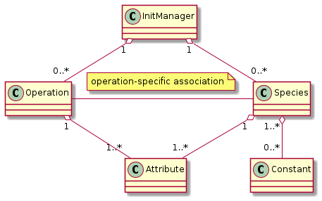
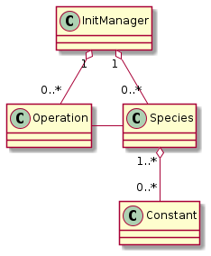
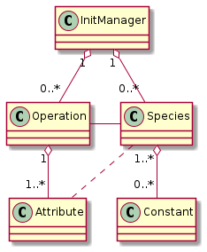
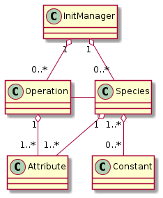
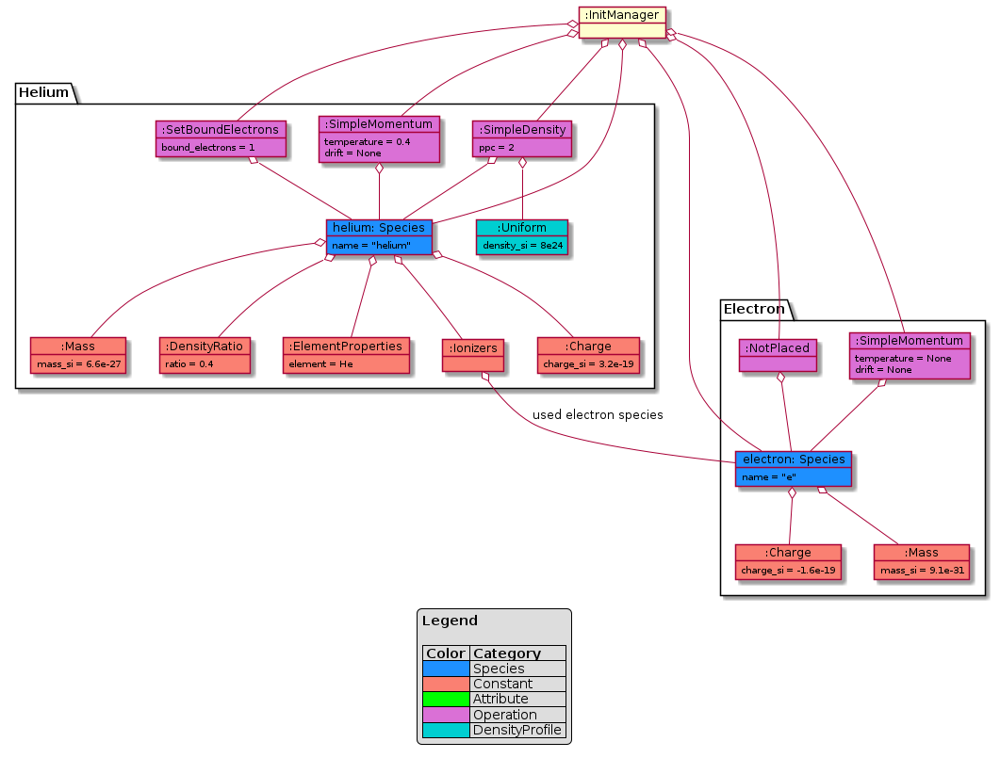
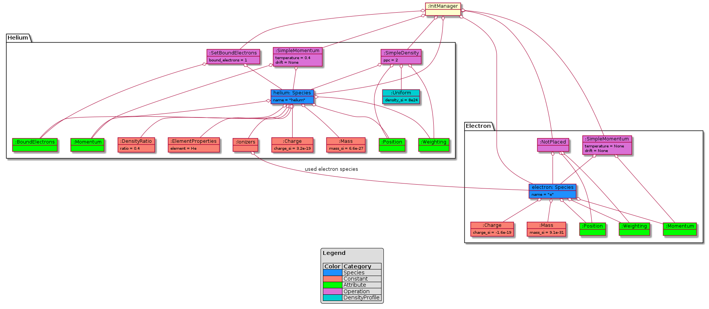

Species translation
===================

In PIConGPU (and PIC-codes in general) “Species” is a catch-all term for
all things particles; it is defined rather losely and used differently
in different contexts.

Generally, a “species” is a **set of macroparticles** in a simulation which are initialized from a **common parameter set**.

   A macroparticle is a representation of a varying number of simulated
   (“real”) particles.

For PyPIConGPU a species consists of a set **constant properties** (same for each macroparticle, "flags") and a set of **variable properties** (attributes, exists for every macroparticle, but may have a different value).
Each *attribute* is initialized by **exactly one operation**.

This results in this `UML class diagram <https://en.wikipedia.org/wiki/Class_diagram>`_.

   Final relationships of species-related classes

..

   In particular, the name is part of this *common parameter set*, as
   well as the *profile* where these particles are placed. If you want
   to initialize the same type of particles (e.g. the same substance)
   with a different *profile*, a second species has to be created.

This document describes how species are translated from PICMI, via an
intermediate PyPIConGPU-only representation, to executable PIConGPU
``.param`` files. For the general process of translation please refer to
the `respective documentation section <translation.md>`__. The process
is outlined back-to-front here, i.e. starting with the desired PIConGPU
result, deriving the PyPIConGPU representation from that and explaining
some PICMI details in the end.

   Neither PICMI nor PIConGPU species declaration are introduced in
   detail, please familiarize yourself with both.

Code Generation
---------------

A species is directly associated to two code sections:

1. A species definition, declaring a C++ species type, placed inside ``speciesDefinition.param``.
2. A species initialization, creating and initializing the attributes of
   the species’ macroparticles, placed inside the init pipeline of ``speciesInitialization.param``.

Particles of a species have different properties, which fall into one of
two categories:

-  **Constants** (*Flags* in PIConGPU lingo): Properties that apply to
   **all (macro-) particles** and can’t be changed for each
   macroparticle

   -  typically matter constants, e.g. number of protons, mass, charge
   -  but also: used pusher, particle shape, etc.
   -  initialized in ``speciesDefinition.param``

-  **Attributes**: Properties that can be different **from macroparticle
   to macroparticle**

   -  most importantly the **position**
   -  other changing/changeable properties, e.g. momentum, number of
      bound electrons
   -  **existence** declared in ``speciesDefinition.param``
   -  **initialized** in ``speciesInitialization.param`` (actual initialization typically loaded from other files, e.g. ``density.param``)

The **constants** are stored purely in the **type definition**.
**Attributes** must be enabled for their respective species in their
type definition, but they are set in the **init pipeline**.

A list of flags and a list of attributes is passed directly from
PyPIConGPU, which makes code generation rather straightforward.

The initpipeline is expressed by a set of operations, which by
definition have no interdependencies. For more details on operations
please refer to the next section.

Note that while the init operations have no inherent order, they are
generated in such a way that macroparticles are placed before any other
attributes are set.

When reading the generated code note that while all operations are
**referred to** in the initpipeline, they are typically defined in a
separate file. (This is more in line with the native PIConGPU configuration.)

.. _pypicongpu_species_architecture:

Architecture of PyPIConGPU Representation
-----------------------------------------

The PyPIConGPU representation of species initialization uses the
concepts **species**, **constant**, **attribute**, **operation** and
**init manager** and defines their relationships.

-  The **init manager** is the global context managing the entire
   lifecycle.

   -  …performs all checks between objects that are not directly
      associated to one another

-  A **species** is a type of macroparticles sharing the same
   properties.

   -  …has a (mandatory) name
   -  …has a list of *constants* and a list of *attributes*
   -  …will only be considered “valid” if position and momentum
      *attributes* are set
   -  …has at most one of each *constant* (type)
   -  …has at most one of each *attribute* (type)

-  A **constant** is a unmodifiable property shared among all
   macroparticles of a species (*flag* in PIConGPU lingo)

   -  …are for example charge and mass.
   -  …carries its value inside its object representation
   -  …is owned by a species
   -  …may depend on other species being present (during code generation)

-  An **attribute** is a property which every macroparticle has, but
   each may have a different value

   -  …are for example position and weighting
   -  …object only contains a name
   -  …is exclusive to a species
   -  …is provided (generated) by an operation, which also sets it
      (inside of PIConGPU); in other words:
   -  …is “in exclusive custody” of exactly one operation.

-  An **operation** initializes a set of *attributes* for a set of *species*

   -  …is independent from all other operations
   -  …gets passed its parameters and affected species in a custom way
      (i.e. there is no globally unified way to pass parameters to
      operations)
   -  …provides and sets a attributes for its species
   -  …may depend on *constants*.
   -  …must **NOT** depend on other attributes/operations.

This leads to some notable conclusions:

An attribute is always managed exclusively by **exactly one** operation.
The purpose of this is it to make it easy to detect conflicts between
operations, and at the same time making it very clear what caused the
value of an attribute.

Therefore, if two attributes depend on each other, they must be set **in
the same operation**. E.g., when placing ions and their electrons, both
are created from **the same** ``SimpleDensity`` operation.

Also, if multiple factors determine an attribute, they must be specified
inside of the same operation: E.g. the momentum is influenced by both
temperature and drift, hence they are properties of the
``SimpleMomentum`` operation.

   We somewhat jokingly refer to this setup as the “grand unified theory
   of species”.

.. _pypicongpu_species_lifecycle:

Lifecycle
---------

The core idea behind this architecture is to associate every **attribute** (of one species) with **exactly one operation**.

   | This has two main advantages:
   | (1) operations are independent of one another, and
   | (2) the initialization can be traced back to exactly one operation.

To ensure this, the species initialization follows this lifecycle:

1. initialize species, constants, and operations
2. check if this setup is valid
3. operations create attributes and *prebook* them for some species
4. these *prebooked* attributes are checked, if no conflicts are found they are added to their species

For the implementation of this process, please see :py:meth:`picongpu.pypicongpu.species.InitManager.bake()`.

The generating script creates this setup:

   Setup as created by PyPIConGPU (before Operations have been applied)

After all checks have passed, the operations may *pre-book* the attributes they want to create.
*Pre-Booking* is performed in :py:meth:`picongpu.pypicongpu.species.operation.Operation.prebook_species_attributes()`
by creating the intended Attribute objects (one per species) and
storing the intended association into the ``Operation.attributes_by_species``.

Pre-Booking results in this intermediate connection:

   classes with prebooked association

After these pre-booked species-attribute connections have been checked,
they are *baked*, i.e. applied into the final model:

   final (*baked*) species-related classes

From these classes the code generation can simply derive:

- a list of species, and for each species

  - its constants
  - required attributes

- a list of operations

..

   Note that the some associations from the model above are lost when translating to JSON for code generation,
   e.g. which operation initializes which attribute.

Checks
------

Constants, Attributes, and Operations may have various dependencies.
**All** possible dependencies are listed here:

- Species may depend on:

  - Nothing: Species are passive, and are manipulated by **multiple** Operations.
  - As a sanity check species require *Position* and *Momentum* attributes (as hard-coded checks).
    This is not because the model requires it,
    but because species without these make no sense in PIC implementations.

- Attributes may depend on:

  - Nothing: Attributes are passive, and are manipulated by **exactly one** Operation.

- Constants may depend on:

  - (not-finalized) **Species** objects:
    E.g. ions may depend on their electrons.
    These dependencies modify the order in which the species are rendered to code.
  - (existence of) **Attribute** types:
    E.g. ionizers depend on the attribute ``BoundElectrons``.
    The Operation which sets the Attribute is not visible to the check.
  - (existence of) **Constant** types:
    E.g. ionizers depend on the constant ``ElementProperties`` (which contains the ionization levels).
    The value of these constants is not visible to the check.

- Operations may depend on:

  - their **Species**:
    Note that at this point the Species do not have any Attributes added.
    (Accessing the Attributes will result in an error.)
  - (through their Species) these Species' **Constants**:
    These are the Attribute objects,
    i.e. their value can be read (and checked against).

Other dependencies are forbidden by design.
Notably, this includes Operation-Operation and Operation-Attribute dependencies,
because Operations are independent from one another.

.. note::

   Errorneous (circular) dependencies are checked by the **init manager**.

All checks are invoked when applying the Operations in the init manager's ``bake()`` method (see also: :ref:`pypicongpu_species_lifecycle`).
(For their implementation details please refer to the respective base classes.)

Constants
---------

PyPIConGPU ``Constant`` objects follow the concept of a *constant property*,
instead of mirroring the PIConGPU *Species Flags* 1-to-1.

E.g., the Constant ``ElementProperties`` is translated to atomic numbers and ionization energies.

(Note: Mass and Charge are treated as separate constants, even if they are element properties too.)

Constants may depend on other species,
which is required due to the C++ syntax:
Forward declarations (referring to to-be-defined *things*, in this case species) are not possible for this case (template programming),
so the order of the code generation matters.
This order is governed by the Constant-Species dependencies and handled by the init manager.

.. _pypicongpu_species_attributes:

Attributes
----------

Attributes are enabled by adding them to the type definition in
PIConGPU. Their values are set in the init pipeline.

The PyPIConGPU species model (see: :ref:`pypicongpu_species_architecture`) ties *Attributes* strongly to *Operations*:
An Attribute is always initialized (handled, created) by **exactly one Operation**.
Hence, Attributes are **never created directly**, but only ever through Operations (see: :ref:`pypicongpu_species_lifecycle`).

Operations
----------

Operations create and initialize :ref:`Attributes <pypicongpu_species_attributes>` **exclusively**,
i.e. one Attribute of a Species can only ever be initialized by **exactly one Operation**.

There is no unified way in which Operations must accept their arguments,
i.e. an Operation must define its own interface how Species and arguments must be passed.

Operations are the intended way how dependencies between Attribute values should be expressed:
**If two Attributes are related, they must be initialized by the same Operation.**
For that, the Operation may depend on Constants of these Species (in ``check_preconditions()``),
but it **must NOT modify** these Constants.

During the code generation these Operations may result in any number of "Functors" in the init pipeline.

The init manager translates the Operations to JSON,
creating a dictionary

.. code:: json

  {
      "op_type1": [ "OP1", "OP2" ],
      "op_type2": [ "OP3" ],
      "op_type3": []
  }

For this every type of Operation must be registered with a name in ``_get_serialized()`` in the init manager (and the respective schema).

Conceptually Operations are **independent from other Operations**.
However, for code generation an inherent order is required,
which implicitly introduces an order between these Operations.
Yet, this order is only required for placing macroparticles (particles must be created before they can be modified) -- for all other cases it is ignored.

The concept of Operations aims to move the species initialization closer to a *declarative* description ("momentum **is** x"),
instead of PIConGPU's *procedural* description ("**set** momentum to x").

.. note::

   The purpose of this is to enable traceability and thereby error handling.
   A *procedural* description is very powerful,
   but quickly runs into the `Halting Problem <https://en.wikipedia.org/wiki/Halting_problem>`_,
   rendering any programmatic handling (besides execution) **impossible**.
   (This includes any manipulation, checking or predicting results.)

In many cases PIConGPU's *functors* from the init pipeline can be translated to a single operation,
however this is not the case for all examples:

- setting the number of bound electrons for ions

  - Attributes: ``boundElectrons``
  - PIConGPU: set bound electrons functor (implementation of ``Free`` functor)
  - PyPIConGPU: ``BoundElectrons`` Operation

- not placing a species itself (e.g. electron species)

  - Attributes: ``position<position_pic>``, ``weighting``
  - PIConGPU: leave init pipeline empty, but add ``position<position_pic>`` Attribute
  - PyPIConGPU: ``NotPlaced`` Operation

- setting the momentum, composed of *drift* and *temperature*

  - Attributes: ``momentum``
  - PIConGPU: **set** *drift*, then **add** *temperature* in second operation
  - PyPIConGPU: ``SimpleMomentum`` Operation (which accepts **both** drift **and** temperature)

- placing multiple species together (see also :ref:`next section <pypicongpu_species_placement>`)

  - Attributes: ``position<position_pic>``, ``weighting``
  - PIConGPU: ``CreateDensity`` for first species, then ``Derive`` all other species
  - PyPIConGPU: ``SimpleDensity`` Operation, which accepts a list of Species

.. _pypicongpu_species_placement:

Placement
---------

The *Placement* describes the **creation** of macroparticles.
(Which differs from all other Operations,
because they only modify existing macroparticles.)

Ultimately, the particle placement expresses where macroparticles with
which weighting (number of represented real particles) should be placed.

| For this, the following components may be specified:
| *PICMI term (PIConGPU term)*

-  particle distribution (density profile): specifies density by
   location

   -  function w.r.t. x, y, z of global coordinate system
   -  typically expressed relative to base density

-  density scale (density ratio): modifies density

   -  scalar factor, multiplied with particle distribution

-  particle layout (particle position): specifies position and number of
   macro particles inside the cell

   -  typically random or fixed to grid positions

Note that there are two steps in deriving the placement of particles
from the density. The density, i.e. number of (real) particles per
volume is given by a particle distribution (density profile). This
profile is multiplied with the density scale (density ratio) and then

1. discretized, i.e. for every cell the average density/the number of
   particles is computed
2. Based on the particle layout (particle position) a certain number of
   macroparticles are placed at a certain position *inside every cell*.
3. The weighting of these macroparticles is adjusted to match the
   computed density. If the weighting is below a configurable threshold,
   particles will be deleted.

This document uses the following terms:

========== ================== ====================== ==================================================================================================== 
used here  PIConGPU           PICMI                  description
========== ================== ====================== ==================================================================================================== 
profile    density profile    particle distribution  description of number of particles per unit of volume
ratio      density ratio      density scale          scalar factor applied to profile (modifies the number of particles represented by one macroparticle)
layout     particle position  particle layout        positioning of macroparticles within a cell
========== ================== ====================== ==================================================================================================== 

The term “placement” refers to the entire process of placing
macroparticles from parameters to final positioning.

Initializing Multiple Species
~~~~~~~~~~~~~~~~~~~~~~~~~~~~~

Some species are to be created together, e.g. ions and their respective
electrons. Though, in general, species are treated separately during
initialization.

   The main purpose of this grouping is to join particles in such a way,
   that in total their charge is (locally) neutral. See: :ref:`usage-workflows-quasiNeutrality`

For the purposes of this document, species might be related as follows:

-  If two (or more) species are related in such a way that their purpose
   is to bring the total (local) charge to a neutral level, they are to
   be *derived* from each other.
-  If the species are not related in such a way, they are to be *treated separately*.

PICMI initializes all species equally, i.e. simply stores a list of all
species to be initialized: The distinction above is not made explictly:
For PICMI, species that are to be *derived* from each other simply end
up at the same place (and can thus neutralize each other) after applying
all initialization of values & position (profile, layout, ratio).

PIConGPU on the other hand uses a different approach. There, particles
that are to be *derived* from each other are initialized in order: Only
the first species (of the group to be *derived*) is placed by a placing
algorithm, all other *derived* species have their position simply
copy-pasted from this first. (If necessary the scalar *density scale* is
adjusted.)

   PIConGPU here is more efficient than (naive) PICMI, because instead
   of placing all particles s.t. the positions are equal for two (or
   more) species (in which case they are *derived*), only the initial
   positions are calculated – and all *derived* species’ positions are
   **made** to be equal.

This schema of separate initialization, yet same final positioning **can
not be recreated in PIConGPU**. The problem lies in the random layout:
When calling the **same random layout** in PIConGPU twice, **the results
do not match**. Therefore, particles that are to be grouped together
**are derived from each other in PIConGPU-native setups**.

   There are very good reasons of the implementation to do that: (1)
   It is more efficient to copy positions instead of generating them
   twice. (2) Due to the parallel nature of PIConGPU, a random placement
   is **not reproducable**. (Not reasonably in practical scenarios at
   least: In particular, it is very difficult to keep the RNG state in
   sync==reproducable across many processes, across many different
   algorithms, and across all supported architectures.)

The implicit grouping in PICMI has to be made explicit before
translating the particle initialization to PIConGPU. For that we
consider the following cases to decide if two species are to be
*derived* or *treated separately*, depending if their initialization
parameters (profile, layout, ratio) are different or equal.

========= ========= ========= ================
profile   layout    ratio     behavior
========= ========= ========= ================
different different different treat separately
different different equal     treat separately
different equal     different treat separately
different equal     equal     treat separately
equal     different different treat separately
equal     different equal     treat separately
equal     equal     different derive
equal     equal     equal     derive
========= ========= ========= ================

This grouping is performed **during the translation from PICMI to PyPIConGPU**.
Profiles/Layouts are considered *equal* if they are ``==`` equal.
For PICMI, ``==`` equality is the same to ``is`` (object identity),
i.e. two species have the same profile (particle distribution) if they use **the same** particle distribution **object**. (PICMI may redefine ``==`` in the future.)

In PyPIConGPU Species that are to be derived are grouped into the same ``SimpleDensity`` Operation.

Ratios are stored in Constants (PIConGPU species flags),
and the species with the **lowest ratio** is placed first to make sure the minimum weighting is always respected.
Note that the first species is not required to use a ratio of one,
which is handled properly by PIConGPU (both during placement and copying).

Notes
-----

Seeds
~~~~~

Seeds are not supported and entirely ignored by PyPIConGPU.

Use Ratios over Profiles!
~~~~~~~~~~~~~~~~~~~~~~~~~

The density is defined by a profile multiplied by a ratio. Hence, in
theory the following two are equal:

-  Ratio 1, Profile ``f(x,y,z) = 6e24 + x * 2e23``
-  Ratio 2, Profile ``f(x,y,z) = 3e24 + x * 1e23``

| However, this is to be discouraged:
| Using a new profile (1) has to be computed for every cell and (2)
  disables the option to detect species placed together.
| Reusing an existing profile (1) is more efficient (reuses previous
  results) and (2) allows to detect species placed together.

Ratio Handling
~~~~~~~~~~~~~~

Ratios are scalar factors applied to profiles.

Profiles are expressed that they are valid with a ratio of one.
By specifying a different PIConGPU density ratio (in the species flags) the PIConGPU ``CreateDensity`` functor in the init pipeline will adjust the weighting accordingly.

The subsequent ``Derive`` functors to copy the species location respect the ratios of the respective species (specifically: the ratio of their ratios),
so no additional measures are required.

Electron Resolution
~~~~~~~~~~~~~~~~~~~

PIConGPU requires an explicit species to be used for electrons,
whereas this is not possible to specify with PICMI.

The user can either explicitly set the electron species by providing ``picongpu_ionization_electrons`` to the PICMI species,
or the PICMI translation will try to guess the used electron species.
If there is exactly one electron species it will be used,
if there is no electron species one will be added,
and if there are two or more electron species an error will be raised.

Example
-------

This example shows the initialization of a constant density of Helium with one bound electron.
For the sake of the example the ratio is 0.5.
The PICMI initialization is:

PICMI
~~~~~

.. code:: python

   uniform_dist = picmi.UniformDistribution(density=8e24,
                                            rms_velocity=[1e5, 1e5, 1e5])
   species_helium = picmi.Species(name="helium",
                                  particle_type="He",
                                  charge_state=1,
                                  density_scale=0.4,
                                  initial_distribution=uniform_dist)

   # init of sim omitted

   random_layout = picmi.PseudoRandomLayout(n_macroparticles_per_cell=2)
   sim.add_species(species_helium, random_layout)

For which an additional electron species is added, equivalent to:

.. code:: python

   electrons = picmi.Species(name="e",
                             particle_type="electron")
   sim.add_species(electrons, None)

PyPIConGPU
~~~~~~~~~~

This translated to these PyPIConGPU objects (simplified, some helper objects are omitted):

.. warning::

   This is a `UML object diagram <https://en.wikipedia.org/wiki/Object_diagram>`_, not a (generally more common) class diagram as above.
   (Boxes here are objects instead of classes.)

   example setup as translated by PICMI before Baking

After attribute creation, prebooking, checking and finally baking, this results in these objects:

   example setup after baking attributes

Rendering JSON Representation
~~~~~~~~~~~~~~~~~~~~~~~~~~~~~

From this, the following (abbreviated) JSON representation is derived:

   ALL CAPS strings are placeholders for full (complex) objects

.. code:: json

    {
        "species": [
            {
                "name": "e",
                "typename": "species_e",
                "attributes": [
                    {"picongpu_name": "position<position_pic>"},
                    {"picongpu_name": "weighting"},
                    {"picongpu_name": "momentum"}
                ],
                "constants": {
                    "mass": {"mass_si": 9.1093837015e-31},
                    "charge": {"charge_si": -1.602176634e-19},
                    "density_ratio": null,
                    "ionizers": null,
                    "element_properties": null
                }
            },
            {
                "name": "helium",
                "typename": "species_helium",
                "attributes": [
                    {"picongpu_name": "position<position_pic>"},
                    {"picongpu_name": "weighting"},
                    {"picongpu_name": "momentum"},
                    {"picongpu_name": "boundElectrons"}
                ],
                "constants": {
                    "mass": {"mass_si": 6.64647366797316e-27},
                    "charge": {"charge_si": 3.204353268e-19},
                    "density_ratio": {"ratio": 0.4},
                    "ionizers": {"electron_species": "ELECTRON SPECIES OBJECT"},
                    "element_properties": {
                        "element": {
                            "symbol": "He",
                            "picongpu_name": "Helium"
                        }
                    }
                }
            }
        ],
        "operations": {
            "simple_density": ["SIMPLE DENSITY OBJECT"],
            "simple_momentum": [
                {
                    "species": "HELIUM SPECIES OBJECT",
                    "temperature": {"temperature_kev": 0.41484025711818995},
                    "drift": null
                },
                {
                    "species": "ELECTRON SPECIES OBJECT",
                    "temperature": null,
                    "drift": null
                }
            ],
            "set_bound_electrons": [
                {
                    "species": "HELIUM SPECIES OBJECT",
                    "bound_electrons": 1
                }
            ]
        }
    }

Generated Code
~~~~~~~~~~~~~~

Ultimately rendering this code (reformatted for reading):

``speciesDefinition.param``:

.. code:: c++

    value_identifier(float_X, MassRatio_species_e,
                    9.1093837015000008e-31 / SI::BASE_MASS_SI);
    value_identifier(float_X, ChargeRatio_species_e,
                    -1.6021766339999999e-19 / sim.si.getBaseCharge());

    using ParticleFlags_species_e = MakeSeq_t<
        massRatio<MassRatio_species_e>, chargeRatio<ChargeRatio_species_e>,

        particlePusher<UsedParticlePusher>, shape<UsedParticleShape>,
        interpolation<UsedField2Particle>, current<UsedParticleCurrentSolver>>;

    using ParticleAttributes_species_e =
        MakeSeq_t<position<position_pic>, weighting, momentum>;

    using species_e = Particles<PMACC_CSTRING("e"), ParticleFlags_species_e,
                                ParticleAttributes_species_e>;

    value_identifier(float_X, MassRatio_species_helium,
                    6.6464736679731602e-27 / SI::BASE_MASS_SI);
    value_identifier(float_X, ChargeRatio_species_helium,
                    3.2043532679999998e-19 / sim.si.getBaseCharge());
    value_identifier(float_X, DensityRatio_species_helium, 0.40000000000000002);

    using ParticleFlags_species_helium = MakeSeq_t<
        massRatio<MassRatio_species_helium>,
        chargeRatio<ChargeRatio_species_helium>,
        densityRatio<DensityRatio_species_helium>,

        ionizers<MakeSeq_t<particles::ionization::BSI<
                            species_e, particles::ionization::current::None>,
                        particles::ionization::ADKCircPol<
                            species_e, particles::ionization::current::None>,
                        particles::ionization::ThomasFermi<species_e>>>,

        atomicNumbers<ionization::atomicNumbers::Helium_t>,
        ionizationEnergies<ionization::energies::AU::Helium_t>,

        particlePusher<UsedParticlePusher>, shape<UsedParticleShape>,
        interpolation<UsedField2Particle>, current<UsedParticleCurrentSolver>>;

    using ParticleAttributes_species_helium =
        MakeSeq_t<position<position_pic>, weighting, momentum, boundElectrons>;

    using species_helium =
        Particles<PMACC_CSTRING("helium"), ParticleFlags_species_helium,
                ParticleAttributes_species_helium>;

    using VectorAllSpecies = MakeSeq_t<species_e, species_helium>;

The operations result in this ``speciesInitialization.param``:

.. code:: c++

    using InitPipeline = boost::mp11::mp_list<
        /**********************************/
        /* phase 1: create macroparticles */
        /**********************************/

        CreateDensity<densityProfiles::pypicongpu::init_species_helium,
                      startPosition::pypicongpu::init_species_helium,
                      species_helium>,

        /*********************************************/
        /* phase 2: adjust other attributes (if any) */
        /*********************************************/

        // *adds* temperature, does *NOT* overwrite
        Manipulate<manipulators::pypicongpu::AddTemperature_species_helium,
                   species_helium>,

        Manipulate<manipulators::pypicongpu::PreIonize_species_helium,
                   species_helium>,

        // does nothing -- exists to catch trailing comma left by code generation
        pypicongpu::nop>;

Utilizing this density definition from ``density.param``:

.. code:: c++

    /**
    * generate the initial macroparticle position for species "helium"
    * (species_helium)
    */
    struct init_species_helium_functor {
        HDINLINE float_X operator()(const floatD_64 &position_SI,
                                    const float3_64 &cellSize_SI) {
            return 7.9999999999999999e+24 / SI::BASE_DENSITY_SI;
        }
    };

    using init_species_helium =
        FreeFormulaImpl<init_species_helium_functor>;
