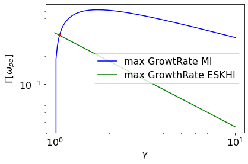
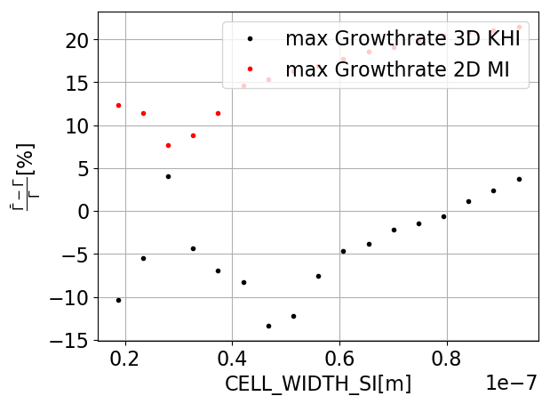
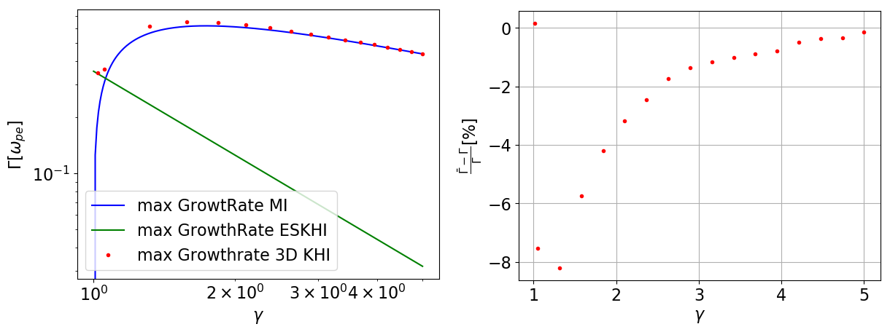

Kelvin-Helmholtz instability: mushroom instability (MI)
=======================================================

.. sectionauthor:: Mika Soren Voß

.. seealso::

   For a better understanding, please read the :ref:`Kelvin Helmholtz instability chapter <../../examples/KelvinHelmholtz/README>` in the examples setups.

The mushroom instability is the transverse dynamics of the KHI and dominates the plasma instability at high Lorentz factors of the plasma streams.
For the sake of simplicity, we consider two equally fast plasma streams, which flow past each other in opposite directions. 
From this assumption, the growth rate :math:`$\Gamma_{max}$` can be described as:

:math:`$\Gamma_{max} = \omega_p \frac{v_0}{c\gamma^{0.5}}$`
   
with :math:`$\omega_{pe}$` being the plasma frequency, c the Speed of Light. 
For further information on the derivation, please refer to the references linked in the Kelvin Helmhotz instability chapter mentioned above.

The longitudinal KHI instability (esKHI) and the traversal instability (MI) have different growth rates depending the the Lorentz factor of the plasma streams.
This results in a point of intersection at a Lorentz factor of :math:`$\gamma = \sqrt{\frac{9}{8]}$`, where both instabilities compete and have the same growth rate.
This results in two possibilities to test the growth rate of the MI.
Since the MI represents the transverse dynamics of the system, the occurrence of ESKHI can be ruled out with a properly aligned 2D simulation.
This has the advantage of being able to use all Lorentz factors.
The second option is to use a 3D simulation of the KHI, whereby a sufficiently large Lorentz factor must be used.

If one examines the deviation of the growth rate from the simulation with that from the theory as a function of the cell width, one obtains:

One of the resulting minima in the deviation (3d) is obtained with :math:`CELL_WIDTH_SI = $8.0378e-8m$`.
Further investigations showed that for different Lorentz factors in the 2D simulation of the MI, other Cell_WIDTH_SI values provide a minimum in the deviation. 
Therefore, the 3D simulation is suitable as a test case due to low deviations for all Lorentz factors.

   
These considerations lead to the parameters used in this test case:

- Lorentz factor: :math:`$\gamma = 1.6$`
- :math:`CELL_HEIGHT_SI = CELL_DEPTH_SI = CELL_WIDTH_SI = $8.03783-8m$`
- Dimension: 3d