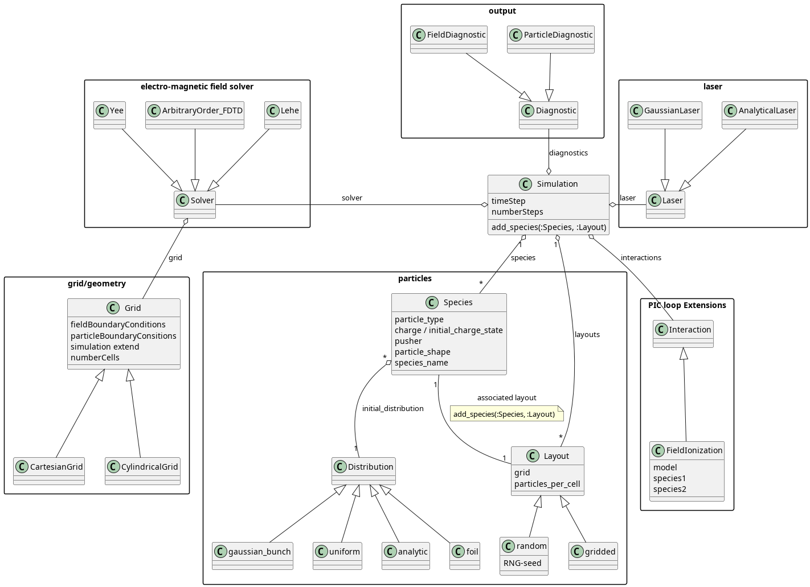

.. _PICMI:
Intro
=====

PICMI is a Python interface for configuring and running Particle-In-Cell simulations, defined via the Python reference implementation
available from `github <https://github.com/picmi-standard/picmi>`_ and `pypip <https://pypi.org/project/picmistandard/>`_.

PICMI allows a user to configure a simulation in a Python script, called *user script*, by building a simulation Python object from different
standardised building blocks.

   general overview of PICMI interface, see the `reference implementation <https://github.com/picmi-standard/picmi>`_ for details

From this simulation object a user may then generate input files for all PIC-simulation codes supporting PICMI, but some features may be code specific or not supported by all codes.

Usage Quick-start
-----------------

To use the PICMI interface you need a working PIConGPU environment, see :ref:`install instructions <install-path>` and :ref:`the Setup part of PIConGPU in 5 Minutes on Hemera <hemeraIn5min>` for instructions.

In addition you need to install the Python dependencies of the PIConGPU PICMI implementation to your Python environment.

To install the Python dependencies you may either run the command below

.. code:: shell

  pip install -r $PICSRC/lib/python/picongpu/picmi/requirements.txt

or install all the requirements listed in

- ``$PICSRC/lib/python/picongpu/picmi/requirements.txt``
- and ``$PICSRC/lib/python/picongpu/pypicongpu/requirements.txt``

After you have installed the dependencies you must include the PIConGPU PICMI implementation in your ``PYHTONPATH`` environment variable, for example by

.. code:: shell

  export PYTHONPATH=$PICSRC/lib/python:$PYTHONPATH

.. note::

  If you are using one of our pre-configured profiles, this is done automatically when you source a profile

.. note::
   Above, we used ``$PICSRC`` as a short hand for the path to picongpu's source code directory, provided from your shell environment if a pre-configured profile is used.

After you have installed all PICMI dependencies, simply create a user script, see the :ref:`warm plasma <example_PICMI_setup_warm_plasma>` and :ref:`laser wakefield <example_PICMI_setup_lwfa>` examples, and generate a picongpu setup, see :ref:`generating a PIConGPU setup with PICMI <generating_setups_with_PICMI>`.

Example User Script for a warm plasma setup:
--------------------------------------
.. _example_PICMI_setup_warm_plasma:

.. literalinclude:: ../../../../share/picongpu/pypicongpu/examples/warm_plasma/main.py
   :language: python

Creates a directory ``warm_plasma``, where you can run ``pic-build`` and subsequently ``tbg``.

Example User Script for a laser wakefield setup:
--------------------------------------
.. _example_PICMI_setup_lwfa:

.. literalinclude:: ../../../../share/picongpu/pypicongpu/examples/laser_wakefield/main.py
   :language: python

Creates a directory ``LWFA``, where you can run ``pic-build`` and subsequently ``tbg``.

Generation of PIConGPU setups with PICMI
----------------------------------------
.. _generating_setups_with_PICMI:

The recommended way to use the generated simulations is to

1. create the simulation in the PICMI
2. call ``simulation.write_input_file(DIR)``
3. use the normal PIConGPU toolchain (``pic-build``, ``tbg``) on the generated PIConGPU setup

.. note::

   Rationale: PICMI does not (yet) support enough parameters to meaningfully control the execution process.

Additionally, the following methods work (but are **not recommended**):

- call ``Simulation.step(NUM)``

  - directly builds and runs the simulation
  - ``NUM`` must be the **maximum number of steps**
  - has no diagnostic output (i.e. console hangs without output)

- call ``Simulation.picongpu_run()``

  - equivalent to ``Simulation.step()`` with the maximum number of steps

- use the :ref:`PyPIConGPU runner <pypicongpu-running>`

PICMI Reference
---------------

The full PICMI standard interface reference is available `upstream <https://picmi-standard.github.io/>`_.

PIConGPU specifics
------------------

PIConGPU has it's own implementation of the PICMI standard with picongpu specific extensions.
Therefore all PICMI implementations for use with PIConGPU are located in the ``picongpu.pimci`` namespace instead of the usual ``picmistandard`` namespace.

In addition names of classes differ a little from the standard names, specifically we usually strip the `PICMI_` prefix, and sometimes a class may provide additional options, see :ref:`Extensions <_PICMI_Extensions>` below.

Extensions
^^^^^^^^^^
.. _PICMI_Extensions:

Parameters/Methods prefixed with ``picongpu_`` are PIConGPU-exclusive.

.. warning::

   We strive to quickly contribute these parameters to PICMI upstream,
   so this list is to be considered volatile.

- **Simulation**

  not supported methods:

  - ``add_interaction(self, interaction)``:
    The PIConGPU PICMI interface does not support the PICMI interaction specification, due to PICMI standard ambiguities.
    Instead you must use the PIConGPU specific ``Interaction`` interface described below.

  additional constructor/configuration options:

  - ``picongpu_template_dir``:
    Specify the template directory to use for code generation,
    please refer to :ref:`the documentation on the matter for details <picmi-custom-generation>`
  - ``picongpu_typical_ppc``:
    typical particle per cell(ppc) to be used for normalization in PIConGPU, if not set explicitly, PIConGPU will use the median ppc of all defined species
  - ``picongpu_moving_window_move_point``:
    portion of the simulation window a light ray reaches from the time of the start of the simulation until the simulation window begins to move.

    .. warning::

      If the moving window is active, one gpu row in y direction is reserved for initializing new spaces, thereby reducing the simulation window size accordingly

  - ``picongpu_moving_window_stop_iteration``:
    iteration at which to stop moving the simulation window
  - ``picongpu_interaction``:
    ``Interaction`` object specifying all interactions of the simulation, i.e. all ionization models and their configurations and so on.
    This replaces the PICMI ``add_interaction`` method.

  additional method arguments:

  - ``write_input_file(..., pypicongpu_simulation)``:
    use a :ref:`PyPIConGPU simulation<PyPIConGPU_Intro>` object instead of an PICMI- simulation object to generate a PIConGPU input.

  additional methods:

  - ``get_as_pypicongpu()``:
    convert the PICMI simulation object to an equivalent :ref:`PyPIConGPU <PyPIConGPU_Intro>` simulation object.
  - ``picongpu_get_runner()``:
    Retrieve a :ref:`PyPIConGPU Runner <pypicongpu-running>` for running a PIConGPU simulation from Python, **not recommended, see :ref:`PICMI setup generation <generating_setups_with_PICMI>`**.
  - ``picongpu_add_custom_user_input()``:
    pass custom user input to the code generation.
    This may be used in conjunction with custom templates to change the code generation.
    See :ref:`PICMI custom code generation<picmi-custom-generation>` for the documentation on using custom input.

- **Grid**

  - ``picongpu_n_gpus``:
    list of a 1 or 3 integers, greater than zero, describing GPU distribution in space
    3-integer list: ``[N_gpu_x, N_gpu_y, N_gpu_z]``
    1-integer list: ``[1, N_gpu_y, 1]``
    Default is ``None`` equal to ``[1, 1, 1]``

- **Gaussian Laser**

  - Laguerre Modes (``picongpu_laguerre_modes`` and ``picongpu_laguerre_phases``):
    Two lists of float, passed to PIConGPU laser definition to use laguerre modes for laser description
  - ``picongpu_polarization_type``:
    configuration of polarization of the laser, either linear or circular, default is linear.
  - ``picongpu_phase``:
    phase offset of the laser, default is 0
  - ``picongpu_huygens_surface_positions``
    configuration of the position of the huygens surfaces used by PIConGPU for laser feed in, in cells

- **Species**

  - ``picongpu_fixed_charge``:
    When defining an ion species using ``particle_type`` it may or may not be ionizable

    - to **enable** ionization add an ionization model to the Interaction object of the simulation and set the initial charge state using ``charge_state``.
    - to **disable** ionization set ``picongpu_fixed_charge=True``, this will fix the charge of particles of this species for entire simulation.

    ``picongpu_fixed_charge`` maybe combined with ``charge_state`` to control which charge state is to used for the ion species

    If neither is set a warning is printed prompting for either of the options above.

Ionization:
^^^^^^^^^^^
The PIConGPU PICMI interface currently supports the configuration of ionization only through a picongpu specific PICMI extension, not the in the PICMI standard defined interface, due to the lack of standardization of ionization algorithm names in the PICMI standard.

Use the **Interaction** interface

- **Interaction**
  picongpu specific configuration of PIC-algorithm extensions.

    - ``__init__(ground_state_ionizaion_model_list= <list of ionization models>)``

Output
^^^^^^
Output is currently **not configurable** for picongpu using the PICMI interface.

.. warning::

   This is subject to change.

If you are using the the default templates some output is automatically enabled, including PNGs.
For this the period is chosen that the output is generated (approx.) 100 times over the entire simulation duration.

To configure output you must :ref:`change the generated files <picmi-custom-generation>` by using use custom user input and custom templates.

Unsupported Features
^^^^^^^^^^^^^^^^^^^^

The PIConGPU PICMI interface currently does not support the entire PICMI interface due to standard ambiguities and/or incomplete implementation.
If you try to use an unsupported feature, you will be alerted by either a warning printed to ``stdout`` or an error thrown (including because a class does not exist).

In this case read the error message to fix this.

For reference you can see how the tests in ``$PICSRC/test/python/picongpu/quick/picmi`` use the interface.

.. note::

  If a feature is not out of the box supported by the PIConGPU PICMI interface but supported by PIConGPU it may still be configured in PICMI through :ref:`custom code generation <picmi-custom-generation>`.

  **In general everything that may be configured using the extensive PIConGPU** ``.param files`` **, may by configured via PICMI using custom input and custom templates.**

.. note::

  Please consider contributing all custom template features and custom user input back to PIConGPU to allow further improvements of the standard, making your life and everybody else' easier.

PyPIConGPU
----------

.. _PyPIConGPU_Intro:

In addition to the PICMI interface PIConGPU has a second Python interface called PyPIConGPU.
This is the native Python interface of PIConGPU to which PICMI inputs are converted to.

This interface offers additional configuration options above and beyond the PICMI interface and may be used instead of PICMI to configure a PIConGPU simulation.

To generate a PIConGPU setup from a PyPIConGPU simulation object use the following.

.. code:: python
  import picongpu

  picongpu.picmi.Simulation().write_input_file(<path of setup to generate>, pypicongpu_simulation)

.. note::

  The PyPIConGPU interface may be used stand-alone or together with the PICMI interface.

  In the latter case configure the PICMI simulation first, generate a PyPIConGPU simulation from the PICMI simulation and then continue configuring the PyPIConGPU object.

  **Changes of the PICMI object after creation of the PyPIConGPU simulation will not be reflected in the PyPIConGPU simulation object.**
  Both simulations representations are independent of each other, after generation.
