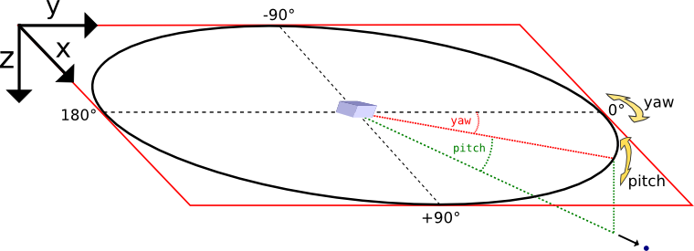

.. _usage-plugins-particleCalorimeter:

Particle Calorimeter
--------------------

A binned calorimeter of the amount of kinetic energy per solid angle and energy-per-particle.

The solid angle bin is solely determined by the particle's momentum vector and not by its position, so we are emulating a calorimeter at infinite distance.

The calorimeter takes into account all existing particles as well as optionally all particles which have already left the global simulation volume.

External Dependencies
^^^^^^^^^^^^^^^^^^^^^

The plugin is available as soon as the :ref:`libSplash and HDF5 libraries <install-dependencies>` are compiled in.

.param file
^^^^^^^^^^^

The spatial calorimeter resolution can be customized and in :ref:`speciesDefinition.param <usage-params-plugins>`.
Therein, a species can be also be marked for detecting particles leaving the simulation box.

.cfg file
^^^^^^^^^

All options are denoted exemplarily for the photon (``ph``) particle species here.

================================== =========================================================================================
PIConGPU command line option       Description
================================== =========================================================================================
``--ph_calorimeter.period``        The ouput periodicity of the plugin.
                                   A value of ``100`` would mean an output at simulation time step *0, 100, 200, ...*.
``--ph_calorimeter.file``          Output file suffix. Put unique name if same ``species + filter`` is used multiple times.
``--ph_calorimeter.filter``        Use filtered particles. All available filters will be shown with ``picongpu --help``
``--ph_calorimeter.numBinsYaw``    Specifies the number of bins used for the yaw axis of the calorimeter.
                                   Defaults to ``64``.
``--ph_calorimeter.numBinsPitch``  Specifies the number of bins used for the pitch axis of the calorimeter.
                                   Defaults to ``64``.
``--ph_calorimeter.numBinsEnergy`` Specifies the number of bins used for the energy axis of the calorimeter.
                                   Defaults to ``1``, i.e. there is no energy binning.
``--ph_calorimeter.minEnergy``     Minimum detectable energy in keV.
                                   Ignored if ``numBinsEnergy`` is ``1``.
                                   Defaults to ``0``.
``--ph_calorimeter.maxEnergy``     Maximum detectable energy in keV.
                                   Ignored if ``numBinsEnergy`` is ``1``.
                                   Defaults to ``1000``.
``--ph_calorimeter.logScale``      En-/Disable logarithmic energy binning.  Allowed values: ``0`` for disable, ``1`` enable.
``--ph_calorimeter.openingYaw``    opening angle yaw of the calorimeter in degrees.
                                   Defaults to the maximum value: ``360``.
``--ph_calorimeter.openingPitch``  opening angle pitch of the calorimeter in degrees.
                                   Defaults to the maximum value: ``180``.
``--ph_calorimeter.posYaw``        yaw coordinate of the calorimeter position in degrees.
                                   Defaults to the +y direction: ``0``.
``--ph_calorimeter.posPitch``      pitch coordinate of the calorimeter position in degrees.
                                   Defaults to the +y direction: ``0``.
================================== =========================================================================================

Coordinate System
^^^^^^^^^^^^^^^^^

Yaw and pitch are `Euler angles <https://en.wikipedia.org/wiki/Euler_angles>`_ defining a point on a sphere's surface, where ``(0,0)`` points to the ``+y`` direction here. In the vicinity of ``(0,0)``, yaw points to ``+x`` and pitch to ``+z``.

**Orientation detail:** Since the calorimeters' three-dimensional orientation is given by just two parameters (``posYaw`` and ``posPitch``) there is one degree of freedom left which has to be fixed.
Here, this is achieved by eliminating the Euler angle roll.
However, when ``posPitch`` is exactly ``+90`` or ``-90`` degrees, the choice of roll is ambiguous, depending on the yaw angle one approaches the singularity.
Here we assume an approach from ``yaw = 0``.

Tuning the spatial resolution
^^^^^^^^^^^^^^^^^^^^^^^^^^^^^

By default, the spatial bin size is chosen by dividing the opening angle by the number of bins for yaw and pitch respectively.
The bin size can be tuned by customizing the mapping function in ``particleCalorimeter.param``.

Memory Complexity
^^^^^^^^^^^^^^^^^

Accelerator
"""""""""""

each energy bin times each coordinate bin allocates two counter (``float_X``) permanently and on each accelerator for active and outgoing particles.

Host
""""

as on accelerator.

Output
^^^^^^

The calorimeters are stored in hdf5-files in the ``simOutput/<species>_calorimeter/<filter>/`` directory.
The file names are ``<species>_calorimeter_<file>_<sfilter>_<timestep>_0_0_0.h5``.

The dataset within the hdf5-file is located at ``/data/<timestep>/calorimeter``.
Depending on whether energy binning is enabled the dataset is two or three dimensional.
The dataset has the following attributes:

================== =============================================
Attribute          Description
================== =============================================
``unitSI``         scaling factor for energy in calorimeter bins
``maxYaw[deg]``    half of the opening angle yaw.
``maxPitch[deg]``  half of the opening angle pitch.
``posYaw[deg]``    yaw coordinate of the calorimeter.
``posPitch[deg]``  pitch coordinate of the calorimeter.
                   If energy binning is enabled:
``minEnergy[keV]`` minimal detectable energy.
``maxEnergy[keV]`` maximal detectable energy.
``logScale``       boolean indicating logarithmic scale.
================== =============================================

The output in each bin is given in Joule.
Divide by energy value of the bin for a unitless count per bin.

.. note::

   This plugin is a multi plugin. 
   Command line parameters can be used multiple times to create e.g. dumps with different dumping period.
   In the case where an optional parameter with a default value is explicitly defined the parameter will be always passed to the instance of the multi plugin where the parameter is not set.
   e.g. 

   .. code-block:: bash

      --ph_calorimeter.period 128 --ph_calorimeter.file calo1 --ph_calorimeter.filter all
      --ph_calorimeter.period 1000 --ph_calorimeter.file calo2 --ph_calorimeter.filter all --ph_calorimeter.logScale 1 --ph_calorimeter.minEnergy 1

   creates two plugins:
 
   #. calorimeter for species ph each 128th time step **with** logarithmic energy binning.
   #. calorimeter for species ph each 1000th time step **without** (this is the default) logarithmic energy binning.

.. attention::

   When using the plugin multiple times for the same combination of ``species`` and ``filter``, you *must* provide a unique ``file`` suffix.
   Otherwise output files will overwrite each other, since only ``species``, ``filter`` and ``file`` suffix are encoded in it.

   An example use case would be two (or more) calorimeters for the same species and filter but with differing position in space or different binning, range, linear and log scaling, etc.

Analysis Tools
^^^^^^^^^^^^^^

The first bin of the energy axis of the calorimeter contains all particle energy less than the minimal detectable energy whereas the last bin contains all particle energy greater than the maximal detectable energy.
The inner bins map to the actual energy range of the calorimeter.

Sample script for plotting the spatial distribution and the energy distribution:

.. code:: python

   f = h5.File("<path-to-hdf5-file>")
   calorimeter = np.array(f["/data/<timestep>/calorimeter"])

   # spatial energy distribution
   # sum up the energy spectrum
   plt.imshow(np.sum(calorimeter, axis=0))
   plt.show()

   # energy spectrum
   # sum up all solid angles
   plt.plot(np.sum(calorimeter, axis=(1,2)))
   plt.show()

