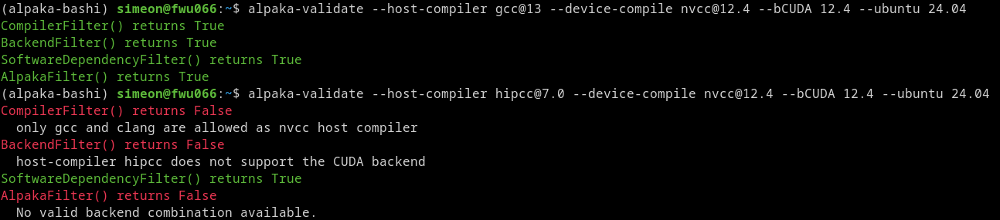

# Job-Generator

The `job-generator` creates all jobs for GitLab CI.
It takes multiple compiler and software versions as input and generates a test matrix by [pairwise combination](https://en.wikipedia.org/wiki/All-pairs_testing).
When you run the `job-generator` process, the output is a valid GitLab CI YAML file for CI.

The `job-generator` uses the [bashi](https://github.com/alpaka-group/bashi/) library, which provides the functions for creating combinations.

`bashi` is designed for use with alpaka-based projects such as alpaka itself, as well as projects that uses alpaka, such as [PIConGPU](https://github.com/ComputationalRadiationPhysics/picongpu/).
Therefore, `bashi` provides a set of rules that define what is technically possible for alpaka-based applications.
For example which nvcc version supports which gcc version.
The `job-generator`, on the other hand, adds its own rules.
Most of these rules reduce the testing effort, e.g., by allowing only a subset of possible backend combinations to reduce the number of test jobs.
In addition to extent the rule set, the `job-generator` implements everything that happens after the combination list is generated.
Most of the functionality involves generating the GitLab CI YAML code from the combination list.

## Naming

The `job-generator` uses `bashi`'s naming convention.
[Here](https://github.com/alpaka-group/bashi/blob/main/docs/naming.md) you can find out what the terms mean.

# Install

The `job-generator` is a Python package and is very easy to install.

```bash
# create a virtual environment with your favorite tool, then
pip3 install .
```

# Usage

Run `job-generator <container_version>` to generate the YAML file for the GitLab CI job.

```bash
job-generator 4.0
```

Use `job-generator --help` to display additional options.

# alpaka-validate

`alpaka-validate` is a tool that can be used to check whether a combination is supported by alpaka.
It is automatically installed along with `job-generator`.

Run `alpaka-validate --help` to display all the parameters that can be checked.



# Verification

When combining parameters in pairs, the goal is to generate as few combinations as possible while ensuring that every pair of parameter-values appears in at least one combination.
Due to the filtering rules, not every combination of two parameter-values is allowed.
The `job-generator` automatically checks whether all valid pairs appear at least once in a combination and ensures that no invalid pairs occur.

# Development

If you want to modify the `job-generator` code, you can install it in an editable version.
This means that the `job-generator` command will run your modified code.

```bash
# create a virtual environment with your favorite tool, then
pip3 install --editable .
```

## Modify bashi

If you want to modify `bashi`, you must enable the Python environment for `job-generator`, clone the [bashi repository](https://github.com/alpaka-group/bashi), and run the command `pip3 install --editable .` in the `bashi` repository.
After that, `job-generator` will access the source code in the local repository, and you can edit it.

## Add new Software Versions

New software versions can be added to [versions.py](./src/alpaka_bashi/versions.py).
Depending on the software, new combinations are generated without any issues.
Sometimes it is also necessary to add a new software relationship.
For example, NVCC 13.0 only supports GCC up to version 15.
If GCC 16 has already been added and CUDA 13.1 is to be added, the `job-generator` generates a job with NVCC 13.1 and GCC 16.
However, NVCC 13.1 only supports GCC up to version 15.
The CI job will fail.
Therefore, a new software relationship must be added to the [get_alpaka_version_relation() function in the version.py file](./src/alpaka_bashi/versions.py), which restricts NVCC 13.1 to GCC 15.

## Python Exception: covertable.exceptions.InvalidCondition

Sometimes, when running the `job-generator`, an exception of type `covertable.exceptions.InvalidCondition` may be triggered when a new software version is added.
This can happen if a filter rule or a software rule is missing.
`bashi` provides a [best practices guide](https://github.com/alpaka-group/bashi/blob/main/docs/rules.md) for resolving the issue.

**Attention:** This guide refers to the `example.py` file and the `bashi-validate` tool.
If you are applying this guide to the `job-generator` package, you must use the `job-generator` application instead of `example.py` and `alpaka-validate` instead of `bashi-validate.`

- To display which combinations the `job-generator` accepts and which it does not, run `job-generator --debug-print=args`. Green combinations pass and red ones are invalid. Run `job-generator --help` for more information.
- Use `alpaka-validate` instead of `bashi-validate`. `alpaka-validate` uses the `bashi` filters as well as the alpaka-specific filter.

## Update the Verification

In most cases, the verification functions adapt to the new software version, and verification passes automatically. However, sometimes existing verification rules need to be adjusted or new ones added. The verification rules are defined in the file [verify.py](./src/alpaka_bashi/verify.py).

This [guide](https://github.com/alpaka-group/bashi/blob/main/docs/remove-parameter-value-pairs.md) explains how the utils functions work to define which parameter-value pairs are valid and which are invalid.
