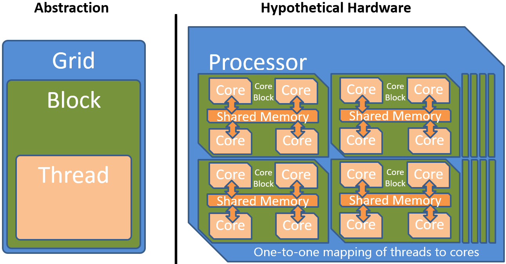
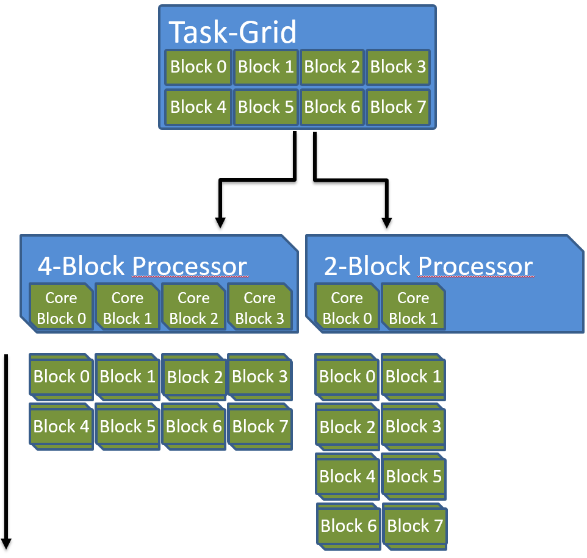

[:arrow_up: Up](../Abstraction.md)

Block
=====

Building a processor with possibly thousands of cores where all cores have an equal length connection for fast communication and synchronization is not viable.
Either the processor size would have to grow exponentially with the number of cores or the all-to-all communication speed would decrease so much that computations on the processor would be impractical.
Therefore, the communication and synchronization of threads has to be limited to sizes manageable by real hardware.

Figure \ref{fig:block} depicts the solution of introducing a new hierarchy level in the abstraction.
A hypothetical processor is allowed to provide synchronization and fast communication within blocks of threads but is not required to provide synchronization across blocks.
The whole grid is subdivided into equal sized blocks with a fast but small shared memory.
Current accelerator abstractions (*CUDA* and *OpenCL*) only support equal sized blocks.
This restriction could possibly be lifted to support future accelerators with heterogeneous block sizes.

There is another reason why independent blocks are necessary.
Threads that can communicate and synchronize require either a one-to-one mapping of threads to cores, which is impossible because the number of data elements is theoretically unlimited, or at least a space to store the state of each thread.
Even old single core CPUs were able to execute many communicating and synchronizing threads by using cooperative or preemptive multitasking.
Therefore, one might think that a single core would be enough to execute all the data parallel threads.
But the problem is that even storing the set of registers and local data of all the possible millions of threads of a task grid is not always viable.
The blocking scheme solves this by enabling fast interaction of threads on a local scale but additionally removes the necessity to store the state of all threads in the grid at once because only threads within a block must be executed in parallel.
Within a block of cores there still has to be enough memory to store all registers of all contained threads.
The independence of blocks allows applications to scale well across diverse devices.
As can be seen in the following figure, the accelerator can assign blocks of the task grid to blocks of cores in arbitrary order depending on availability and workload.

Shared Memory
-------------

Each block has its own shared memory.
This memory can only be accessed explicitly by threads within the same block and gets discarded after the complete block finished its calculation.
This memory is typically very fast but also very small.
No variables are shared between kernels by default.
