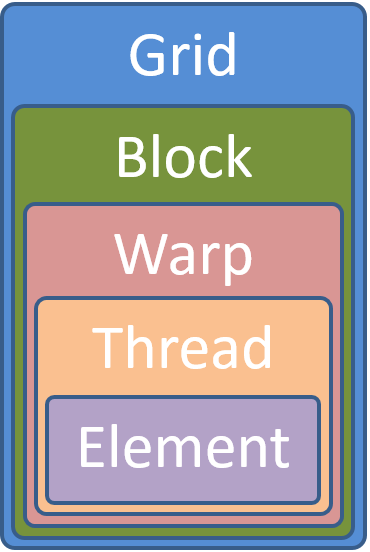

[:arrow_up: Up](../Abstraction.md)

Element
=======

To use the maximum available computing power of, for example, a modern x86 processor, the computation has to utilize the SIMD vector registers.
Many current architectures support issuing a single instruction that can be applied to multiple data elements in parallel.

The original x86 instruction set architecture did not support SIMD instructions but has been enhanced with MMX (64 bit width registers), SSE (128 bit width registers), AVX (256 bit width registers) and AVX-512 (512 bit width registers) extensions.
In varying degree, they allow to process multiple 32 bit and 64 bit floating point numbers as well as 8, 16, 32 and 64 bit signed and unsigned integers.

*CUDA* capable GPUs do not have vector registers where multiple values of type `float` or `double` can be manipulated by one instruction.
Nevertheless, newer *CUDA* capable devices implement basic SIMD instructions on pairs of 16 bit values and quads of 8-bit values. 
They are described in the documentation of the [PTX instruction set architecture](http://docs.nvidia.com/cuda/parallel-thread-execution/index.html#axzz4OTzGGwcJ) chapter 8.7.13 but are only of any use in very special problem domains, for example for deep learning.

It would be optimal if the compiler could automatically vectorize our kernels when they are called in a loop and vectorization is supported by the underlying accelerator.
However, besides full blown vector processors, mainstream CPUs do not support predicated execution or similar complex things within vector registers.
At most, there is support for masking operations which allow to emulate at least some conditional branching.
Therefore, this missing hardware capability has to be circumvented by the compiler.
There are scientific research projects such as the work done by Ralf Karrenberg et al [1](http://www.cdl.uni-saarland.de/publications/theses/karrenberg_msc.pdf) [2](http://www.cdl.uni-saarland.de/projects/wfv/wfv_cgo11_slides.pdf) [3](http://www.cdl.uni-saarland.de/papers/karrenberg_opencl.pdf) building on the *LLVM* compiler infrastructure supporting such whole-function vectorization.
However, current mainstream compilers do not support automatic vectorization of basic, non trivial loops containing control flow statements (`if`, `else`, `for`, etc.) or other non-trivial memory operations.
Therefore, it has to be made easier for the compiler to recognize the vectorization possibilities by making it more explicit.

The opposite of automatic whole function vectorization is the fully explicit vectorization of expressions via compiler intrinsics directly resulting in the desired assembly instruction.
A big problem when trying to utilize fully explicit vectorization is, that there is no common foundation supported by all explicit vectorization methods.
A wrapper unifying the x86 SIMD intrinsics found in the `intrin.h` or `x86intrin.h` headers with those supported on other platforms, for example ARM NEON (`arm_neon.h`), PowerPC Altivec (`altivec.h`) or *CUDA* is not available and to write one is a huge task in itself.
However, if this would become available in the future, it could easily be integrated into *alpaka* kernels.

Due to current compilers being unable to vectorize whole functions and the explicit vectorization intrinsics not being portable, one has to rely on the vectorization capabilities of current compilers for primitive loops only consisting of a few computations.
By creating a grid of data elements, where multiple elements are processed per thread and threads are pooled in independent blocks, as it is shown in the figure below, the user is free to loop sequentially over the elements or to use vectorization for selected expressions within the kernel.
Even the sequential processing of multiple elements per thread can be useful depending on the architecture.
For example, the *NVIDIA cuBLAS* general matrix-matrix multiplication (GEMM) internally executes only one thread for each second matrix data element to better utilize the registers available per thread.

<!---
The best solution to vectorization would be one, where the user does not have to do anything.
This is not possible because the smallest unit supplied by the user is a kernel which is executed in threads which can synchronize.

It is not possible to execute multiple kernels sequentially to hide the vectorization by starting a kernel-thread for e.g. each 4th thread in a block and then looping over the 4 entries.
This would prohibit the synchronization between these threads.
By executing 4 fibers inside such a vectorization kernel-thread we would allow synchronization again but prevent the loop vectorizer from working.
--->