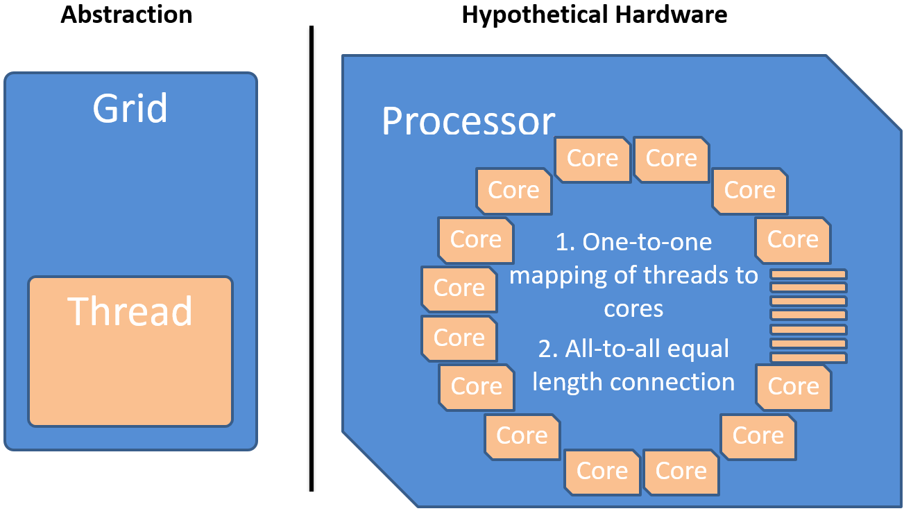

[:arrow_up: Up](../Abstraction.md)

Thread
======

Theoretically, a basic data parallel task can be executed optimally by executing one thread per independent data element.
In this context, the term thread does not correspond to a native kernel-thread, an *OpenMP* thread, a *CUDA* thread, a user-level thread or any other such threading variant.
It only represents the execution of a sequence of commands forming the desired algorithm on a per data element level.
This ideal one-to-one mapping of data elements to threads leads to the execution of a multidimensional grid of threads corresponding to the data structure of the underlying problem.
The uniform function executed by each of the threads is called a kernel.
Some algorithms such as reductions require the possibility to synchronize or communicate between threads to calculate a correct result in a time optimal manner.
Therefore our basic abstraction requires a n-dimensional grid of synchronizable threads each executing the same kernel.
The following figure shows an hypothetical processing unit that could optimally execute this data parallel task.
The threads are mapped one-to-one to the cores of the processor.
For a time optimal execution, the cores have to have an all-to-all equal length connection for communication and synchronization.

The only difference between the threads is their positional index into the grid which allows each thread to compute a different part of the solution.
Threads can always access their private registers and the global memory.

Registers
---------

All variables with default scope within a kernel are automatically saved in registers and are not shared automatically.
This memory is local to each thread and can not be accessed by other threads.

Global Memory
-------------

The global memory can be accessed from every thread in the grid as well as from the host thread.
This is typically the largest but also the slowest memory available.

Individual threads within the grid are allowed to statically or dynamically allocate buffers in the global memory.

Prior to the execution of a task, the host thread copies the input buffers and allocates the output buffers onto the accelerator device.
Pointers to these buffers then can be given as arguments to the task invocation.
By using the index of each thread within the grid, the offset into the global input and output buffers can be calculated.
After the computation has finished, the output buffer can be used either as input to a subsequent task or can be copied back to the host.
