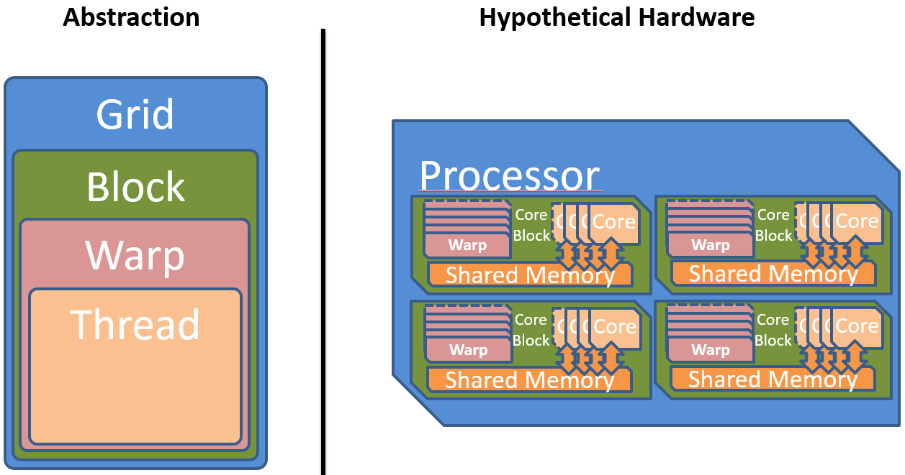

[:arrow_up: Up](../Abstraction.md)

Warp
====

With the current abstraction only independent parallelism via blocks and synchronizable parallelism via threads can be expressed.
However, there are more variants of parallelism in real hardware.
Because all threads in the grid are executing the same kernel and even the same instruction at the same time when ignoring divergent control flows, a lot of chip space can be saved.
Multiple threads can be executed in perfect synchronicity, which is also called lock-step.
A group of such threads executing the same instruction at the same time is called a warp .
All threads within a warp share a single instruction pointer (IP), and all cores executing the threads share one instruction fetch (IF) and instruction decode (ID) unit.

Even threads with divergent control flows can be executed within one warp.
*CUDA*, for example, solves this by supporting predicated execution and warp voting.
For long conditional branches the compiler inserts code which checks if all threads in the warp take the same branch.
For small branches, where this is too expensive, all threads always execute all branches.
Control flow statements result in a predicate and only in those threads where it is true, the predicated instructions will have an effect.

Not only *CUDA* GPUs support the execution of multiple threads in a warp.
Full blown vector processors with good compilers are capable of combining multiple loop iterations containing complex control flow statements in a similar manner as *CUDA*.

Due to the synchronictiy of threads within a warp, memory operations will always occur at the same time in all threads.
This allows to coalesce memory accesses.
Different *CUDA* devices support different levels of memory coalescing.
Older ones only supported combining multiple memory accesses if they were aligned and sequential in the order of thread indices.
Newer ones support unaligned scattered accesses as long as they target the same 128 byte segment.

The ability of very fast context switches between warps and a queue of ready warps allows *CUDA* capable GPUs to hide the latency of global memory operations.
