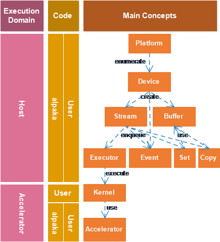

[:arrow_up: Up](../Library.md)

Structure
=========

The *alpaka* library allows offloading of computations from the host execution domain to the accelerator execution domain, whereby they are allowed to be identical.

In the abstraction hierarchy the library code is interleaved with user supplied code as is depicted in the following figure.

User code invokes library functions, which in turn execute the user provided thread function (kernel) in parallel on the accelerator.
The kernel in turn calls library functions when accessing accelerator properties and methods.
Additionally, the user can enhance or optimize the library implementations by extending or replacing specific parts.

The *alpaka* abstraction itself only defines requirements a type has to fulfill to be usable with the template functions the library provides.
These type constraints are called concepts in C++.

*A concept is a set of requirements consisting of valid expressions, associated types, invariants, and complexity guarantees.
A type that satisfies the requirements is said to model the concept.
A concept can extend the requirements of another concept, which is called refinement.* [BoostConcepts](http://www.boost.org/community/generic_programming.html)

Concepts allow to safely define polymorphic algorithms that work with objects of many different types.

The *alpaka* library implements a stack of concepts and their interactions modeling the abstraction defined in the previous chapter.
Furthermore, default implementations for various devices and accelerators modeling those are included in the library.
The interaction of the main user facing concepts can be seen in the following figure.

For each type of `Device` there is a `Platform` for enumerating the available `Device`s.
A `Device` is the requirement for creating `Streams` and `Events` as it is for allocating `Buffers` on the respective `Device`. `Buffers` can be copied, their memory be set and they can be pinned or mapped.
Copying and setting a buffer requires the corresponding `Copy` and `Set` tasks to be enqueued into the `Stream`.
An `Event` can be enqueued into a `Stream` and its completion state can be queried by the user.
It is possible to wait for (synchronize with) a single `Event`, a `Stream` or a whole `Device`.
An `Executor` can be enqueued into a `Stream` and will execute the `Kernel` (after all previous tasks in the stream have been completed). 
The `Kernel` in turn has access to the `Accelerator` it is running on.
The `Accelerator` provides the `Kernel` with its current index in the block or grid, their extents or other data as well as it allows to allocate shared memory, execute atomic operations and many more.
