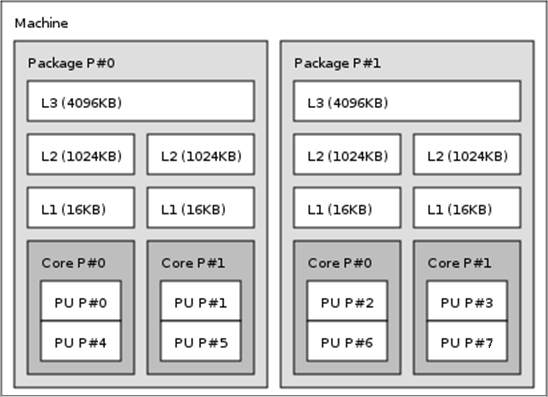
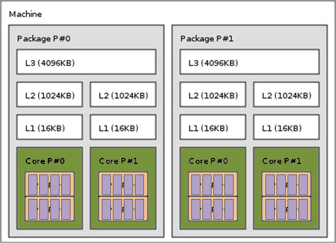

[:arrow_up: Up](../Mapping.md)

x86 CPUs
========

There are multiple possible ways to map the *alpaka* abstraction to x86 CPUs.
The following figure shows the compute and memory hierarchy of a dual-socket (package) node with dual-core CPUs and symmetric multithreading (Hyper-Threading).
Through symmetric multithreading (Hyper-Threading) each core represents two processing units.

Thread
------

Mapping the thread level directly to the processing units is the most trivial part of the assignment of hierarchy levels to hardware units.
However, the block and warp levels could be mapped to hardware components in different ways with varying advantages and disadvantages.

Warp
----

Even though a warp seems to be identical to a vector register, because both execute a single uniform instruction on multiple data elements, they are not the same.
[Warps](../../abstraction/Abstraction.md) can handle branches with divergent control flows of multiple threads.
There is no equivalent hardware unit in a CPU supporting this.
Therefore, the warp level can not be utilized on CPUs leading to a one-to-one mapping of threads to warps which does not violate the rules of the abstraction.

Block
-----

### One Block Per Node

By combining all processing units (possibly Hyper-Threads) of all processors on a node into one block, the number of synchronizing and communicating threads can be enlarged.
This high possible thread count would simplify the implementation of some types of algorithms but introduces performance issues on multi-core nodes.
The shared memory between all cores on a node is the RAM.
However, the RAM and the communication between the sockets is far too slow for fine-grained communication in the style of *CUDA* threads.

### One Block Per Socket

If each processor on each socket would concurrently execute one block, the L3 cache would be used as the fast shared memory.
Although this is much better then to use the RAM, there is still a problem.
Regions of the global memory and especially from the shared memory that are accessed are automatically cached in the L1 and / or L2 caches of each core.
Not only the elements which are directly accessed will be cached but always the whole cache line they lie in.
Cache lines typically have a size of 64 Bytes on modern x86 architectures.
This leads to, for example, eight double precision floating point numbers being cached at once even though only one value really is required.
As long as these values are only read there is no problem.
However, if one thread writes to a value that is also cached on other cores, all such cache copies have to be invalidated.
This results in a lot of cache and bus traffic.
Due to the hierarchical decomposition of the grid of threads reflecting the data elements, neighboring threads are always combined into a common block.
By mapping a block to a socket, threads that are executed concurrently always have very close indices into the grid.
Therefore, the elements that are read and written by the threads are always very close together within the memory and will most probably share a cache line.
This property is exploited on *CUDA* GPUs, where memory accesses within a warp are combined into one large transaction.
However, when multiple threads from multiple CPU cores write to different elements within a cache line, this advantage is reversed into its opposite.
This pattern non-intuitively leads to heavy performance degradation and is called false-sharing.

### One Block Per Core

The best compromise between a high number of threads per block and a fast communication between the threads is to map a block directly to a CPU core.
Each processing unit (possibly a Hyper-Thread) executes one or more threads of our hierarchical abstraction while executing multiple elements locally either by processing them sequentially or in a vectorized fashion.
This possible mapping of blocks, threads and elements to the compute and memory hierarchy of a dual-socket node with dual-core CPUs and symmetric multithreading is illustrated in the following figure.

### One Block Per Thread

If there is no symmetric multithreading or if it is desired, it is also possible to implement a mapping of one block with exactly one thread for each processing unit.
This allows to completely remove the synchronization overhead for tasks where this is not required at all.

Threading Mechanisms
--------------------

The mapping of threads to processing units is independent of the threading mechanism that is used.
As long as the thread affinity to cores can be set correctly, *OpenMP*, *pthread*, *std::thread* or other libraries and APIs can be used interchangeably to implement various *alpaka* back-ends.
They all have different advantages and disadvantages.
Real operating system threads like *pthread*, *std::thread* and others have a high cost of thread creation and thread change because their default stack size amounts to multiple megabytes.
*OpenMP* threads on the other hand are by default much more lightweight.
However, they are arbitrarily limited by the runtime implementation in the maximum number of concurrent threads a machine supports.
All of the previous methods have non-deterministic thread changes in common.
Therefore it is not possible to decide the order in which threads within a block are processed, which could be a good optimization opportunity.

To allow blocks to contain more threads then the number of processing units each core provides, it is possible to simply start more threads then processing units are available.
This is called oversubscription.
Those threads can be bound to the correct cores and by relying on the operating system thread scheduler, they are preemptively multitasked while sharing a single cache and thereby avoiding false-sharing.
However, this is not always beneficial because the cost of thread changes by the kernel-mode scheduler should not be underestimated.

### Fibers

To remove the overhead of the kernel mode scheduler as well as to enable the usage of deterministic thread context-switches, fibers can be used.
A fiber is a user-space thread with cooperative context-switches and extends the concept of coroutines.
A coroutine is basically a function that can be suspended and resumed but does not necessarily have a stack.
In contrast, functions within most programming languages represent subroutines and not coroutines because they can neither be suspended in the mid of execution nor resumed exactly at the place they were suspended without losing values on the functions local stack.

Multiple fibers can be executed within one operating system thread, which allows to simulate multiple threads per block without kernel-mode multithreading.
This was not possible without fibers because only coroutines allow the kernel functions to be suspended at synchronization points and resumed when all fibers reached it.
Each time an operating system thread executing a function would wait for an other thread or a resource, an equivalent fiber just switches to the next fiber within the executing host thread.
Due to the context changes happening at user-level, the cost is much lower.
Additionally, fiber context changes are deterministic and it is even possible to implement an user-level scheduler.
An advantage of a user level scheduler over the operating system thread scheduler is the possibility to optimally utilize the caches by taking into account the memory access pattern of the algorithm.
Furthermore, fibers reduce the number of locks and busy waits within a block because only one fiber is active per operating system thread at a time.

There are multiple C++ Standards Committee Papers (N3858, N3985, N4134) discussing the inclusion of fibers, awaitable functions and similar concepts into C++.
